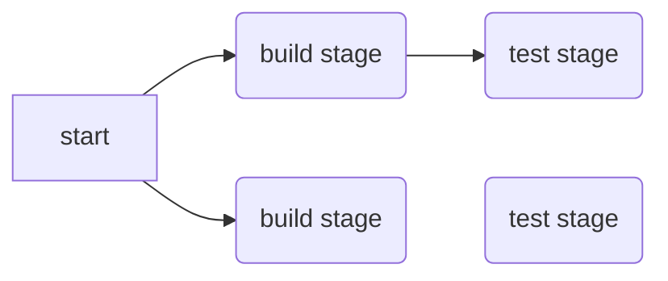

## Pipeline

利用yaml定義CICD流程 , 通常包含一個stage與多個job組成,  
若job中與全局設定有重復, 則以job為主  

預設為 .gitlab-ci.yml,  
需修改可至 <project> -> settings -> CI/CD -> General pipelines -> Custom CI config path  


### stage
  定義job執行順序, 但只限於 .pre 與 .post 之間順序  
  , .pre , .post 為系統內建的stage, 不需自己定義, 表示為最前面執行與最後面執行  
  偌多個job同時定義相同的stage, 則會並行執行  

```yaml
stages:
  - build
  - test
  - deploy
```

### job

pipeline的執行單位,名稱可自訂 但需避開關鍵字 如stage,  
至少須包含一個script  

```yaml
build:
  before_script:
    - echo "before script"
  stage: build
  script: "echo Hello, World!"
  after_script:
    - echo "after script"

```

### before_script
全局before script,若job沒指定, 會在每個job執行前執行, 若before_script執行失敗,則該次任務就直接停止  

```yaml
before_script:
  - echo "before script"
```

### after_script
   全局after script,若job沒指定, 會在每個job執行後執行, 若after_script執行失敗,不影響該次任務

```yaml
after_script:
  - echo "after script"
```

### tags

主要用於指定runner, 若該runner也有與job有相同的tag, 該runner才會執行該任務, 可以讓一個pipeline由不同的runner共同執行

```yaml
build:
  stage: build
  tags:
    - build
  script:
    - echo "build"
```

### allow_failure
   可允許失敗, 若job失敗,最終狀態會被理解成成功, 本次任務依然會繼續執行

```yaml
build:
  stage: build
  allow_failure: true
  script:
    - echo "build"
```

### when
   指定job執行時機, 預設是 on_success, 表示前一階段皆執行成功才會執行

| when       | 說明                    |
|------------|-----------------------|
| on_success | 前階段皆執行成功才會執行          |
| on_failure | 前一階段任一執行失敗就會執行        |
| always     | 前一階段執行完畢就會執行          |
| manual     | 需要手動觸發執行              |
| delayed    | 延遲執行,須配合start_in 預設為秒 |


```yaml
stages:
  - build
  - t1
  - t2
  - t3
  - deploy

variables:
  my_key: "myvalue"


build:
  stage: build
  script:
    - echo "build"
t1:
  stage: t1
  script:
    - erew
  allow_failure: true

t2:
  stage: t2
  script:
    - "echo 123"

t3:
  stage: t3
  script:
    - "echo 123"
  when: delayed
  start_in: "30"

deploy:
  stage: deploy
  script:
    - echo "deploy"
    - mkdir -p /tmp/123/123
  when: manual
```

### retry
   若job執行失敗, 可以重新執行, 預設為0, 最多可設定2次, retry=2, 表示最多總共執行3次

```yaml
t1:
  stage: t1
  script:
    - erew
  retry:
    max: 2
    when:
      - script_failure
```

| when                       | 說明             |
|----------------------------|----------------|
| always                     | 無論何時都會執行       |
| script_failure             | 執行script失敗才會執行 |
| api_failure                | 執行api失敗才會執行    |
| stuck_or_timeout_failure   | 執行超時才會執行       |
| unknown_failure            | 執行未知錯誤才會執行     |
| missing_dependency_failure | 執行缺少依賴才會執行     |
| jpb_execution_timeout      | 執行超時才會執行       |

### timeout

設定job執行超時時間, 若超過時間, 則會被強制終止, 不能大於runner timeout , 但可以大於 pipeline timeout

```yaml
deploy:
  stage: deploy
  script:
    - echo "deploy"
    - mkdir -p /tmp/123/123
  timeout: 1 hours 10 minutes
```

- runner timeout 10hr, CI/CD pipeline timout 1 hr, 則是會在1 hr timeout

- runner no timeout, CI/CD pipeline task timeout 1 hr, 則是會在1 hr timeout

- runner timeout 30min, CI/CD pipeline task timeout 1 hr, 則是會在30min timeout

- runner timeout 1 hr, CI/CD pipeline task timeout 30min, job timeout 1 hr, 則是會在1 hr timeout


### parallel

並行job instance, 設定值須大於2 小於等於50

```yaml
deploy:
  stage: deploy
  script:
    - echo "deploy"
    - mkdir -p /tmp/123/123
  timeout: 1 hours 10 minutes
  parallel: 5
```

### only

用來指定特定branch 被commit, 才會被runner執行, only的branch名稱支援正則表達式, 已被rule取代

```yaml
deploy:
  stage: deploy
  only:
    - main
    - /^issue-.*$/ # 正則表達式
  script:
    - echo "deploy"
    - mkdir -p /tmp/123/123

```

### except

與only相反, 被指定的branch不會被runner執行, 已被rule取代

```yaml
deploy:
  stage: deploy
  except:
    - main
  script:
    - echo "deploy"
    - mkdir -p /tmp/123/123
```

### rule

- 由上至下順序匹配規則, 若有多個符合條件, 只會匹配最先符合條件規則開始執行, 若都不符合, 則不會執行job
- 須注意不能與 only, except 同時使用

rule 可使用三種條件式. 也可不用 , 無使用則是 if true ....

| rule    | 說明               |
|---------|------------------|
| if      | 條件式, 若為true, 則執行 |
| changes | 指定檔案產生變化 則執行     |
| exists  | 指定檔案存在 則執行       |

條件式後面就與一般job設定的屬性一樣, 可理解成在不同條件下, 該job有不同的形態

```yaml

variables:
  my_key: "myvalue1"

stages:
  - build
  - deploy

build:
  stage: build
  script:
    - "echo build"
  rules:
    - if: '$my_key == "myvalue"'
      when: manual
    - when: on_success
## 可理解成
## if my_key == "myvalue", 等待直到可手動觸發執行
## else if previous_jos is success, 直接執行 

deploy:
  stage: deploy
  script:
    - echo "deploy"
    - mkdir -p /tmp/123/123
  rules:
    - if: '$my_key == "myvalue1"'
      when: on_success
```

```yaml

variables:
  my_key: "myvalue1"

stages:
  - build
  - deploy

build:
  stage: build
  script:
    - "echo build"
  rules:
    - changes:
        - cicd_example.go
      when: manual
    - when: on_success
## 可理解成
## if cicd_example.go異動, 等待直到手動觸發執行
## else if previous_jos is success, 直接執行 

deploy:
  stage: deploy
  script:
    - echo "deploy"
    - mkdir -p /tmp/123/123
  rules:
    - if: '$my_key == "myvalue1"'
      when: on_success
```

```yaml

variables:
  my_key: "myvalue1"

stages:
  - build
  - deploy

build:
  stage: build
  script:
    - "echo build"
  rules:
    - exists:
        - cicd_example.go
        - 1234.txt
      when: manual
    - when: on_success
## 可理解成
## if cicd_example.go 與 1234.txt 其中之一存在, 等待直到手動觸發執行
## else if previous_jos is success, 直接執行 

deploy:
  stage: deploy
  script:
    - echo "deploy"
    - mkdir -p /tmp/123/123
  rules:
    - if: '$my_key == "myvalue1"'
      when: on_success
```

### workflow

設定條件,用來判斷整個pipeline是否被創建, 類似rule用法, 預設為 when: always

簡單說就是不會有任何 CI CD 流程產生, pipeline也不會有紀錄

```yaml
variables:
  my_key: "myvalue1"

workflow:
  rules:
    - if: '$my_key == "myvalue99"'
      when: always
    - when: never


stages:
  - build
  - deploy

build:
  stage: build
  script:
    - "echo build"

deploy:
  stage: deploy
  script:
    - echo "deploy"
    - mkdir -p /tmp/123/123
  rules:
    - if: '$my_key == "myvalue1"'
      when: on_success

```

### cache

讓job有一部分紀錄狀態的目錄, 可以被下一個job使用, 通常用於編譯後的檔案, 以減少下一個job的執行時間  
可以理解成volume目錄或檔案
也可用key 儲存多組cache, 若有build重複名稱的檔案 會有被覆蓋問題, 可用key進行控制  
go compile example

```yaml
image: golang:latest

cache:
  paths:
    - ./
## 每個job都是獨立的 不相互影響
## ./ 表示當前目錄所有
## 可指定檔案 e.g ./cicd_example
## 也可用 通配符 pattern *.go

test1:
  script:
    go build cicd_example.go
## 可以理解會把新增的產物 放一份至cache

test2:
  script:
    - ./cicd_example
## 無cache的話 會讀不到
```

python pip example

```yaml
image: python:latest

# Change pip's cache directory to be inside the project directory since we can
# only cache local items.
variables:
  PIP_CACHE_DIR: "$CI_PROJECT_DIR/.cache/pip"

# Pip's cache doesn't store the python packages
# https://pip.pypa.io/en/stable/reference/pip_install/#caching
cache:
  paths:
    - .cache/pip
    - ./*.py

before_script:
  - python -V               # Print out python version for debugging
  - pip install virtualenv
  - virtualenv venv
  - source venv/bin/activate
  - pip install pyyaml

build:
  script:
    - echo "import yaml" >> test.py


run:
  script:
    - python test.py
```

### artifacts

若CI/CD過程中想記錄狀態, e.g. unit test report... , 可用artifacts記錄  
預設會有 cicd的log, 設定後 會將artifact打包成zip檔案, artifact檔案清單的metadata gzip壓縮  
若有相依, 也可用來傳遞檔案

```yaml
image: golang:latest


build:
  stage: build
  script:
    go build cicd_example.go
  artifacts:
    expose_as: 'my binary1' ## 可在pull request, merge頁面 將該檔案展示出來 , 最多10組 
    name: "my binary1"
    paths:
      - ./cicd_example
    ## 假設我想保留 binary file ,  
    when: always  # 可設定 on_success, on_failure, always
    expire_in: 1 week # 預設為30天, '5' #5s , '5 hrs 20min' , '1 mins 2sec', '1h40min', '2 mos 1 day' , '41yrs 2mos and 1d' '2 weeks and 1 days'

test:
  stage: test
  script:
    - ./cicd_example
  dependencies: ## 只是確保正確執行順序  
    - build
```

### needs

用來綁定特定job,   
常用於build, 假設有兩個檔案都是build stage, 因此在該階段, 兩個JOB會併發執行, 但結束時間不會相同  
若一般來說, 會需要等待兩個都結束才會繼續, 用 needs 可以綁定下個階段 使其build完 馬上偷跑,  
needs list 上限目前為10  
artifact預設為True, 功能與dependencies相同, 但dependencies只能綁定同一個stage, 且只能綁定一個job,之後應該會取代dependencies

```yaml

image: golang:latest

stages:
  - build
  - test

build1:
  stage: build
  script:
    - go build cicd_example.go
  artifacts:
    expose_as: 'my binary1' ## 可在pull request, merge頁面 將該檔案展示出來 , 最多10組 
    name: "my binary1"
    paths:
      - ./cicd_example
    ## 假設我想保留 binary file ,  
    when: always  # 可設定 on_success, on_failure, always
    expire_in: 1 week # 預設為30天, '5' #5s , '5 hrs 20min' , '1 mins 2sec', '1h40min', '2 mos 1 day' , '41yrs 2mos and 1d' '2 weeks and 1 days' 

test1:
  stage: test
  script:
    - ./cicd_example
  needs:
    - job: build1
      artifacts: true

build2:
  stage: build
  script:
    - go build cicd_example.go
    - sleep 10
  artifacts:
    expose_as: 'my binary2'
    name: "my binary2"
    paths:
      - ./cicd_example
    when: always
    expire_in: 1 week

test2:
  stage: test
  script:
    - ./cicd_example
  needs:
    - job: build2
      artifacts: true
``` 



### include

用來引入外部yaml設定擋, 可以理解成include的yaml會被直接放在該位置, 若有相同名稱的job, 則以原yaml為主

| include type | 說明                                                                                      |
|--------------|-----------------------------------------------------------------------------------------|
| local        | 引入本地yaml檔案                                                                              |
| file         | 引入其他project特定branch yaml檔案                                                              |
| template     | 引入[官方模板](https://gitlab.com/gitlab-org/gitlab-foss/tree/master/lib/gitlab/ci/templates) |
| remote       | 引入遠端yaml檔案, 可用http or https, 不支持鑒權,只能用公開文件                                              |

主要演示local

local

```yaml

test:
  stage: test
  script:
    - echo 123
```

```yaml

image: golang:latest

stages:
  - build
  - test

build:
  stage: build
  script:
    - go build cicd_example.go


include:
  - local: config/myconfig.yaml


```

file:

```yaml
include:
  - file: 'myconfig.yaml'
    project: 'demo/myproject'
    ref: 'master'
```

template

```yaml
include:
  - template: 5-Minute-Production-App.gitlab-ci.yml
```

remote

```yaml
include:
  - remote: 'https://test.com/NodeJS.gitlab-ci.yml'
```

### extends

主要是用於job的組合, 若有重複的屬性則是會以主job為主, 若主job沒有定義, 則會新增extend的屬性

```yaml 
image: golang:latest

.test: ## extend job  
  stage: test
  script:
    - echo 123
  only:
    - main

test1: ## 主job
  extends: .test
  script:
    - echo 456

```

實際上等同

```yaml
image: golang:latest

test1:
  stage: test
  script:
    - echo 456
  only:
    - main
```

官方範例會配合include使用

aa.yaml

```yaml
.template:
  script:
    - echo "Hello, $CI_JOB_NAME!"
```

```yaml
include: aa.yaml

test1:
  extends: .template
  variables:
    CI_JOB_NAME: "test1"
  only:
    - main
```

### trigger

該關鍵字有限制,僅能與[這些關鍵字](https://docs.gitlab.com/16.7/ee/ci/yaml/index.html#trigger)一起使用, e,g, script 不能

用於觸發其他project的pipeline, 通常用於當前project的pipeline執行完畢後, 觸發其他project的pipeline, 並且可以傳遞變數(
局部,全域)  
若觸發pipeline也有與原pipeline有相同的變數, 皆會以原pipeline為主

因觸發後,並不會監測被觸發的pipeline狀態, 若有dependency, 可用strategy:depend, 確保觸發pipeline成功, 才會繼續往下  
strateggy depend為 被觸發的pipeline執行完成後, 主pipeline的狀態才會轉為success

| trigger type | Description                       |
|--------------|-----------------------------------|
| 多項目pipeline  | 觸發後並行執行的多項目流程                     |
| 子pipeline    | 類似 `include` 用法，用於嵌套或引用其他流程中的配置設定 |

多項目pipeline:

```yaml
## main pipeline
image: golang:latest

variables:
  var2: "999"

test1:
  stage: test
  variables:
    ENTRYPOINT: "test1"
  trigger:
    project: "root/demo2"
    branch: "main"
    strategy: depend
```

root/demo2 .gitlab-ci.yaml

```yaml
# sub pipeline
image: golang:latest


echo:
  stage: build
  script:
    - echo $var2
    - echo $ENTRYPOINT

test:
  stage: build
  script:
    - go build cicd_example.go
    - sleep 15

```

子pipeline: 

```yaml
## main pipeline
image: golang:latest

variables:
  var2: "999"

test1:
  stage: test
  variables:
    ENTRYPOINT: "test1"
  trigger:
    include:
      - local: config/myconfig2.yaml
    strategy: depend
```


config/myconfig2.yaml
```yaml
## child pipeline
image: golang:latest


echo:
  stage: build
  script:
    - echo $var2
    - echo $ENTRYPOINT

test:
  stage: build
  script:
    - go build cicd_example.go
    - sleep 15
```


### image

若使用運行容器化的runner, 可以使用image指定該job運行時的環境image, 可在runner,pipeline,job 進行設定  
若有重複設定, 優先級 job > pipeline > runner  

```yaml
## child pipeline
image: golang:latest


echo:
  stage: build
  script:
    - echo $var2
    - echo $ENTRYPOINT
  image: python:latest  

```

以上會使用 python:latest, 因優先級 job > pipeline,  

Environment Variable   

[參考](https://docs.gitlab.com/ee/ci/variables/predefined_variables.html)  


### service

若runner運行的image需相依其他容器化服務, 可用service將其啟動, 局部設定, 優先級 局部> 全域
```yaml


use_svc:
  services:
    - name: postgres:11.7
      alias: db
# entrypoint: ["/bin/sh", "-c" ....]
#      command: ["sleep", "10"]
  script:
    - python --version
  image: python:latest  
```


### environment

主要用來表示該應用程式運行環境, 簡單說是敘述被佈署至哪個環境, 通常用於佈署至不同環境時, 會有不同的設定,  
純粹的紀錄狀態, 實際對主機上的deployment上沒有效果, 在<project> > operations > environments 可以看到定義環境的佈署狀態  
但可藉由該標記, 來觸發其他動作, e.g. 佈署後, 在web UI 上將其stop 可以觸發 .gitlab-ci.yml 中的job  


name可參考

| Environment  | Alias                           |
|--------------|---------------------------------|
| production   | Production, Live                |
| staging      | Staging, Model, Demo             |
| testing      | Test, QC                         |
| development  | Dev, Review apps, Trunk          |
| other        |                                   |


```yaml
deploy:
  stage: deploy
  script:
    - echo "deploy"
    - mkdir -p /tmp/123/123
  environment:
    name: production
    url: https://example.com
  when: manual
```


範例:  
設定UI STOP 執行特定流程  
deploy執行成功後, 會卡在myjob等待, 但若後續在 environments UI 將production名稱的物件 點stop, 則會讓myjob執行  
可以理解成被停止後 幫你觸發manual, 讓其執行  

```yaml
deploy:
  stage: deploy
  script:
    - echo "deploy"
    - mkdir -p /tmp/123/123
  environment:
    name: production
    url: https://www.google.com
    on_stop: myjob

myjob:
  script:
    - echo "stop"
  environment:
    name: production
    action: stop
  when: manual

```


### inherit

可讓job繼承variable或default 特定key, default是關鍵字, 可以理解成跟variable類似, 只是用來定義全域的關鍵字  
default,variables 預設為true, 即使不用inherit 也會繼承default,variables  
只是用inherit 可以進行選擇, 部分key繼承, 或是都不繼承  


```yaml
## 預設runner image: python:latest
variables:
  my_var: "myvalue"
  foo: "bar"

default:
  interruptible: true
  image: golang:latest
  retry: 1

job1:
  script:
    - go version
    - echo $my_var
    - echo $foo
  inherit: #　都true 可省略
    default: true
    variables: true

job2:
  script:
    - echo $my_var
    - echo $foo
    - go version
  inherit: # 只繼承特定key  
    default:
      - retry
    variables:
      - my_var
```

