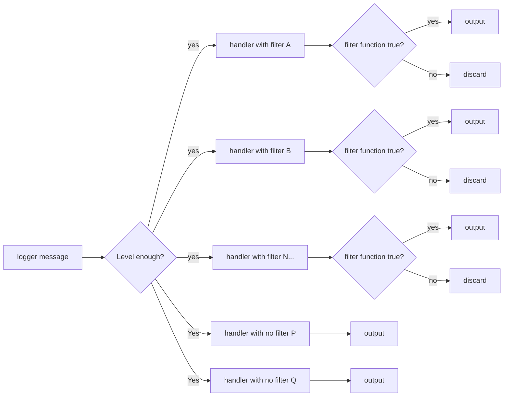

大部分已經都有預設格式, 也可以依照自己需求設計  
功能包含 日誌分級, rotate, 格式化輸出 等等...   


> 需注意 Loguru的logger是 pass by reference,   


## remove handler
可以刪除之前的所有設定, 也包含本來就存在的handler 
 
```python
from loguru import logger
logger.remove()
import sys
from loguru import logger

logger.remove()
format = "<green>{time}</green> | <level>{level}</level>     | <blue>{name}:{function}:{extra[ip]}:{extra[request_id]}:{extra[user]}:{line}</blue> - <level>{message}</level>"

logger.add(sys.stdout, level="INFO", format=format) # 增加第一個handler to stdout
```
這樣可以避免重複輸出, 但只能設定一組handler  

## add handler

主要是處理輸出, 可以對輸出進行格式化, 分級, 重新向, rotate  

```python
import sys

from loguru import logger

logger.remove()
format = "<green>{time}</green> | <level>{level}</level>     | <blue>{name}:{function}:{extra[ip]}:{extra[request_id]}:{extra[user]}:{line}</blue> - <level>{message}</level>"

logger.add(sys.stdout, level="INFO", format=format) # 增加第一個handler to stdout
```

定向至stdout, 且為INFO以上的log, 使用特定格式輸出  


### filter function
filter設定是一個callable function 參數傳入dict  
傳入一個dict, 並存在各種key, 對應該次log的所有屬性,    
例如: level, message, name, function, line, time, exception, extra, record_id, thread, process, elapsed, file, path, module, and so on.  

```
{'elapsed': datetime.timedelta(microseconds=15719), 'exception': None, 'extra': {'ip': '123.123.123.111', 'request_id': '18', 'user': 'someone_else'}, 'file': (name='test.py', path='/home/hccuse/dev/ETC/log_test/fastapi-sam-base-dev-template/test.py'), 'function': 'testact', 'level': (name='SUCCESS', no=25, icon='✅'), 'line': 38, 'message': 'set action successfully', 'module': 'test', 'name': '__main__', 'process': (id=112553, name='MainProcess'), 'thread': (id=140287233048576, name='MainThread'), 'time': datetime(2024, 1, 3, 14, 3, 23, 545979, tzinfo=datetime.timezone(datetime.timedelta(seconds=28800), 'CST'))}
```

```python
import sys
from typing import Dict, Any
from loguru import logger

def filter_func(record: Dict[str, Any]):
    print("enter filter_func","all handler will trigger",record["level"].name)
    if record["level"].name == "SUCCESS":
        print("this is success handler")
        return True
    return False
logger.remove()
format = "<green>{time}</green> | <level>{level}</level>     | <blue>{name}:{function}:{extra[ip]}:{extra[request_id]}:{extra[user]}:{line}</blue> - <level>{message}</level>"

logger.add(sys.stdout, level="INFO", format=format, filter=lambda x: "INFO" in x["level"].name)
logger.add(sys.stdout, level="SUCCESS", format=format,
           filter=filter_func)
```


### 參考流程圖




### 範例一

分級增加handler, 卻沒有filter

```python
import sys

from loguru import logger

logger.remove()
format = "<green>{time}</green> | <level>{level}</level>     | <blue>{name}:{function}:{extra[ip]}:{extra[request_id]}:{extra[user]}:{line}</blue> - <level>{message}</level>"

logger.add(sys.stdout, level="INFO", format=format) # 增加第一個handler to stdout
logger.add(sys.stdout, level="SUCCESS", format=format) # 增加第二個handler to stdout, 對於SUCCESS 實際上設定了兩個 
logger.add(sys.stdout, level="WARNING", format=format) # 增加第三個handler to stdout 對於WARNING 實際上設定了三個
logger.add(sys.stderr, level="ERROR", format=format) # 增加第四個handler to stderr 對於ERROR 實際上設定了四個

def testact():
    context_logger = logger.bind(ip="null", request_id="null", user="null")
    c1 = context_logger.bind(user="someone_else", request_id="18", ip="123.123.123.111")
    c1.info("set action")
    c1.success("set action successfully")
    c1.warning("123")
    c1.error("####")


testact()
```

```
2024-01-03T10:35:32.139555+0800 | INFO     | __main__:testact:123.123.123.111:18:someone_else:27 - set action
2024-01-03T10:35:32.139879+0800 | SUCCESS     | __main__:testact:123.123.123.111:18:someone_else:28 - set action successfully
2024-01-03T10:35:32.139879+0800 | SUCCESS     | __main__:testact:123.123.123.111:18:someone_else:28 - set action successfully
2024-01-03T10:35:32.140283+0800 | WARNING     | __main__:testact:123.123.123.111:18:someone_else:29 - 123
2024-01-03T10:35:32.140283+0800 | WARNING     | __main__:testact:123.123.123.111:18:someone_else:29 - 123
2024-01-03T10:35:32.140283+0800 | WARNING     | __main__:testact:123.123.123.111:18:someone_else:29 - 123
2024-01-03T10:35:32.140800+0800 | ERROR     | __main__:testact:123.123.123.111:18:someone_else:30 - ####
2024-01-03T10:35:32.140800+0800 | ERROR     | __main__:testact:123.123.123.111:18:someone_else:30 - ####
2024-01-03T10:35:32.140800+0800 | ERROR     | __main__:testact:123.123.123.111:18:someone_else:30 - ####
2024-01-03T10:35:32.140800+0800 | ERROR     | __main__:testact:123.123.123.111:18:someone_else:30 - ####
```


### 範例二

```python
import sys
from typing import Dict, Any

from loguru import logger


def filter_func(record: Dict[str, Any]):
    print("enter filter_func","all handler will trigger",record["level"].name)
    if record["level"].name == "SUCCESS":
        print("this is success handler")
        return True
    return False


logger.remove()
format = "<green>{time}</green> | <level>{level}</level>     | <blue>{name}:{function}:{extra[ip]}:{extra[request_id]}:{extra[user]}:{line}</blue> - <level>{message}</level>"

logger.add(sys.stdout, level="INFO", format=format, filter=lambda x: "INFO" in x["level"].name)
logger.add(sys.stdout, level="SUCCESS", format=format,
           filter=filter_func)
logger.add(sys.stdout, level="WARNING", format=format,
           filter=lambda x: "WARNING" in x["level"].name)
logger.add(sys.stderr, level="ERROR", format=format, filter=lambda x: "ERROR" == x["level"].name)


def testact():
    context_logger = logger.bind(ip="null", request_id="null", user="null")
    c1 = context_logger.bind(user="someone_else", request_id="18", ip="123.123.123.111")
    c1.info("set action")
    c1.success("set action successfully")
    c1.warning("123")
    c1.error("####")


testact()
```


```
2024-01-03T14:10:00.008684+0800 | INFO     | __main__:testact:123.123.123.111:18:someone_else:37 - set action
enter filter_func all handler will trigger SUCCESS
this is success handler
2024-01-03T14:10:00.008877+0800 | SUCCESS     | __main__:testact:123.123.123.111:18:someone_else:38 - set action successfully
enter filter_func all handler will trigger WARNING
2024-01-03T14:10:00.008983+0800 | WARNING     | __main__:testact:123.123.123.111:18:someone_else:39 - 123
enter filter_func all handler will trigger ERROR
2024-01-03T14:10:00.009098+0800 | ERROR     | __main__:testact:123.123.123.111:18:someone_else:40 - ####
```


## 實際應用範例

### API log  
```python
import sys
from fastapi import Request
from loguru import logger
import os
logdir = os.path.join(os.path.dirname(os.path.dirname(os.path.abspath(__file__))), "logs")
logger.remove()
format = "<green>{time}</green> | <level>{level}</level>     | <blue>{name}:{function}:{extra[ip]}:{extra[method]}:{extra[path]}:{extra[request_id]}:{extra[user]}:{line}</blue> - <level>{message}</level>"
## logger always pass by reference, even pass as parameter into function
logger.add(sys.stdout, level="INFO", format=format, filter=lambda x: x["level"].name == "INFO")
logger.add(sys.stdout, level="SUCCESS", format=format, filter=lambda x: x["level"].name == "SUCCESS")
logger.add(sys.stdout, level="WARNING", format=format, filter=lambda x: x["level"].name == "WARNING")
logger.add(sys.stderr, level="ERROR", format=format, filter=lambda x: x["level"].name == "ERROR")
logger.add(sys.stderr, level="CRITICAL", format=format, filter=lambda x: x["level"].name == "CRITICAL")
logger.add(os.path.join(logdir,"logic.log"), format=format, rotation="12:00", retention="10 days", level="INFO", enqueue=True,
           serialize=True, filter=lambda x: x["level"].name == "INFO")
logger.add(os.path.join(logdir,"logic.log"), format=format, rotation="12:00", retention="10 days", level="SUCCESS", enqueue=True,
           serialize=True, filter=lambda x: x["level"].name == "SUCCESS")
logger.add(os.path.join(logdir,"logic.log"), format=format, rotation="12:00", retention="10 days", level="WARNING", enqueue=True,
           serialize=True, filter=lambda x: x["level"].name == "WARNING")
logger.add(os.path.join(logdir,"error.log"), format=format, rotation="12:00", retention="10 days", level="ERROR", enqueue=True,
           serialize=True, filter=lambda x: x["level"].name == "ERROR")
logger.add(os.path.join(logdir,"critical.log"), format=format, rotation="12:00", retention="10 days", level="CRITICAL", enqueue=True,
           serialize=True, filter=lambda x: x["level"].name == "CRITICAL")

def get_logger(request: Request = None) -> logger:
    """
    自定義logger, 多增加 request id, username, ip , api path, method
    """
    clogger = logger.bind(ip="null", request_id="null", user="null", path="null", method="null")
    if request and request.state.__dict__["_state"].get("username"):
        return clogger.bind(ip=request.client.host, request_id=request.state.request_id,
                            user=request.state.username, path=request.url.path, method=request.method)
    elif request:
        return clogger.bind(ip=request.client.host, request_id=request.state.request_id,
                            user="NO AUTH", path=request.url.path, media_type=request.method)

    return clogger.bind(user="NO AUTH")
```
