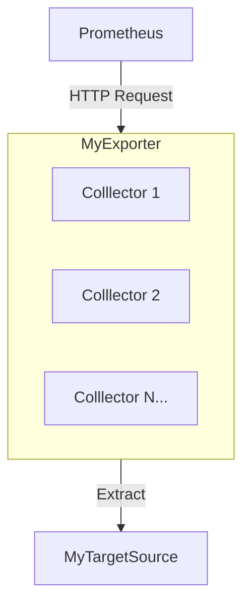

Prometheus Exporter 交互架構圖 




>> Prometheus 實際上可以理解成一個資料庫, 並可以使用一些PromQL進行查詢   
Prometheus 獲取資料的方式是藉由發起 HTTP Request 與想監測的資源互動  
但想監測的資源並不一定會提供 Prometheus 的資料格式接口  
這邊會需要利用Exporter作為中間人使 prometheus 可以獲取監控目標的資料  
簡單的說 Exporter 就是一個 HTTP 的API Server, 只是response的格式是符合Prometheus的格式  

>> Collector 是 Prometheus 官方定義的一種物件資源, 主要用來將資料源抽象化, 並提供一個統一的介面給Exporter使用  
> 假設某Exporter 可能需要監控某元件 A,B,C種類型的資料, 這時候就可以使用Collector來將A,B,C的資料抽象化,  
> 若某些情況只需要A類型資料, 就可以很只調用A的Collector即可, 


## Exporter 範例

Go有提供SDK可以快速的開發Exporter,  
流程 簡單來說就是 定義一個collector,  
然後將collector註冊到Exporter Register,  
再藉由HTTP Server將監控資料暴露出去   


### Exporter 主要邏輯範例  
```
func main() {

	c := &MyCollector{}
	// 定義一個collector

	reg := prometheus.NewRegistry()
	// 創建一個prometheus的註冊器

	reg.MustRegister(c)
	// 註冊自定義的collector

	http.Handle("/metrics", promhttp.HandlerFor(reg, promhttp.HandlerOpts{}))
	http.ListenAndServe(":18081", nil)
	// 啟動一個http server, 並且將監控資料暴露出去  

}
```

- Collector: 接口只須滿足Describe, Collect兩個方法即可  
- Describe: 用來定義監控資料的meta data, 當監控資料被註冊到Exporter時, 會被調用一次
- Collect: 用來定義監控資料的數值, 每當該Http Server被請求時, 會被調用一次   
<br/>
啟動後, Prometheus 就會每過一小段間隔, 對該Http Server發起一次請求, 並將資料存入prometheus的資料庫  
<br/>

### Collector 自定義範例
```go
type MyCollector struct {
	queue_set map[string]*prometheus.Desc 
	// 創建一個map 存放監控資料的meta data 
    // 這邊的key 是監控資料的名稱, value 是該監控資料的meta data
    // promtheus.Desc 是SDK提供的一個結構, 用來定義監控資料的meta data
}

// 將 定義監控的資料類型的 prometheus.Desc 傳入ch
// 這邊是監控兩組資料 名為 my_gauge, my_counter
func (self *MyCollector) Describe(ch chan<- *prometheus.Desc) {
	ch <- self.queue_set["my_gauge"]
	ch <- self.queue_set["my_counter"]
}

// 將數值更新至 instance, 傳入
func (self *MyCollector) Collect(ch chan<- prometheus.Metric) {
	val := rand.Intn(999999)
	sessionid1 := []string{strconv.Itoa(rand.Intn(1111)), strconv.Itoa(rand.Intn(2222))}
	sessionid2 := []string{strconv.Itoa(rand.Intn(2222)), strconv.Itoa(rand.Intn(3222))}
	// 這邊是模擬一組數值   
	
	
	ch <- prometheus.MustNewConstMetric(self.queue_set["my_gauge"], prometheus.GaugeValue, float64(val), sessionid1...)
	// 將當下的數值更新至 my_gauge,    
	// MustNewConstMetric 是SDK提供的一個方法, 用來創建一個監控資料的數值
	// 參數依序是 1. 該metric的meta data 是哪一組,  2. 該metric的數值類型, 3. 該metric的數值, 4. 這組metric有設定動態的label, 這邊是設定該次的labe數值  
	
	ch <- prometheus.MustNewConstMetric(self.queue_set["my_counter"], prometheus.CounterValue, float64(time.Now().Unix()), sessionid2...)
    // 同上 只是是更新 my_counter 的數值
}
```

### 完整範例

將上面collect結合main的範例, 就可以啟動一個Exporter, 並且將監控資料暴露出去  

```go
package main

import (
	"github.com/prometheus/client_golang/prometheus"
	"github.com/prometheus/client_golang/prometheus/promhttp"
	"math/rand"
	"net/http"
	"strconv"
	"time"
)

type MyCollector struct {
	queue_set map[string]*prometheus.Desc // define data queue instance
}

func (self *MyCollector) Describe(ch chan<- *prometheus.Desc) {
	ch <- self.queue_set["my_gauge"]
	ch <- self.queue_set["my_counter"]
}

func (self *MyCollector) Collect(ch chan<- prometheus.Metric) {
	val := rand.Intn(999999)
	sessionid1 := []string{strconv.Itoa(rand.Intn(1111)), strconv.Itoa(rand.Intn(2222))}
	sessionid2 := []string{strconv.Itoa(rand.Intn(2222)), strconv.Itoa(rand.Intn(3222))}
	ch <- prometheus.MustNewConstMetric(self.queue_set["my_gauge"], prometheus.GaugeValue, float64(val), sessionid1...)
	ch <- prometheus.MustNewConstMetric(self.queue_set["my_counter"], prometheus.CounterValue, float64(time.Now().Unix()), sessionid2...)
}

func main() {

	c := &MyCollector{queue_set: map[string]*prometheus.Desc{
		"my_gauge": prometheus.NewDesc("my_gauge", "gauge_help_tag", []string{"l1", "l2"}, map[string]string{ // 靜態label
			"static_example": "I am static value",
		}),
		"my_counter": prometheus.NewDesc("my_counter", "counter_help_tag", []string{"l3", "l4"}, nil),
	}}
	// 創建一個collector instance

	reg := prometheus.NewRegistry() 
	// 創建一個prometheus的註冊器

	reg.MustRegister(c)
	// 將collector 註冊到 prometheus 的註冊器 


	http.Handle("/metrics", promhttp.HandlerFor(reg, promhttp.HandlerOpts{}))
	http.ListenAndServe(":18081", nil)  // 自定義 port 18081

}
```  

執行後 透過 http://localhost:18081/metrics 就可以看到監控資料  


