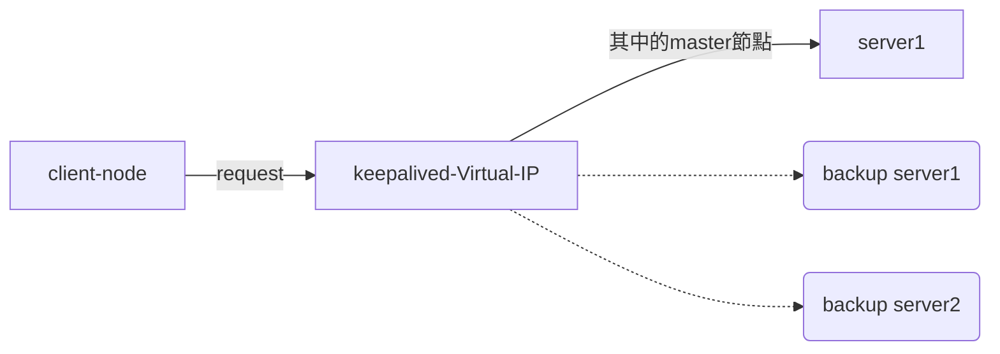

nginx的高可用解決方案之一,  
主要概念是keepalived會創建一個虛擬ip, 用戶只要對該虛擬ip進行訪問, 藉由keepalived的機制, 會將訪問導向正常運作的伺服器
keepalived會需要跟提供的服務一起佈署在主機上 (這邊代表各節點都會安裝nginx+keepalived)




***keepalived是獨立的套件 不一定要跟nginx一起使用, 這邊只是把nginx作為後端服務***


## keepalived

keepalived 佈署在各主機上後, 他們之間會定期通訊 依照設定選舉出一個master,之後的訪問都會導向master節點,    
當master節點失效時, 會重新選舉出新的master節點, 這樣就可以保證服務的高可用性  

/etc/keepalived/keepalived.conf  

最低程度設定 參考如下
```
global_defs {
   router_id test01 ## keepalived unique id
}


## keepalived後面的實體節點配置
vrrp_instance test_keepalived { ## keepalived的實體名稱, 同一組集群設定需相同
    state MASTER ## 啟動時的狀態
    interface eth0 ## 監聽的網路界面 可用ifconfig 查看
    virtual_router_id 51 ## 該網路內 keepalived的虛擬路由器ID, 同一組集群設定需相同
    priority 50 ## keepalived的優先級 調度時優先級高的為master
    authentication { ## 該網路內 keepalived的配盾通訊密碼, 同一組集群設定需相同
        auth_type PASS
        auth_pass 1111
    }
    virtual_ipaddress { ## 該網路內 keepalived的虛擬IP, 可藉由該組ip訪問後端的服務
        131.25.0.200
    }
}

```


## nginx

這邊不用特別做設定   


## playground

這邊用容器啟動四台機器, 一台作為客戶端訪問, 例外三台作為後端伺服器,   

這邊效果大概是
```bash
curl 131.25.0.200
## 當前位於client主機
## 藉由keepalived 虛擬ip 訪問後端 nginx服務
```
一開始會訪問到n1 (預設master)   
當n1失效時 會訪問到n3 (backup機器中優先度高)  
當n3失效時 會訪問到n2  
若n1恢復正常, 則會重新訪問到n1  


### Dockerfile

```
FROM ubuntu:22.04
RUN apt-get update -y \
    && apt-get install keepalived -y \
    && apt-get install nginx -y \
    && apt-get install vim  -y \
    && apt-get install fish -y \
    && apt-get install systemctl -y \
    && apt-get install init -y \
    && apt-get install net-tools -y \
    && apt-get install curl -y
```


### docker compose 

```yaml
version: "3.8"
services:
  client:
    image: test_env
    privileged: true
    container_name: c1
    build:
      context: .
      dockerfile: ./Dockerfile
    tty: true
    networks:
      alive_net:
        ipv4_address: 131.25.0.100

  nginx_keep_master:
    image: test_env
    privileged: true
    container_name: n1
    build:
      context: .
      dockerfile: ./Dockerfile
    command: /sbin/init
    volumes:
      - ./keepalived1.conf:/etc/keepalived/keepalived.conf
      - ./index1.html:/var/www/html/index.nginx-debian.html # for verifying machine number
    networks:
      alive_net:
        ipv4_address: 131.25.0.2

  nginx_keep_backup1:
    image: test_env
    privileged: true
    container_name: n2
    build:
      context: .
      dockerfile: ./Dockerfile
    volumes:
        - ./keepalived2.conf:/etc/keepalived/keepalived.conf
        - ./index2.html:/var/www/html/index.nginx-debian.html  # for verifying machine number
    command: /sbin/init
    networks:
      alive_net:
        ipv4_address: 131.25.0.3

  nginx_keep_backup2:
    image: test_env
    privileged: true
    container_name: n3
    build:
      context: .
      dockerfile: ./Dockerfile
    volumes:
      - ./keepalived3.conf:/etc/keepalived/keepalived.conf
      - ./index3.html:/var/www/html/index.nginx-debian.html # for verifying machine number
    command: /sbin/init
    networks:
      alive_net:
        ipv4_address: 131.25.0.4

networks:
  alive_net:
    name: "alive_net"
    driver: bridge
    ipam:
      config:
        - subnet: 131.25.0.0/16
          gateway: 131.25.0.1
```

### keepalived1.conf


```
global_defs {
   router_id test01 ## keepalived unique id
}


## keepalived後面的實體節點配置
vrrp_instance test_keepalived { ## keepalived的實體名稱
    state MASTER ## 啟動時的狀態
    interface eth0 ## 監聽的網路界面 可用ifconfig 查看
    virtual_router_id 51 ## 該網路內 keepalived的虛擬路由器ID, 同一組集群設定需相同
    priority 100 ## keepalived的優先級 調度時優先級高的為master
    authentication { ## 該網路內 keepalived的配盾通訊密碼, 同一組集群設定需相同
        auth_type PASS
        auth_pass 1111
    }
    virtual_ipaddress { ## 該網路內 keepalived的虛擬IP, 可藉由該組ip訪問後端的服務
        131.25.0.200
    }
}

```

### keepalived2.conf

```
global_defs {
   router_id test02 ## keepalived unique id
}


## keepalived後面的實體節點配置
vrrp_instance test_keepalived { ## keepalived的實體名稱
    state BACKUP ## 啟動時的狀態
    interface eth0 ## 監聽的網路界面 可用ifconfig 查看
    virtual_router_id 51 ## 該網路內 keepalived的虛擬路由器ID, 同一組集群設定需相同
    priority 50 ## keepalived的優先級 調度時優先級高的為master
    authentication { ## 該網路內 keepalived的配盾通訊密碼, 同一組集群設定需相同
        auth_type PASS
        auth_pass 1111
    }
    virtual_ipaddress { ## 該網路內 keepalived的虛擬IP, 可藉由該組ip訪問後端的服務
        131.25.0.200

    }
}

```

### keepalived3.conf
```
global_defs {
   router_id test03 ## keepalived unique id
}


## keepalived後面的實體節點配置
vrrp_instance test_keepalived {  ## keepalived的實體名稱
    state BACKUP ## 啟動時的狀態  MASTER/BACKUP , 優先度 master > backup
    interface eth0 ## 監聽的網路界面 可用ifconfig 查看
    virtual_router_id 51 ## 該網路內 keepalived的虛擬路由器ID, 同一組集群設定需相同
    priority 80 ## keepalived的優先級 當Master失效時 調度時優先級高的會轉為 master
    authentication { ## 該網路內 keepalived的配盾通訊密碼, 同一組集群設定需相同
        auth_type PASS
        auth_pass 1111
    }
    virtual_ipaddress { ## 該網路內 keepalived的虛擬IP, 可藉由該組ip訪問後端的服務
        131.25.0.200

    }
}
```

