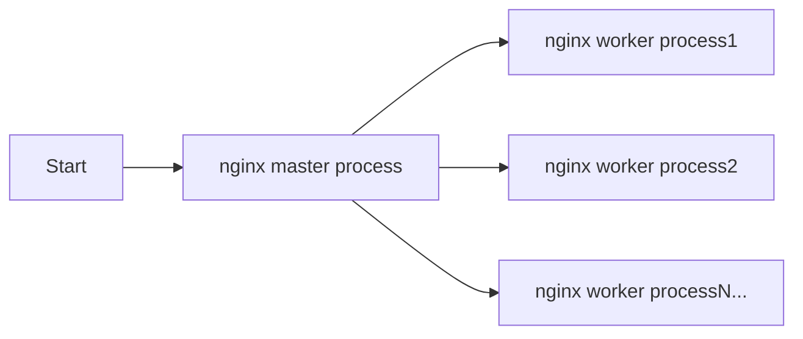
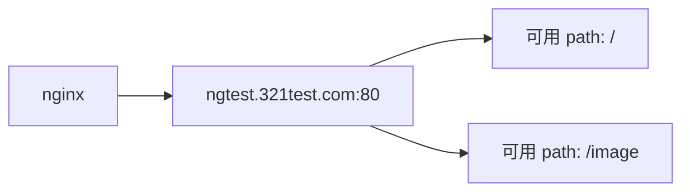
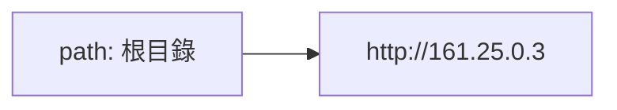
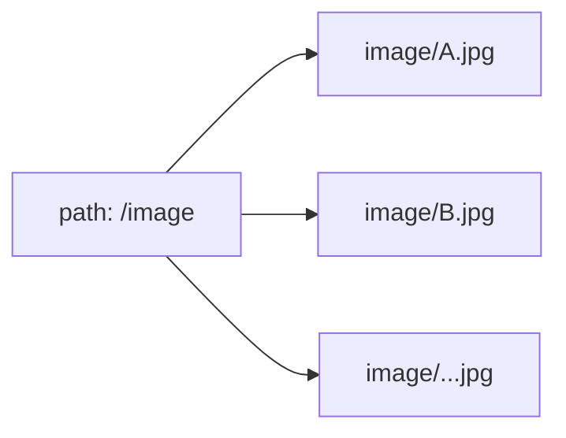

稍微系統整理相關設定  

## 流程

Nginx 啟動後有一個 master process, 負責讀取設定文件, 並fork出多個worker process, 這些worker process負責處理實際的請求.  
請求近來後, 實際上是由worker process 解析並處理,  
會查找 html目錄下的相對應文件, 並返回給客戶端.



## 文件基礎設定

nginx.conf

```
user  nginx;
worker_processes  auto;
## 這裡的auto會根據系統的cpu核心數自動設定, 若自訂則是 直接指定worker數量, 例如: worker_processes  4;  

error_log  /var/log/nginx/error.log notice;
## error log 的位置  
pid        /var/run/nginx.pid;
## 紀錄nginx master process的pid, 用於停止nginx時使用  

events {
    worker_connections  1024;
}
## 每個worker process 可以同時處理的連線數量, 這裡設定為1024,  每個worker process 最多可以同時處理1024個連接數  


http {
    include       /etc/nginx/mime.types;
    ## 輸入其他位置的設定檔, 分檔有助於維護管理 
    ## mime_type 該檔是定義response header中的Content-Type, 使其瀏覽器取得response時, 可以用正確的方式解析請求
    ## 例如:
    ## text/html                                        html htm shtml;
    ## 若請求對應的檔案為.html, 則response的content-type 就會是 text/html     
    
    default_type  application/octet-stream;
    ## 若mine_type 或其他設定檔沒有該檔案類型的設定, 則會用這個預設值, 

    log_format  main  '$remote_addr - $remote_user [$time_local] "$request" '
                      '$status $body_bytes_sent "$http_referer" '
                      '"$http_user_agent" "$http_x_forwarded_for"';

    access_log  /var/log/nginx/access.log  main;

    sendfile        on;
    ## sendfile 用於開啟高效能的檔案傳輸模式,
    ## 這個模式下, nginx會直接在kernel中處理請求, 直接將檔案從磁碟讀取到網路傳輸,
    ## off的話, nginx會將檔案讀取到自己的記憶體中, 再傳輸到網路, 這樣會多一次記憶體的拷貝, 性能較差  
    
    #tcp_nopush     on;

    keepalive_timeout  65;

    #gzip  on;

    include /etc/nginx/conf.d/*.conf;
    ## 載入其他設定檔, 這裡載入的是conf.d目錄下的所有.conf檔案,


## 虛擬伺服器設定, 讓一個nginx server可以處理多個vhost請求  
    server {
        listen       80;
        ## 監聽port
        listen  [::]:80;
        server_name  localhost;
        ## server_name 用於設定該vhost的domain name, 
        ## 若有多個domain name, 可以用空格分開
        ## 預設localhost, 對應本機127.0.0.1 
        
    
        location / {
            root   /usr/share/nginx/html; ## 檔案目錄
            index  index.html index.htm;  ## 指向檔案名稱
        }
        ## 主要為url的path, 即uri   
    
        error_page   500 502 503 504  /50x.html;
        ##  若該vhost發生錯誤, 會跳轉置server_name/50x.html 這個頁面,
        ## 但其實沒有該頁面, 
        
        location = /50x.html {             ## 這邊是catch該路徑的處理
            root   /usr/share/nginx/html;  ## 該路徑會指向該目錄下
        }
        ## 直接查找path=/50x.html,  就會跳至root目錄 , 也就是至 /usr/share/nginx/html/下
        ## 尋找 50x.html 這個檔案
        }
}
```

### DNS

層級於 http -> resolver  
使用docker佈署時, 可能會遇到不會自動使用docker內部的DNS, 這時需手動追加

```
http {

    resolver 127.0.0.11 ipv6=off; ## Use docker internal DNS

    include       /etc/nginx/mime.types;
    default_type  application/octet-stream;

    log_format  main  '$remote_addr - $remote_user [$time_local] "$request" '
                      '$status $body_bytes_sent "$http_referer" '
                      '"$http_user_agent" "$http_x_forwarded_for"';

    access_log  /var/log/nginx/access.log  main;

    sendfile        on;
    #tcp_nopush     on;

    keepalive_timeout  65;

    #gzip  on;

    include /etc/nginx/conf.d/*.conf;
}

```

## Server

主要是將請求跳轉至某個虛擬伺服器上(可理解成request -> host:port -> 某個目標),   
目標可以是本機檔案 或是 其他url   
層級在http -> server

> 抽象化概念  
host:port 指向的是一個ningx的目錄物件  

範例

```
    server {
        listen       80;   ## nignx監聽的port
        listen  [::]:80;   ## ipv6
        server_name  localhost;  ## reuqest的domain name, 若有多個domain name, 可以用空格分開
    
        location / {  ## 當該虛擬伺服器的物件接收到request時, 路徑符合 / 規則, 則會導向root目錄下的index.html, 其他也可是proxypass,   
            root   /usr/share/nginx/html; ## 檔案目錄
            index  index.html index.htm;  ## 指向檔案名稱
        }
    
        error_page   500 502 503 504  /50x.html; ## 狀態碼為500,502,503,504時, 會導向uri/50x.html
        
        location = /50x.html {             ## 處理上方error page 路徑  
            root   /usr/share/nginx/html;  ## 該路徑會指向該目錄下的 /50x.html
        }
    }
```

簡單說就是處理 request host:port 這個東西的導向

後續進一步處理會在 server下的 location中處理

## Location

解析request後    
藉由該request的host:port 導向特定nginx server物件   
再由該request的uri path 導向特定的nginx location物件    
location可分    
由 root,index 將本機檔案內容 response回去  , index為開放的檔案名稱, 預設index.html,其他不寫則會304   
或   
由 proxy_pass 將其他主機的服務內容 response回去  
<br/>  
Location uri path匹配方式依開頭符號會有所不同  

> 抽象化概念  
> host:port  nginx 根目錄物件   
> uri path  nginx 根目錄物件下的檔案/目錄   


| 開頭符號 | 說明           |
|------|--------------|
| `=`  | 精確匹配         |
| `^~` | 前綴匹配         |
| `~`  | 正則表達式,區分大小寫  |
| `~*` | 正則表達式,不區分大小寫 |
| `/`  | 通用匹配         |

***該開頭符號也適用於server的domain name設定***


***須注意 location匹配後 也會將匹配的pattern作為 uri 接在root後面***

以下用location的path來說明  

### `=`

需要全部符合才會匹配  

```
location = /test {
    root   /usr/share/nginx/html;
    index  index.html index.htm;
}

# /test     可
# /test/    不可
# /test/23  不可
# /test2    不可
```

### `^~`

必須以特定字串開頭才會匹配  

```
location ^~ /test {
    root   /usr/share/nginx/html;
    index  index.html index.htm;
}

# /test/123 可
```

### `~`

正則表達式, 區分大小寫  

```
location ~ /test$ {
    root   /usr/share/nginx/html;
    index  index.html index.htm;
}

# /test     可  
# /Test/    不可  
# /test/23  不可  
# /test2    不可  
```

### `~*`

正則表達式, 不區分大小寫  

```
location ~* /test$ {
    root   /usr/share/nginx/html;
    index  index.html index.htm;
}
# /test     可
# /Test     可
# /test/23  不可
# /test/    不可
```

### `/`

通用匹配, 會匹配所有的路徑  

```
location / {
    root   /usr/share/nginx/html;
    index  index.html index.htm;
}

# /index.html   可
# /test         可
# /Test         可
# /test/23      可
```

```
location /test {
    root   /usr/share/nginx/html;
    index  index.html index.htm;
}

# /test         可
# /test2         可
# /test/23      可

```

## root & index

> 抽象類  
> Location uri path  nginx 目錄物件下的檔案/目錄 物件  

root 定義 Location 的檔案根目錄   
index 定義 Location 的檔案名稱  

用於輸出本機的特定檔案/目錄   
層級於   
http -> server -> location -> root   
http -> server -> location -> index   
root 主要是定義想要輸出檔案的目錄, 通常與index一起使用   
index 則是定義想要輸出的檔案名稱,  

假設想要輸出 /home/root/mypage/index.html  
可  

```
location / {
    root   /home/root/mypage;
    index  index.html;
}
```

***需注意目錄是沒辦法遞迴, 若有靜態檔案是在該目錄的目錄內, 讀取上是會有問題的***  
root 沒用絕對路徑, 預設位置為 /usr/share/nginx    


## proxy_pass

用於輸出其他主機的服務內容     
就可用ProxyPass將請求跳轉到其他server    
層級在http -> server -> location -> ProxyPass  
若在location中使用ProxyPass, 則root,index等設定會被忽略

需注意 proxy_pass 必須是http://開頭,且只能跳轉http協議, 不能跳轉https協議, 若帶https會報錯   
若使用upstream 則是 `http://<upstream name>`  
指向可以是url或是upstream

```
server {
    listen       80;
    server_name  ngtest.test.com2;


    location / {
        proxy_pass http://161.25.0.5;
    }

    error_page   500 502 503 504  /50x.html;
    location = /50x.html {
        root   /usr/share/nginx/html;
    }

}
```

## Upstream

> 抽象類 , nginx load balance 對應的主機群物件  

upstream 用於定義一組server群的進入點, 可用於設定load balance策略   
***使用時 須注意load balance對有狀態服務的影響***  

層級在http -> upstream  

與server是同一層級的  

若用瀏覽器 可關閉cache,,否則可能看不出效果 chrome,F12, network, disable cache, 先不不關閉開發者頁面, 直接F5 重新整理,  
應該可看出效果    
自己測試時 若不停留開發者介面還是會吃cache , 待釐清  

***須注意 upstream內的host, 不能有http:// ... , 只能直接host***  

```
upstream backends {
    server 161.25.0.3;
    server 161.25.0.4;
    server 161.25.0.5;
}

server {
    listen       80;
    server_name  ngtest.test.com;


    location / {
        proxy_pass http://backends;
    }

    error_page   500 502 503 504  /50x.html;
    location = /50x.html {
        root   /usr/share/nginx/html;
    }

}
```

### load balance 策略後綴關鍵字  

| 關鍵字    | 說明                                  |
|--------|-------------------------------------|
| weight | 權重, 用於設定server的權重比例, 用於load balance |
| down   | 不參與 load balance                    |
| backup | 備援機 平時不參與, 無機器可用時 才會參與              |

weight 不設定則是平均輪詢   
若有設定則造成權重比例進行輪詢  

```
upstream backends {
    server 161.25.0.3 weight=1;
    server 161.25.0.4 weight=2;
    server 161.25.0.5 weight=3;
}
```

down 表示該server不參予load balance,  

```
upstream backends {
    server 161.25.0.3 weight=1 down;
    server 161.25.0.4 weight=2;
    server 161.25.0.5 weight=3;
}
```

backup 表示該server為備援機, 平時不參與load balance, 當其他server都無法提供服務時, 才會參與   
啟動機制, 嘗試連線 161.25.0.4, 但若這台無法連線 等待至timeout, 下次請求就會轉至 161.25.0.5   
實際上每次連線還是會嘗試找 161.25.0.4 這台, 若該台回復服務後, 161.25.0.5 會馬上再次被閒置  

```
upstream backends {
    server 161.25.0.3 weight=1 down;
    server 161.25.0.4 weight=2;
    server 161.25.0.5 weight=3 backup;
}
```

### 其他load balance策略

hash偏定向分配,   

| 關鍵字        | 說明                        |
|------------|---------------------------|
| least_conn | 連接數與權重比值最小的為優先            |
| ip_hash    | 依據ip hash, 同ip會分配至同一個節點   |
| url_hash   | 依據url hash, 同url會分配至同一個節點 |


## proxy_pass 靜態檔案

這邊在nginx直接設定 proxypass後的 服務會用到的靜態檔案  

這邊把proxy_pass後的服務會用到的靜態檔案放在 proxy_pass主機上  

範例  
```
server {
    listen       80;
    server_name  ngtest.321test.com;


    location / {
        proxy_pass http://161.25.0.3;
    }

    location /image {
        root /usr/share/nginx/html;  
    }

    error_page   500 502 503 504  /50x.html;
    location = /50x.html {
        root   /usr/share/nginx/html;
    }

}
```

這邊概念應該是  


可以將ngtest.321test.com:80 理解成一個空目錄   
uri定義該目錄有啥檔案  





因此 ngtest.321test.com 也可以讀取到proxy_pass的 /image/...jpg  


## rewrite

可以使外部使用偽uri,不將真正的uri暴露出去, 這樣可以保護內部的uri, 也可以使uri更加美觀  

靜態範例  

```
server {
    listen       80;
    server_name  ngtest.4321test.com;


    location / {
        rewrite ^/2.html /index.html break;
        proxy_pass http://161.25.0.3;
    }


    error_page   500 502 503 504  /50x.html;
    location = /50x.html {
        root   /usr/share/nginx/html;
    }

}
```

lcation / 會批配所有的uri  
但rewrite只會批配/2.html, 並且將其轉換成/index.html  

動態範例  

```
server {
    listen       80;
    server_name  ngtest.54321test.com;


    location / {
        rewrite ^/([0-9]+).html$ /index.html?page=$1 break;
        proxy_pass http://161.25.0.3;
    }


    error_page   500 502 503 504  /50x.html;
    location = /50x.html {
        root   /usr/share/nginx/html;
    }

}
```

批配 開頭/ 數字1-9 一個或多個 .html 結尾的uri, 並且將其轉換成/index.html?page=$1    
$1 代表第一個返回的內容 也就是第一組括號的內容  
假設輸入 http://ngtest.4321test.com/32.html  
實際上 會轉換成 http://ngtest.4321test.com/index.html?page=32   
break 確保rewrite後的uri不會再次進行location的匹配,    
其他關鍵字  

| 關鍵字       | 說明                      |
|-----------|-------------------------|
| last      | 批配完成後,還是會繼續後序批配         |
| break     | 一旦批配成功就會停止              |
| redirect  | 返回302,瀏覽器會跳至rewrite的url |
| permanent | 返回301,瀏覽器會跳至rewrite的url |

## referer

這個主要是用於防止盜連, 藉由referer來判斷客戶端是否是從指定的網站連過來的  

referer 是由瀏覽器操作在http request headers中的一個field, 使用瀏覽器訪問特定頁面時,該頁面可能有一些其他的資源, 如圖片,API之類的資源,   
在一并request這些資源時, 瀏覽器會在request headers中加入referer, 表示是從哪個頁面發起請求連過來的    
而初次訪問網站時, referer是空的, 這時可以用來判斷是否是直接訪問的網站, 或是從其他網站連過來的  

範例  
```
server {
    listen       80;
    server_name  ngtest.54321test.com;


    location / {
        proxy_pass http://161.25.0.3;
    }
    location /image {
        valid_referers 161.25.0.2;
        if ($invalid_referer) {
            return 403;
        }
        root /usr/share/nginx/html;
    }

    error_page   500 502 503 504  /50x.html;
    location = /50x.html {
        root   /usr/share/nginx/html;
    }

}
```
ngtest.54321test.com 是map 127.0.0.1:80 map 161.25.0.2  
161.25.0.3 是有內嵌  161.25.0.2/image的圖片(架在proxy_pass的static file)   
這個location只有在referer是訪問161.25.0.2, , 才會返回圖片, 否則返回403  
若直接訪問ngtest.54321test.com map `127.0.0.1:80` map 161.25.0.2:80  藉由nginx proxy_pass到 161.25.0.3,  
此時也會請求 ngtest.54321test.com/image/duck.jpg  
這時referer會是ngtest.54321test.com的, 所以會返回403  
要能正常訪問圖片, 要訪問的網頁直接是 161.25.0.2/ , 該網頁上有內嵌 /image/duck.jpge, 這樣referer才會是161.25.0.2  
<br/>

小坑  
```bash
curl -e http://XXXXX OOOOOO
## -e 使用referer, 代表是從哪個網站連過來的
## curl 若使用-e 參數, 必須要有http://
```


```bash
curl -e "http://ngtest.54321test.com" -I  ngtest.54321test.com/image/duck.jpg
# HTTP/1.1 403 Forbidden
## 實際訪問 ngtest.54321test.com/image/duck.jpg
## -e 表示refer 為http://ngtest.54321test.com, -I 表示只返回response header
# 此為模擬 訪問 http://ngtest.54321test.com, 該網頁上有內嵌 /image/duck.jpg, 這樣referer會是ngtest.54321test.com
```

```bash
curl -e "http://161.25.0.2" -I ngtest.54321test.com/image/duck.jpg
# HTTP/1.1 200 OK
## 實際訪問 ngtest.54321test.com/image/duck.jpg
## -e 表示refer 為http://161.25.0.2 , -I 表示只返回response header
## 此為模擬 訪問 http://161.25.0.2 , 該網頁上有內嵌 /image/duck.jpg, 這樣referer會是 161.25.0.2
```


若增加none 可以讓referer為空的時候也能訪問圖片, 直接不訪問特定網站 間接訪問圖片  
而是直接訪問圖片 ngtest.54321test.com/image/duck.jpg, 是可以訪問是可以成功的  

有None的範例  , 可直接訪問 ngtest.54321test.com/image/duck.jpg  
```
server {
    listen       80;
    server_name  ngtest.54321test.com;


    location / {
        proxy_pass http://161.25.0.3;
    }
    location /image {
        valid_referers none 161.25.0.2;
        if ($invalid_referer) {
            return 403;
        }
        root /usr/share/nginx/html;
    }

    error_page   500 502 503 504  /50x.html;
    location = /50x.html {
        root   /usr/share/nginx/html;
    }

}
```

```bash
curl -e "http://ngtest.54321test.com" -I  ngtest.54321test.com/image/duck.jpg
# HTTP/1.1 403 Forbidden
## 實際訪問 ngtest.54321test.com/image/duck.jpg
## -e 表示refer 為http://ngtest.54321test.com, -I 表示只返回response header
# 此為模擬 訪問 http://ngtest.54321test.com, 該網頁上有內嵌 /image/duck.jpg, 這樣referer會是ngtest.54321test.com
```
```bash
curl -I ngtest.54321test.com/image/duck.jpg
# HTTP/1.1 200 OK
## 因沒設置refer, refer = None, 因此可以訪問
```

```bash
curl -e "http://161.25.0.2" -I ngtest.54321test.com/image/duck.jpg
# HTTP/1.1 200 OK
## 實際訪問 ngtest.54321test.com/image/duck.jpg
## -e 表示refer 為http://161.25.0.2 , -I 表示只返回response header
## 此為模擬 訪問 http://161.25.0.2 , 該網頁上有內嵌 /image/duck.jpg, 這樣referer會是 161.25.0.2
```

## 測試設定範例

```bash
root@09725b99f67e:/usr/share/nginx/html# ls 
50x.html  image.html  index.html  video.html  txt.hmtl
```

nginx.conf中的http{}   
有將conf.d目錄下的所有.conf檔案載入,   
因此這邊直接在conf.d目錄下新增一個.conf檔案,

```
include /etc/nginx/conf.d/*.conf;
```

本機host設定  

```host
127.0.0.1 ngtest.test1
127.0.0.1 ngtest.test2
127.0.0.1 ngtest.test3
127.0.0.1 ngtest.test4
127.0.0.1 ngtest.test5.ooxx
127.0.0.1 ooxx.ngtest.test5
127.0.0.1 ngtest.test6.ooxx
127.0.0.1 ngtest.test7.ooxx
127.0.0.1 ngtest.test.com
127.0.0.1 ngtest.test.com2
127.0.0.1 ngtest.123test.com
127.0.0.1 ngtest.321test.com
```

若直接用IP直接連線, 會連忽略domain name的設定    
會連線至 domain name = IP 的 第一組設定  

### 不同domain name 映射不同的路徑檔案

兩個domain name 綁同一個ip 可連至同一個主機 各domain name 可連至 不同的路徑檔案  

ngtest.test1 --> image.html  
ngtest.test2 --> video.html  

```
server {
    listen       80;
    ## 監聽port
    server_name  ngtest.test1;
    ## server_name 用於設定該vhost的domain name,
    ## 若有多個domain name, 可以用空格分開
    ## 預設localhost, 對應本機127.0.0.1


    location / {
        root   /usr/share/nginx/html;
        index  image.html;
    }
    ## 主要為url的path, 即uri

    error_page   500 502 503 504  /50x.html;
    ##  若該vhost發生錯誤, 會跳轉置server_name/50x.html 這個頁面,
    ## 但其實沒有該頁面,

    location = /50x.html {
        root   /usr/share/nginx/html;
    }
    ## 這裡設定了一個location,去catch path= /50x.html,的情況
    ## 只要是查找path=/50x.html,  就會跳至root目錄 , 也就是至 /usr/share/nginx/html/下
    ## 尋找 50x.html 這個檔案
}


server {
    listen       80;
    ## 監聽port
    server_name  ngtest.test2;
    ## server_name 用於設定該vhost的domain name,
    ## 若有多個domain name, 可以用空格分開
    ## 預設localhost, 對應本機127.0.0.1


    location / {
        root   /usr/share/nginx/html;
        index  video.html;
    }
    ## 主要為url的path, 即uri

    error_page   500 502 503 504  /50x.html;
    ##  若該vhost發生錯誤, 會跳轉置server_name/50x.html 這個頁面,
    ## 但其實沒有該頁面,

    location = /50x.html {
        root   /usr/share/nginx/html;
    }
    ## 這裡設定了一個location,去catch path= /50x.html,的情況
    ## 只要是查找path=/50x.html,  就會跳至root目錄 , 也就是至 /usr/share/nginx/html/下
    ## 尋找 50x.html 這個檔案
}
```

### 不同 port 映射不同的路徑檔案

監聽port localhost:88, --> image.html   
監聽port localhost:87, --> video.html  

conf.d/01_test.conf  

```
server {
    listen       88;
    server_name  localhost;


    location / {   ## catch :88/ 這個路徑 會致root下找 image.html
        root   /usr/share/nginx/html;
        index  image.html;
    }

    error_page   500 502 503 504  /50x.html;

    location = /50x.html {
        root   /usr/share/nginx/html;
    }
}


server {
    listen       87;
    server_name  localhost;


    location / { ## catch :87 這個路徑 會致root下找 video.html
        root   /usr/share/nginx/html;
        index  video.html;
    }

    error_page   500 502 503 504  /50x.html;

    location = /50x.html {
        root   /usr/share/nginx/html;
    }
}

```

### 多個domain name 映射同一個路徑檔案

ngtest.test3 , ngtest.test4 --> txt.html  

```
server {
    listen       80;
    server_name  ngtest.test3,ngtest.test4;


    location / {
        root   /usr/share/nginx/html;
        index  video.html;
    }

    error_page   500 502 503 504  /50x.html;

    location = /50x.html {
        root   /usr/share/nginx/html;
    }
}
```

### 通配* 映射不同的路徑檔案

通配任意* 只能用於開頭與結尾, 中間不適用

`*`.ngtest.test5 -> video.html e.g. http://ooxx.ngtest.test5/   
ngtest.test5.`*` -> image.html e.g. http://ngtest.test5.ooxx/

```
server {
    listen       80;
    server_name  *.ngtest.test5;


    location / {
        root   /usr/share/nginx/html;
        index  video.html;
    }

    error_page   500 502 503 504  /50x.html;

    location = /50x.html {
        root   /usr/share/nginx/html;
    }
}


server {
    listen       80;
    server_name  ngtest.test5.*;


    location / {
        root   /usr/share/nginx/html;
        index  image.html;
    }

    error_page   500 502 503 504  /50x.html;

    location = /50x.html {
        root   /usr/share/nginx/html;
    }
}
```

### 正則表達式

| 開頭符號 | 說明           |
|------|--------------|
| ~    | 正則表達式,區分大小寫  |
| ~*   | 正則表達式,不區分大小寫 |

```bash
server {
    listen       80;
    server_name  ~ngtest.test[0-9].ooxx$;


    location / {
        root   /usr/share/nginx/html;
        index  image.html;
    }

    error_page   500 502 503 504  /50x.html;

    location = /50x.html {
        root   /usr/share/nginx/html;
    }
}
```

http://ngtest.test6.ooxx  
http://ngtest.test7.ooxx  

### 連至nginx後端的服務

```
server {
    listen       80;
    server_name  ngtest.test.com2;


    location / {
        proxy_pass http://161.25.0.5;
    }

    error_page   500 502 503 504  /50x.html;
    location = /50x.html {
        root   /usr/share/nginx/html;
    }

}
```

### 利用upstream連至nginx後端的服務

```
upstream backends {
    server 161.25.0.3;
    server 161.25.0.4;
    server 161.25.0.5;
}

server {
    listen       80;
    server_name  ngtest.test.com;


    location / {
        proxy_pass http://backends;
    }

    error_page   500 502 503 504  /50x.html;
    location = /50x.html {
        root   /usr/share/nginx/html;
    }

}
```


### proxy_pass 設定靜態檔案


```
server {
    listen       80;
    server_name  ngtest.321test.com;


    location / {
        proxy_pass http://161.25.0.3;
    }

    location ~*/(image|video) {
        root /usr/share/nginx/html;  
    }

    error_page   500 502 503 504  /50x.html;
    location = /50x.html {
        root   /usr/share/nginx/html;
    }

}
```

### rewrite

將符合regex uri redirect 至指定uri, $1 表示regex的第一個回傳值
```
server {
    listen       80;
    server_name  ngtest.4321test.com;


    location / {
        rewrite ^/([0-9]+).html$ /index.html?page=$1 break;
        proxy_pass http://161.25.0.3;
    }


    error_page   500 502 503 504  /50x.html;
    location = /50x.html {
        root   /usr/share/nginx/html;
    }

}
```


### referer

防盜連, 只有從特定domain or ip過來的請求才做處理,否則403  
```
server {
    listen       80;
    server_name  ngtest.54321test.com;


    location / {
        proxy_pass http://161.25.0.3;
    }
    location /image {
        valid_referers none 161.25.0.2;
        if ($invalid_referer) {
            return 403;
        }
        root /usr/share/nginx/html;
    }

    error_page   500 502 503 504  /50x.html;
    location = /50x.html {
        root   /usr/share/nginx/html;
    }
}
```


