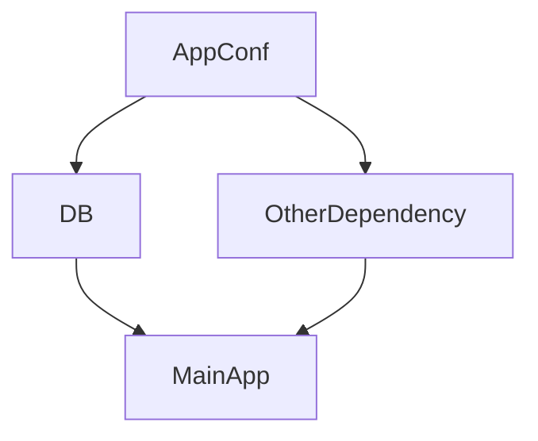

# Wire

為Google開源 用於處理golang依賴注入的工具  
主要處理物件初始化前的依賴關係, 以下用sudo code舉例  

假設我有一個app, 需要依賴於database與另一個相依object才能運行

- no wire  

```

mydb = DB()
obj = Object()
app = App(myapp,obj)
app.run()

```

- wire  

```
app = InitApp()
app.run()
```


以上為簡單的例子, 看起來可能差沒很多, 但在依賴項很多個的時候, 就可以很大程度讓code更簡潔  
wire 使用的方式是 code generation, 簡單說就是直接幫你把 需要 套娃物件的部份 直接合併成一個初始化函數   

wire變數輸入上有使用限制, wire一個類型只能有一種輸入,  e.g.  Name string, 就不有其他string類型,  
這邊會使用上是建議直接將需要輸入的變數打包成一個 config物件, 直接輸入config , 不會有類型上的問題    


## 實際範例

物件關係, MainApp 相依DB與OtherDependency   
DB與OtherDependency的輸入值會定義在 AppConf中  




main.go  
```go
package main

import "fmt"

type AppConf struct {
	Username string
	Password string
	Url      string
	Id       int
	Content  string
}

func NewAppConf() AppConf {
	return AppConf{Username: "hccuse", Password: "dev123", Url: "test_url", Id: 1, Content: "test wire"}
}

type DB struct {
	username string
	password string
	url      string
}


func NewDB(conf AppConf) DB {
	return DB{conf.Username, conf.Password, conf.Url}
}

type OtherDependency struct {
	ID      int
	Content string
}

func NewOtherDependency(conf AppConf) OtherDependency {
	return OtherDependency{conf.Id, conf.Content}
}

type MainApp struct {
	AppDB         DB
	AppDependency OtherDependency
}

func NewMainApp(db DB, dp OtherDependency) MainApp {
	return MainApp{AppDB: db, AppDependency: dp}
}

func (self MainApp) Echo() {
	fmt.Println(self.AppDB.username)
	fmt.Println(self.AppDB.url)
	fmt.Println(self.AppDependency.ID)
	fmt.Println(self.AppDependency.Content)
}

```


以上物件, 若不使用wire, 正常調用則是   
```go
func main(){
conf := NewAppConf()
db := NewDB(conf)
obj := NewOtherDependency(conf)
app = NewApp(db,obj)
app.Echo()
}
```

這邊若需使用wire,  

會需要定義wire.go, 用途是定義依賴關係    

需注意, 最上面 +build wireinject 是必須的  
使用wire.NewSet定義 ProviderSet, 輸入參數為相依物件的instance,    
最後定義一個初始化函數, 返回為輸始化後的目標物件  

```go
//go:build wireinject
// +build wireinject

package main

import "github.com/google/wire"

var ProviderSet = wire.NewSet(
	NewAppConf, NewDB, NewOtherDependency, NewMainApp,
)

func InitApp() MainApp {
	wire.Build(ProviderSet)
	return MainApp{}
}
```


之後在該目錄下執行  
```bash
wire
```


就會輸出一個wire_gen.go  裡面就是wire幫我們打包好的初始化函數  


以上範例輸出後 wire_gen.go內容   
```go

import (
	"github.com/google/wire"
)

// Injectors from wire.go:

func InitApp() MainApp {
	appConf := NewAppConf()
	db := NewDB(appConf)
	otherDependency := NewOtherDependency(appConf)
	mainApp := NewMainApp(db, otherDependency)
	return mainApp
}

// wire.go:

var ProviderSet = wire.NewSet(
	NewAppConf, NewDB, NewOtherDependency, NewMainApp,
)

```

可以發現InitApp實際上就是上面無wire版本的部份, wire直接幫你產生出來打包成一個初始化函數   \


之後調用就可以直接  

```go

func main(){
    app := InitApp()
    app.Echo()
}
```


### 其他補充  

產生wire_gen.go 後, 若只go build main.go, 會編譯不到wire產生的code  

需將main.go 與 wire_gen.go 一起編譯

```bash
go run main.go wire_gen.go
## 直接執行

go build main.go wire_gen.go
## 編譯  
```


