concurrency pattern 整理


## generator

返回一個可以持續產生數值的 channel

```golang
package main

import (
	"fmt"
)

func Generator() <-chan int {

	ch := make(chan int, 0)

	go func() {

		for i := 0; i < 10; i++ {
			ch <- i
		}

		close(ch)
	}()

	return ch

}

func main() {

	ch := Generator()

	for val := range ch {
		fmt.Println(val)
	}

	fmt.Println("done")

}
```

```
0
1
2
3
4
5
6
7
8
9
done

Process finished with the exit code 0
```

## channel done

類似 generator，產生一個可持續輸出的channel, 但可以在從外部控制何時結束

```golang

package main

import (
	"context"
	"fmt"
	"time"
)

func DataGenerator(ctx context.Context) <-chan int {

	ch := make(chan int, 0)

	go func() {
		i := 0
		defer close(ch)

		for {

			select {

			case <-ctx.Done():
				fmt.Println("finish...")
				return
			case ch <- i:
				time.Sleep(time.Millisecond * 100)
				i += 1
			}

		}

	}()

	return ch

}

func main() {

	ctx, cancel := context.WithCancel(context.Background())

	ch := DataGenerator(ctx)

	for val := range ch {

		fmt.Println(val)

		if val == 10 {
			cancel()
			break
		}
	}

	fmt.Println("done")

}

```

```
0
1
2
3
4
5
6
7
8
9
10
done

```

## pipeline

簡單說就是將多個channel串接在一起，每個channel都有自己的處理程序, 之後從最終端channel取得結果

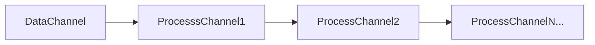

以下範例

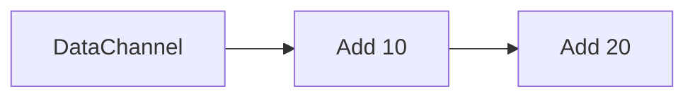

```golang
package main

import (
	"context"
	"fmt"
)

func Generator(ctx context.Context) <-chan int {

	ch := make(chan int, 0)

	go func() {
		defer close(ch)
		i := 0
		for {
			select {
			case <-ctx.Done():
				fmt.Println("finish...")
			case ch <- i:
				i += 1
			}
		}
	}()

	return ch

}

func ADD(ctx context.Context, inputChan <-chan int, AddValue int) <-chan int {

	resChan := make(chan int, 0)

	go func() {
		defer close(resChan)

		for {
			select {
			case <-ctx.Done():
				fmt.Println("finish... Add...")
				return
			case val, ok := <-inputChan:
				if !ok {
					return
				}
				resChan <- AddValue + val
			}
		}
	}()

	return resChan
}

func main() {

	ctx, cancel := context.WithCancel(context.Background())

	ch := Generator(ctx)
	ch2 := ADD(ctx, ch, 10)
	ch3 := ADD(ctx, ch2, 20)

	for val := range ch3 {
		fmt.Println(val)
		if val == 35 {
			cancel()
			break
		}
	}

	fmt.Println("done")

}
```

```
30
31
32
33
34
35
done
```

## fan in

將多個channel的輸出合併成一個channel

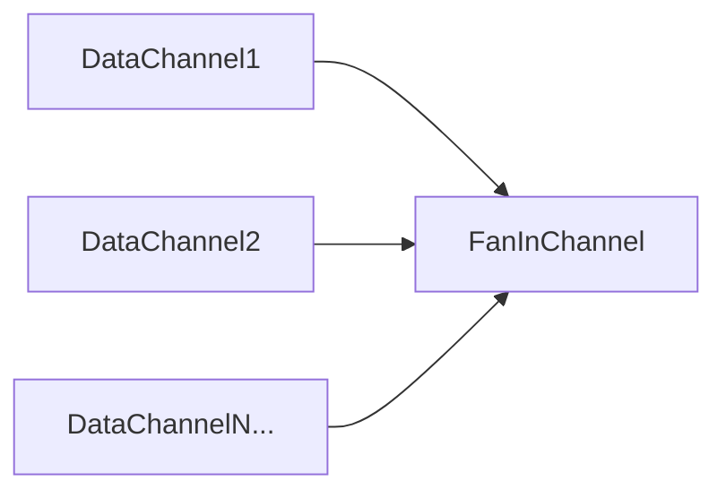

範例

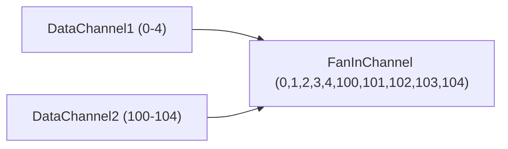

```golang
package main

import "sync"

func Generator1() <-chan int {

	ch := make(chan int, 0)

	go func() {

		for i := 0; i < 5; i++ {
			ch <- i
		}

		close(ch)
	}()

	return ch

}

func Generator2() <-chan int {

	ch := make(chan int, 0)

	go func() {

		for i := 100; i < 105; i++ {
			ch <- i
		}

		close(ch)
	}()

	return ch

}

func FanIn(wg *sync.WaitGroup, chs ...<-chan int) chan int {

	out := make(chan int, 0)
	go func() {

		defer close(out)

		for _, ch := range chs {
			wg.Add(1)

			go func(ch <-chan int) {
				for val := range ch {
					out <- val
				}
				wg.Done()
			}(ch)

		}

		wg.Wait()

	}()

	return out

}

func main() {

	wg := sync.WaitGroup{}

	ch1 := Generator1()
	ch2 := Generator2()

	out := FanIn(&wg, ch1, ch2)

	for val := range out {
		println(val)
	}

	println("done")
}
```

```
100
0
1
2
3
4
101
102
103
104
done
```

## fan out

將一個channel的資料分發到多個channel

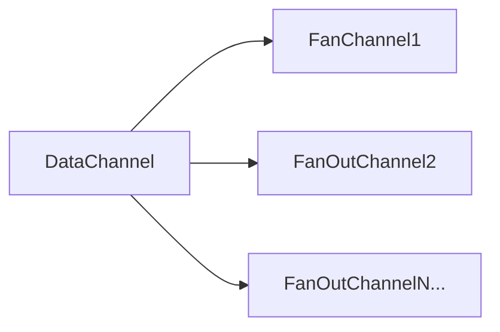

範例

實際上分配不一定會平均, 有一定數量時, 分配會接近

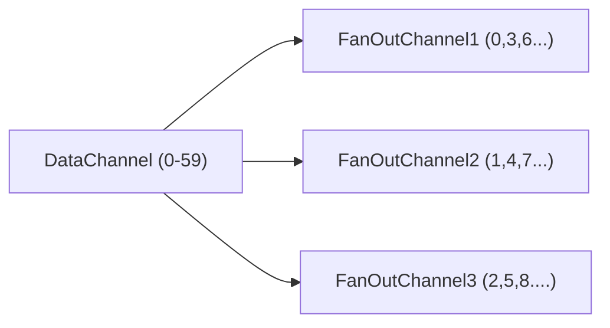

```golang
package main

import (
	"fmt"
	"sync"
)

func Generator() <-chan string {

	ch := make(chan string, 0)

	go func() {

		for i := 0; i < 60; i++ {
			ch <- fmt.Sprintf("data: %d", i)
		}
		close(ch)
	}()

	return ch
}

func FanOut(SourceChan <-chan string, Name string) <-chan string {

	splitchan := make(chan string, 0)

	go func() {

		for val := range SourceChan {
			splitchan <- fmt.Sprintf("%v assgin to %v", val, Name)
		}
		close(splitchan)

	}()

	return splitchan

}

func main() {

	ch := Generator()
	wp := &sync.WaitGroup{}
	splitchan1 := FanOut(ch, "fan1")
	splitchan2 := FanOut(ch, "fan2")
	splitchan3 := FanOut(ch, "fan3")
	static_num := make(chan int, 3)

	wp.Add(3)
	go func() {
		count := 0
		for val := range splitchan1 {
			fmt.Println(val)
			count += 1
		}
		static_num <- count
		wp.Done()

	}()

	go func() {
		count := 0
		for val := range splitchan2 {
			fmt.Println(val)
			count += 1
		}
		static_num <- count
		wp.Done()
	}()

	go func() {
		count := 0
		for val := range splitchan3 {
			fmt.Println(val)
			count += 1
		}
		static_num <- count
		wp.Done()
	}()

	wp.Wait()
	close(static_num)
	fmt.Println("fan size")
	for val := range static_num {
		fmt.Println(val)
	}
}
```

```golang
data: 2 assgin to fan2
data: 3 assgin to fan2
data: 4 assgin to fan2
data: 5 assgin to fan2
data: 6 assgin to fan2
data: 7 assgin to fan2
data: 0 assgin to fan3
data: 1 assgin to fan1
data: 10 assgin to fan1
data: 11 assgin to fan1
data: 14 assgin to fan1
data: 9 assgin to fan3
data: 13 assgin to fan3
data: 16 assgin to fan3
data: 17 assgin to fan3
data: 19 assgin to fan3
data: 15 assgin to fan1
data: 18 assgin to fan1
data: 8 assgin to fan2
data: 12 assgin to fan2
data: 24 assgin to fan2
data: 21 assgin to fan1
data: 22 assgin to fan1
data: 20 assgin to fan3
data: 27 assgin to fan1
data: 23 assgin to fan3
data: 28 assgin to fan1
data: 29 assgin to fan1
data: 30 assgin to fan1
data: 25 assgin to fan2
data: 26 assgin to fan2
data: 33 assgin to fan2
data: 34 assgin to fan2
data: 37 assgin to fan2
data: 31 assgin to fan1
data: 35 assgin to fan1
data: 32 assgin to fan3
data: 36 assgin to fan3
data: 40 assgin to fan3
data: 41 assgin to fan3
data: 44 assgin to fan3
data: 38 assgin to fan2
data: 42 assgin to fan2
data: 39 assgin to fan1
data: 43 assgin to fan1
data: 46 assgin to fan2
data: 47 assgin to fan1
data: 45 assgin to fan3
data: 51 assgin to fan3
data: 52 assgin to fan3
data: 49 assgin to fan1
data: 54 assgin to fan1
data: 53 assgin to fan3
data: 55 assgin to fan3
data: 56 assgin to fan1
data: 57 assgin to fan1
data: 48 assgin to fan2
data: 50 assgin to fan2
data: 59 assgin to fan1
data: 58 assgin to fan3
fan size
19
22
19
```

## fan in out

簡單說就是結合fan in , fan out, 將多個channel的資料匯集近一個channel, 之後再將資料分配至多個channel  


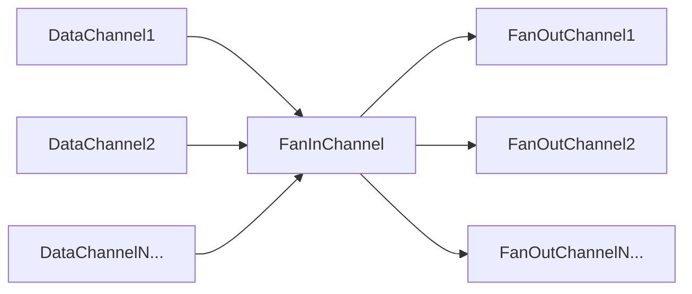

```golang
package main

import (
	"fmt"
	"sync"
)

func Generator1() <-chan int {

	ch := make(chan int, 0)

	go func() {

		for i := 0; i < 20; i++ {
			ch <- i
		}

		close(ch)
	}()

	return ch

}

func Generator2() <-chan int {

	ch := make(chan int, 0)

	go func() {

		for i := 80; i < 100; i++ {
			ch <- i
		}

		close(ch)
	}()

	return ch

}

func FanIn(chs ...<-chan int) <-chan string {

	out := make(chan string, 0)

	go func() {
		wp := &sync.WaitGroup{}
		for _, ch := range chs {
			wp.Add(1)
			go func(ch <-chan int) {

				for val := range ch {
					out <- fmt.Sprintf("data: %v", val)
				}
				wp.Done()
			}(ch)
		}
		wp.Wait()
		close(out)
	}()

	return out

}

func FanOut(SourceChan <-chan string, Name string) <-chan string {

	splitchan := make(chan string, 0)

	go func() {

		for val := range SourceChan {
			splitchan <- fmt.Sprintf("%v assgin to %v", val, Name)
		}
		close(splitchan)

	}()

	return splitchan

}

func main() {

	ch1 := Generator1()
	ch2 := Generator2()
	fanin := FanIn(ch1, ch2)

	wp := &sync.WaitGroup{}
	splitchan1 := FanOut(fanin, "fan1")
	splitchan2 := FanOut(fanin, "fan2")
	splitchan3 := FanOut(fanin, "fan3")
	static_num := make(chan int, 3)

	wp.Add(3)
	go func() {
		count := 0
		for val := range splitchan1 {
			fmt.Println(val)
			count += 1
		}
		wp.Done()
		static_num <- count
	}()

	go func() {
		count := 0
		for val := range splitchan2 {
			fmt.Println(val)
			count += 1
		}
		wp.Done()
		static_num <- count
	}()

	go func() {
		count := 0
		for val := range splitchan3 {
			fmt.Println(val)
			count += 1
		}
		wp.Done()
		static_num <- count
	}()

	wp.Wait()
	close(static_num)
	fmt.Println("fan size")
	for val := range static_num {
		fmt.Println(val)
	}

}
```


## or channel

會設計多個 函數, 該函數會回傳一個channel, 平時堵塞, 只有該函數完成後, 會輸入訊號至該channel  

會監控以上函數的channel, 一旦有一個channel有訊號, 會執行後續的動作 (僅執行一次), 後面監控函數完成後 不會再執行

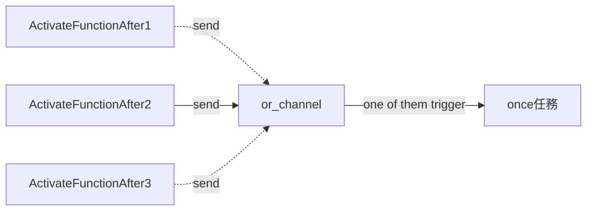


```golang
package main

import (
	"fmt"
	"sync"
	"time"
)

// 該函數主要是輸出一個channel, 這邊模擬處理任務處理 完成後 close channel, 使其不阻塞
func ActivateFunctionAfter(duration time.Duration) <-chan struct{} {

	c := make(chan struct{})
	time.AfterFunc(duration, func() {
		fmt.Println("任務完成")
		close(c)
	})
	return c
}

// 用於傳入多個channel, 這邊目的是其中之一完成後(不阻塞), 執行一次特定任務
func or_channel(wp *sync.WaitGroup, chans ...<-chan struct{}) <-chan struct{} {

	ch := make(chan struct{}, 0) // 用於傳出 once任務已經被觸發
	once := new(sync.Once)

	go func() {

		for _, inputChan := range chans {
			wp.Add(1)
			go func(inputChan <-chan struct{}) {

				<-inputChan // 等待 activeFunctionAfter 其中之一被完成

				once.Do(func() { // once 任務 只會被觸發一次

					fmt.Println("執行once任務")
					// once 任務 內容 ..... 這邊只是模擬

					ch <- struct{}{} // once 完成後 傳出
					close(ch)
				})
				wp.Done()
			}(inputChan)
		}
	}()

	return ch
}

// 主要用於多個任務 , 只要其中之一完成後, 執行once任務 (只想被觸發一次,後續其他任務不會再被觸發)
func main() {
	wp := &sync.WaitGroup{}
	// 傳入想監控的函數channel, 函數完成後會觸發once任務
	res := or_channel(wp,
		ActivateFunctionAfter(time.Second*5),
		ActivateFunctionAfter(time.Second*2),
		ActivateFunctionAfter(time.Second*3),
		ActivateFunctionAfter(time.Second*4),
	)

	<-res // 監控once任務完成
	wp.Wait()

}
```
```
任務完成
執行once任務
任務完成
任務完成
任務完成
```

## or channel done

與 or channel 類似,  監控多個函數的完成channel, 一旦有一個函數完成後, 會執行後續的動作, 但多了可從外部trigger直接執行後續動作

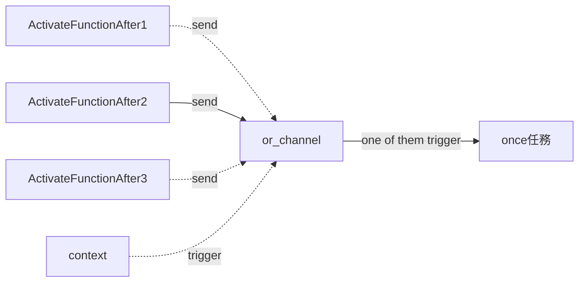


```golang
package main

import (
	"context"
	"fmt"
	"sync"
	"time"
)

func ActivateFunctionAfter(duration time.Duration) <-chan struct{} {
	c := make(chan struct{})
	time.AfterFunc(duration, func() {
		fmt.Println("任務完成")
		close(c)
	})
	return c
}

func or_channel_done(ctx context.Context, wp *sync.WaitGroup, chans ...<-chan struct{}) <-chan struct{} {
	ch := make(chan struct{})
	once := new(sync.Once)
	go func() {
		for _, inputChan := range chans {
			go func(inputChan <-chan struct{}) {
				wp.Add(1)
				defer wp.Done()
				for {
					select {
					case <-ctx.Done():
						fmt.Println("任務逾時....")
						once.Do(func() {
							fmt.Println("timeout, 執行once任務")
							close(ch)
						})
						return
					case <-inputChan:
						once.Do(func() {
							fmt.Println("執行once任務")
							ch <- struct{}{}
							close(ch)
						})
						return
					}
				}
			}(inputChan)
		}
	}()
	return ch
}

func main() {
	wp := &sync.WaitGroup{}
	ctx, _ := context.WithTimeout(context.Background(), time.Second*5)
	ch1 := ActivateFunctionAfter(time.Second * 7)
	ch2 := ActivateFunctionAfter(time.Second * 11)
	ch3 := ActivateFunctionAfter(time.Second * 9)
	res := or_channel_done(ctx, wp, ch1, ch2, ch3)
	<-res
	wp.Wait()
```

```
任務逾時....
timeout, 執行once任務
任務逾時....
任務逾時....
```


## tee channel

將一個channel 產生duplicate, 若將資料送入該channel, duplicate的channel 也會收到資料  

實際作法為 原始channel會保持被listen , 只要發現有資料送入, 就會在duplicate的channel也送入相同的資料  

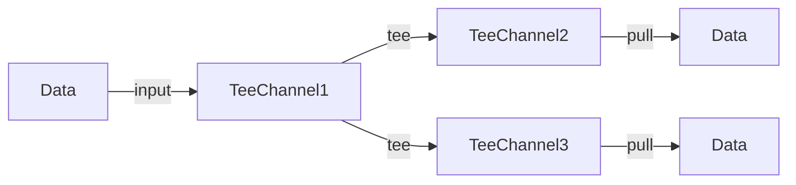

在原始channel放入1-4, 從duplicate channel 讀出資料  
```golang

package main

import (
	"fmt"
	"sync"
)

func Generator() <-chan int {

	ch := make(chan int, 0)

	go func() {

		for i := 0; i < 5; i++ {
			ch <- i
		}

		close(ch)
	}()

	return ch

}

func tee(input <-chan int, outputs []chan int) {
	go func() {
		wg := &sync.WaitGroup{}

		for data := range input {
			for _, output := range outputs {
				wg.Add(1)
				go func(data int, output chan int) {
					defer wg.Done()
					output <- data
				}(data, output)
			}
			wg.Wait()
		}

		for _, output := range outputs {
			close(output)
		}

	}()
}

// 簡單說就是把一個channel 產生多個duplicate, 與fan out不同的是, fan out 也是一分多 但資料的總數不會變多 (一包餅乾變成兩個人在吃)
// tee則是真的一包餅乾變兩包
func main() {
	wp := &sync.WaitGroup{}
	ch := Generator()

	outputs := make([]chan int, 2)

	for i := 0; i < len(outputs); i++ { // 初始化 outputs
		outputs[i] = make(chan int, 0)
	}

	tee(ch, outputs)

	for index, output := range outputs {
		wp.Add(1)
		go func(index int, chanInt chan int) {
			for val := range chanInt {
				fmt.Printf("%v chan: %v\n", index, val)
			}
			wp.Done()
		}(index, output)
	}
	wp.Wait()
}
```

```
1 chan: 0
1 chan: 1
0 chan: 0
1 chan: 2
0 chan: 1
1 chan: 3
0 chan: 2
1 chan: 4
0 chan: 3
0 chan: 4
```


## bridge channel

將多個channel的資料合併成一個channel輸出, 可保證順序性 

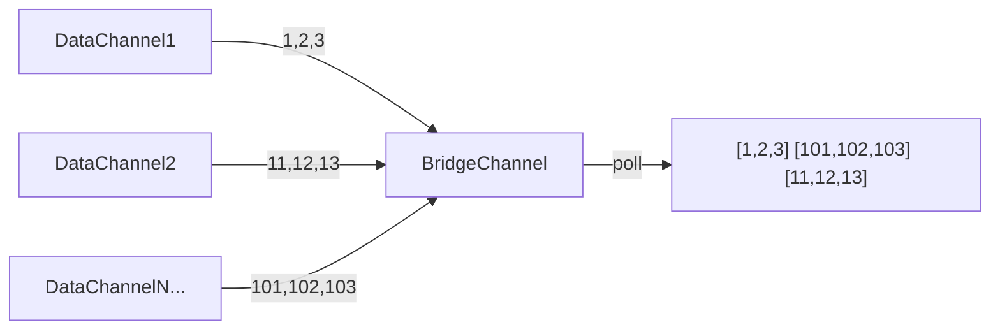

```golang
package main

import (
	"context"
	"fmt"
)

func Generator(start int, end int) <-chan int {
	ch := make(chan int)

	go func() {
		defer close(ch)
		for i := start; i < end; i++ {
			ch <- i
		}
	}()

	return ch
}

func StreamGenerator(chs ...<-chan int) <-chan (<-chan int) {
	ch := make(chan (<-chan int))

	go func() {

		for _, val := range chs {
			ch <- val
		}

		close(ch)
	}()

	return ch
}

func Bridge(ctx context.Context, ch_ch <-chan <-chan int) <-chan int {
	res := make(chan int)

	go func() {
		defer close(res)
		for {
			select {
			case <-ctx.Done():
				return
			case ch, ok := <-ch_ch:
				if !ok {
					return
				}
				for val := range ch {
					res <- val
				}
			}
		}
	}()

	return res
}

func main() {

	ctx, cancel := context.WithCancel(context.Background())
	defer cancel()

	ch1 := Generator(100, 105)
	ch2 := Generator(6, 10)
	ch3 := Generator(500, 507)

	ch_ch := StreamGenerator(ch1, ch2, ch3)

	for val := range Bridge(ctx, ch_ch) {
		fmt.Println(val)
	}

}
```

```
100
101
102
103
104
6
7
8
9
500
501
502
503
504
505
506
```


