Virtual Private Cloud


- Region Level ,可跨AZ(如 ap-northeast-1a, ap-northeast-1b), 但不同跨region (如 ap-northeast-1 (東京), ap-southeast-3(
  大阪)  )
- 同一個VPC中, 即是不同subnet, 也可以互相訪問
- Virtual Private Cloud (VPC) 為私有的虛擬網路
- 每組AWS帳號都有預設的VPC, 通常創建服務時, 若無指定VPC, 則會使用預設的VPC
- VPC會在Region中, 一個Region最多可以有5個VPC(soft limit)
- 每個VPC最多5組CIDR, 每個CIDR最小SIZE為/28 (16個IP), 最大SIZE為/16(65536組IP)
- VPC內部IP為 IPv4
- VPC內部CIDR不可重疊
- AWS VPC 預設會有5個保留IP, 若需求為28個IP, 那則實際需要 28+5 = 33個IP, 也就是需要/26的CIDR (32-26)**2=64個IP,才會足夠, /26 = 32個IP, 扣掉保留的就會不足  

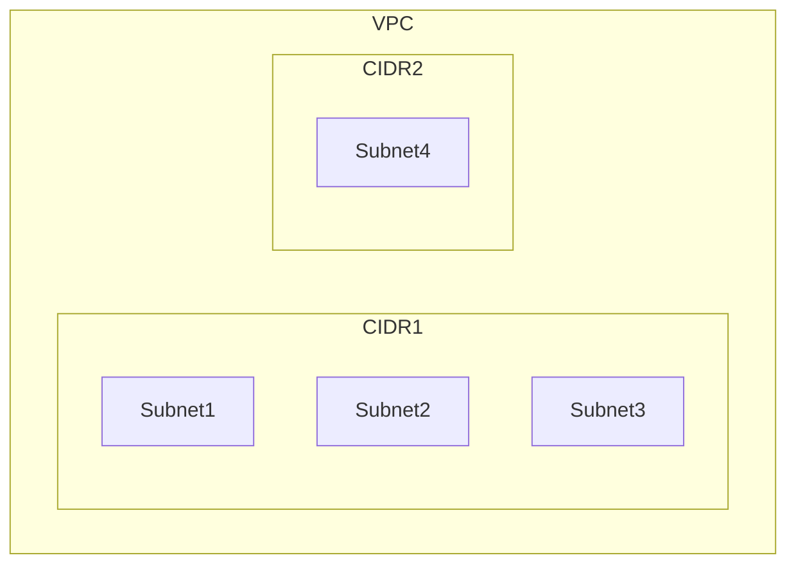

## AZ & Subnet

- AZ 就是實體的資料中心 e.g. ap-northeast-1a(東京a資料中心), ap-northeast-1b(東京b資料中心)
- subnet是不跨AZ的, 不同AZ Subnet不同, 但同一個VPC中的不同subnet可以互相訪問
- VPC表示是一個region, Subnet則是AZ e.g. ap-northeast-1 (可以建立VPC) 其中可以建立兩個subnet於 (ap-northeast-1a,
  ap-northeast-1b)
- 同VPC subnet, 可以跨AZ
- 進出subnet, 都會經過NACL驗證(無狀態) e.g. subnetA -> subnetB

## CIDR

用於指定一個範圍的IP

VPC CIDR 預設保留為 .0 , .1 , .2 , .3 , .255

常見如:

| IP Range         | Subnet Mask     | Usable IP Range                 | Total Usable IPs |
|------------------|-----------------|---------------------------------|------------------|
| 192.0.0.0/8      | 255.0.0.0       | 192.0.0.1 - 192.255.255.254     | 16,777,214       |
| 192.168.0.0/16   | 255.255.0.0     | 192.168.0.1 - 192.168.255.254   | 65,534           |
| 192.168.132.0/24 | 255.255.255.0   | 192.168.132.1 - 192.168.132.254 | 254              |
| 192.168.132.5/32 | 255.255.255.255 | 192.168.132.5                   | 1                |

其他參考:

| IP range       | Subnet Mask   | Usable IP Range             | Total Usable IPs |
|----------------|---------------|-----------------------------|------------------|
| 172.31.32.0/20 | 255.255.240.0 | 172.31.32.1 - 172.31.47.254 | 4,094            |
| 172.31.0.0/20  | 255.255.240.0 | 172.31.0.1 - 172.31.15.254  | 4,094            |
| 172.31.16.0/20 | 255.255.240.0 | 172.31.16.1 - 172.31.31.254 | 4,094            |

[CIDR計算器](https://www.ipaddressguide.com/cidr)

## Internet Gateway

為VPC level, Internet Gateway (IGW), 可將VPC內部的資源連接至internet,  
IPv4,IPv6都是使用Internet Gateway訪問外部網路

## route table

為VPC level, 可以有一個或多個

但每個subnet只能有一個route table, 且必須存在

IPv4,IPv6的規則需分別制定 e.g. 0.0.0.0/0 == ::/0 , 若只有設置0.0.0.0/0, 則若請求某IPv6 是會出不去的

內部網路請求至該subnet對應的route table時, 會用route table 確認該 ip 是落在哪個subnet, 並將請求轉發至對應的目標    
e.g. 若是public subnet, 通常會將0.0.0.0/0 導向 internet gateway, 將請求發至外部網路     
e.g. 若是private subnet,若要訪問外部網路, 也會將 0.0.0.0/0 NAT gateway, 將請求發至外部網路  
e.g. 若請求同一個VPC中的另一個網段的IP, 而route table中有對應的route, 則會直接轉發至對應的subnet

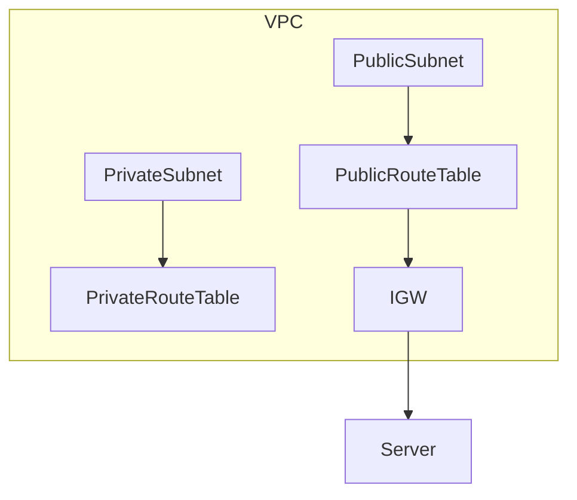

## Tenancy

- default: 共享硬體
- dedicated: 專用硬體 (通常用於有特殊需求的應用, 如license, compliance, security, ) , 費用昂貴

## NAT Instance

- 已經被棄用, 建議使用NAT Gateway
- NAT = Network Address Translation
- 用於private subnet, 讓private subnet的instance可以連接internet
- 該instance主要是用於轉發private instance的流量, 必須在public subnet中, 並且有public ip
- 必須使用 Elastic IP
- 必須關閉 EC2中的 Source/Destination Check, 以允許該instance轉發流量

## NAT Gateway

- 需於public subnet 與 Internet Gateway
- 必須使用 Elastic IP
- 計費依照 每小時使用量與頻寬(5gbps scale to 100Gbps)
- 可多個跨AZ, 實現HA
- 無須管理 security group
- 只能用於IPv4

## DNS

### DNS Resolution (EnableDnsSupport)

- Default: enable,
- 若開啟則是使用AWS預設的DNS解析
- 若關閉則是需要自訂的DNS 進行解析 (如route53, private hosted zone, 可自訂domain map至 特定ip, 並associate至VPC,
  在該vpc中就藉由該domain找到ip)
- AWS預設使用Route53 Resolve server (AmazonProvidedDNS, 169.254.169.253) 或是VPC的 IPv4 network range .2 的IP
  進行DNS解析 (x.x.x.2)

### DNS Hostnames

- 若是使用預設的VPC, default: True, 若是自定義的VPC, default: False
- 必須在 EnableDnsSupport 開啟後才能使用
- 開啟後, 若ec2 instance 為IPv4, instance 會得到一個 public hostname
- 簡單說就是若有開啟, 創建ec2時 若為public, 除了會分配一個IPv4 IP給你之外, 也會分配給你一個 hostname,
  可以直接藉由該hostname訪問至你的ec2

有開啟: public EC2: Private hostname, Public hostname  
無開啟: public EC2: Only Private hostname

e.g. public: ec2-175-41-237-246.ap-northeast-1.compute.amazonaws.com  
e.g. private: ip-172-31-16-112.ap-northeast-1.compute.internal

## security group and NACL

- NACL 無狀態, 進入與出去都需要符合條件
- security group 有狀態, 只要能進入, 出去會自動符合條件 , 可以理解成 只有進去會需要符合條件

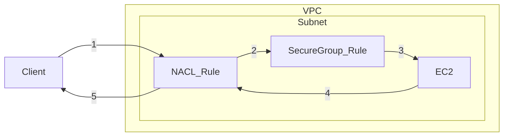

一般網路流入經過防火牆為

traffic > network gateway(VPC level) > NACL > public subnet > security group > EC2 instance

### Security Group

- instance level
- A firewall, 控制流量進出EC2 instance
- only ALLOW rules
- rules 可以是IP , 或是 其他 security group
- stateful, 能追蹤並記憶主機之間的通訊連線狀態, 有狀態代表流量單向出去後, 回來的response是不需再被防火牆檢查的, 會自動放行,
  因該連接是有狀態的, 回來時 防火牆會知道這是之前的連線, 不需再次檢查

### NACL

- NACL = Network Access Control List
- 類似防火牆 控制流量進出入subnet, 只要流量進出subnet 就會驗證一次NACL
- 每個subnet有 attach 一個NACL (VPC創建會自動隨著自動創建一組, subnet創建後會自動使用該組  )
- NACL Rule: 優先級可設 1-32766, 數字愈小 優先級愈高
- 優先級最高的規則為決策 e.g 100 allow 10.2.5.11/32 , 200 deny 10.2.5.11/32, 這邊 10.2.5.11/32是可以進入的
- 無規則匹配為 deny
- AWS 建議以100為單位增量
- 新建的NACL 預設 * Deny all, 表示最低優先級的deny for all, 若有任一規則符合 就不會被deny
- 適合 阻止特定IP 於 subnet level
- 建議不要修改這邊預設規則, outbound 會有 ephemeral port, 若要進行調整, 需要小心調適

default

inbound rule

| rule number | type     | protocol | port range | source    | allow/deny |
|-------------|----------|----------|------------|-----------|------------|
| 100         | ALL IPV4 | ALL      | ALL        | 0.0.0.0/0 | ALLOW      |
| *           | ALL IPv4 | ALL      | ALL        | 0.0.0.0/0 | DENY       |

outbound rule

| rule number | type     | protocol | port range | source    | allow/deny |
|-------------|----------|----------|------------|-----------|------------|
| 100         | ALL IPV4 | ALL      | ALL        | 0.0.0.0/0 | ALLOW      |
| *           | ALL IPv4 | ALL      | ALL        | 0.0.0.0/0 | DENY       |

### Ephemeral Port

主要是client發送請求時,用於接收 server response 短暫開啟的port (該port是depend on client OS, 可以理解請求時會跟你說
我會在某個port等待回傳結果)   
相對於server端 response時, 也會因應開啟相對應的ephemeral port

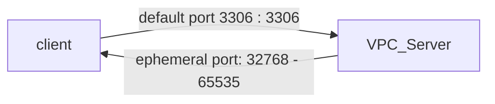

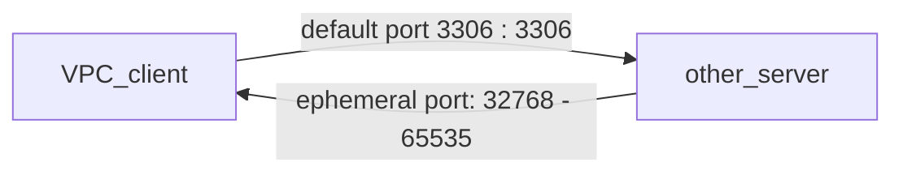

- Windows10: 49152-65535
- Linux: 32768-60999
-

```
sysctl net.ipv4.ip_local_port_range 
## list ephemeral port range  
## Linux

hccuse@R075 ~> sysctl net.ipv4.ip_local_port_range 
net.ipv4.ip_local_port_range = 32768    60999
```

```
netsh int ipv4 show dynamicport tcp
## windows terminal

C:\Users\chungchi>netsh int ipv4 show dynamicport tcp

通訊協定 tcp 動態連接埠範圍
---------------------------------
開始連接埠        : 49152
連接埠數目        : 16384
# 實際範圍為 49152+ (49152+16384-1)
```

### NACL 與 Ephemeral Port

由於NACL無狀態, response的port是ephemeral port,   
會需要注意哪些ephemeral port是需要開放的, 以允許response的流量進入subnet  
若有多個subnet相互請求, 需要注意是不是雙方的ephemeral port都是開放的

### security group vs NACL

| security group          | NACL                             |
|-------------------------|----------------------------------|
| instance level          | subnet level                     |
| support only allow rule | support allow rule and deny rule |
| 會評估所有規則                 | 由優先級由高至低評估規則, 只要優先級高的符合, 即作出決定   |
| 有狀態                     | 無狀態, 會須注意 ephemeral port         |
| 需對每個EC2 instance設定      | 會自動套用該subnet的NACL                |

## Reachability Analyzer

- 可用於檢查VPC中兩資源的連線情況分析
- 單次10美分
- 不會產生實際流量, aws會利用兩資源的設定產生model,進行驗證分析 e.g. vpc中任2 EC2, 特定port 連線分析

待實作

## VPC Peering

- 可以將兩個不同的VPC進行對接, 使其可以通過內部網段進行連接
- 可以跨AWS帳號對接VPC
- 兩者CIDR需不能重疊
- 兩個VPC Peering後, 都需要更新route table, 設置對方的CIDR, target選擇vpc peering, 選擇另一組VPC  
- private subnet 是無法直接相互訪問的, 需透過一個中間的VPC作為bridge, 使兩者可以互相訪問

待實作

## VPC Endpoint

- 使特定AWS服務可以不透過公開網路去訪問, 而是直接使用AWS內部網路去請求這些服務
- 目前只有 S3, DynamoDB, Cloudformation, SSM 有 endpoint ...
  待實作

## VPC Flow Logs

- VPC flow logs
- Subnet flow logs
- Elastic Network interface flow logs
- Capture network information from AWS managed interfaces e.g. ELB,RDS,ElasticCache, Redshift, WorkSpaces, NAT,Transit
  Gateway
- 支援S3, CloudWatch Logs , kinesis Data Firehouse
- query VPC flow using Athena on S3 or CloudWatch Log Insight

### Syntax

```
version account-id interface-id srcaddr dstaddr srcport dstport protocol packets bytes start end action log-status
2 123456789010 eni-abc123de 192.168.1.123 192.168.1.200 49152 80 6 5 343 1554317460 1554317480 ACCEPT OK
```

| version      | 流量日誌版本                                                  |
|--------------|---------------------------------------------------------|
| version      | 流量日誌版本                                                  |
| account-id   | AWS 帳戶 ID                                               |
| interface-id | 網路介面 ID (ENI)                                           |
| srcaddr      | 來源 IP 地址 (192.168.1.123)                                |
| dstaddr      | 目的地 IP 地址 (192.168.1.200)                               |
| srcport      | 來源端口 (49152)                                            |
| dstport      | 目的地端口 (80/HTTP)                                         |
| protocol     | 協議編號 (6/TCP)                                            |
| packets      | 傳輸的數據包數量                                                |
| bytes        | 傳輸的位元組數                                                 |
| start、end    | 流量捕獲的起止時間                                               |
| action       | 流量被接受 (ACCEPT) 或拒絕 (REJECT),security group / NACL level |
| log-status   | 日誌捕獲狀態                                                  |

### issue解析

請求進入

| event                             | probably cause        |
|-----------------------------------|-----------------------|
| inbound: reject                   | security group / NACL |
| inbound: accept, outbound: reject | NACL                  |

發出請求

| event                             | probably              |
|-----------------------------------|-----------------------|
| outbound: reject                  | security group / NACL |
| outbound: accept, inbound: reject | NACL                  |

### Architecture

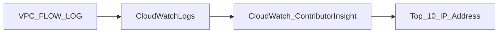

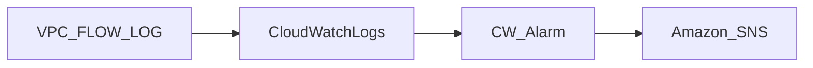

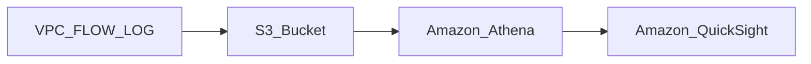

### cloudwatch

若開啟 flow log 至 cloudwatch 需要建立 IAM

#### Trusted entities

使用aws服務時, 使用者可以是 user , service或是application , 這邊是定義IAM role 使用者哪種,  
下面定義為 使用者為 service , vpc-flow-logs

```json
{
  "Version": "2012-10-17",
  "Statement": [
    {
      "Sid": "Statement1",
      "Effect": "Allow",
      "Principal": {
        "Service": "vpc-flow-logs.amazonaws.com"
      },
      "Action": "sts:AssumeRole"
    }
  ]
}
```

#### Permission

- CloudWatchLogsFullAccess

## Direct Connect

- 提供私人網路連至你的VPC
- VPC需設置Virtual Private Gateway
- 可以直接使用該連接訪問 private EC2 或是 public S3
- 支持IPv4, IPv6

Direct Connect Location為AWS的數據中心 , 會連接該位置開啟Direct Connect 至VPC

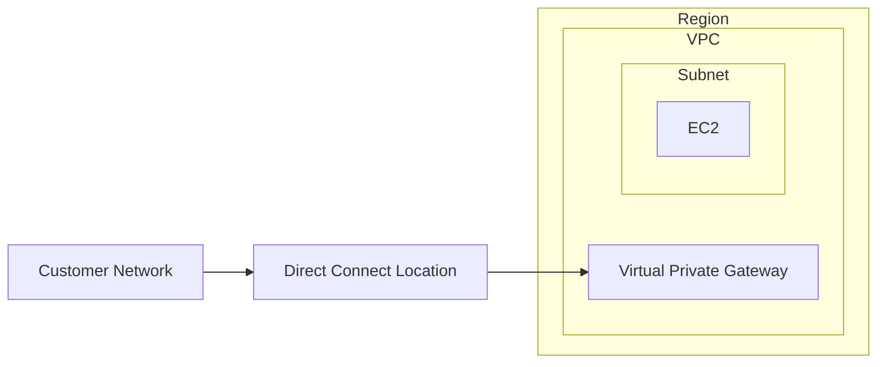

使用場景

- 巨量資料傳輸 , 增加吞吐量  (不經過外網, 速度更快,成本更低)
- 網路的一致性, 無論訪問外網或是私有網段 都是使用同一個連接
- Hybrid Environment (on prem + cloud ) 混和雲 , 雲端結合本地設施


### Direct Connect Gateway

- 若要使用Direct Connect 至 一個 或 多個region的VPC (同帳號), 需要使用Direct Connect Gateway  

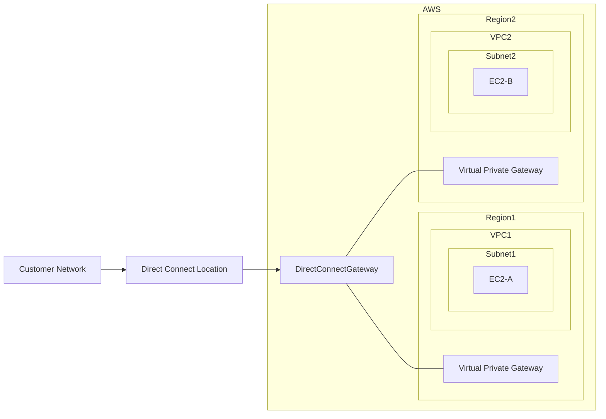


### 類型

分成兩種, 無論哪種方式, 申請後至少都需要超過1個月才有辦法建置完成

#### Dedicated Connections

直接建一條專線

- 速度 1 Gbps, 10 Gbps, 100G bps
- 該方式需要有前期建置, 需跟AWS申請, 由其代理商設置
- 會得到一實體的網卡

#### Hosted connection

托管

- 速度 50M,100M to 1, 2, 5, 10Gps
- 直接跟代理商申請
- 可隨時調整方案, 較為彈性

### 加密

預設無加密, 但因為是私有連接, 依然有隱蔽性

需要加密會建議 Direct Connect + VPN , 可提供 IPsec-encrypt Private Connection

### resiliency

這邊只發生意外的可用性

- One connection at multiple location, 可理解成本地設施需要也有多個, 每個設施都建立connection至AWS服務
- 最大的彈性則是 本地設施皆佈署兩個線路, 且本地設施也有多個

## PrivateLink

- 使VPC中的資源expose至其他VPC, 但不依靠公共網路  (vpc可以是自己的 或是跨帳戶)
- 不需要依賴 VPC Peering, NAT, Internet Gateway, route table ... (類似VPC Endpoint機制)
- 需要 Network Load Balancer (NLB) (服務端VPC) 與 ENI or GWLB (客戶端VPC)
- 可以理解成PrivateLink 把 服務端VPC NLB與客戶端 VPC的ENI 綁再一起變成一個共同節點

ClassLink已經被棄用 , 可直接連至EC2

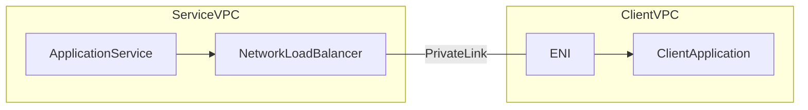

AWS private link & ECS 參考

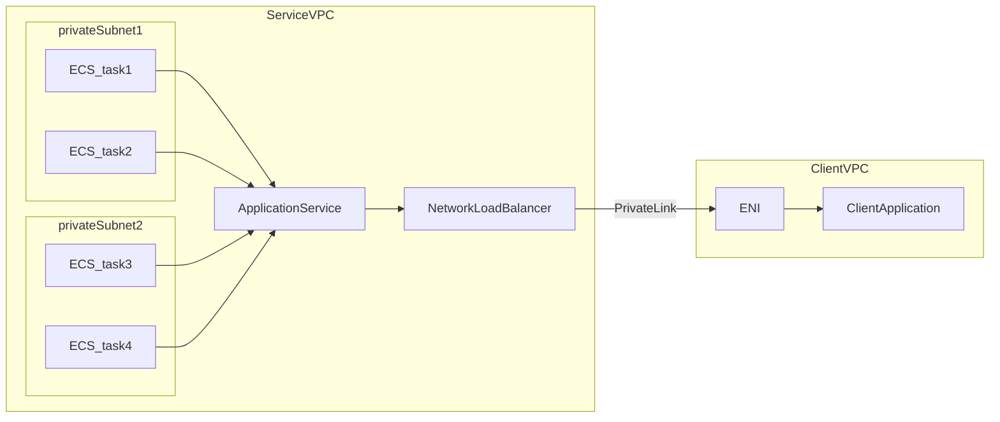

## Transit Gateway

應該可以理解成 AWS PrivateLink的中繼站, 類似MQ中解偶的概念, 使得多個VPC可以互相訪問, 且不需要建立多個PrivateLink  
若是有大量的VPC需要共享資源, 可以使用Transit Gateway 來管理這些VPC

- Regional resource 可跨Region work
- 可跨帳戶 (藉由 Resource Access Manager)
- 可跨region,使Transit Gateway連接多個VPC
- 須建立routeTable 限制VPC之間的連接關係
- 可與 Direct Connect Gateway與 VPN 一起使用
- 支援 IP Multicase (從一個街口把資料傳給多個接收端)

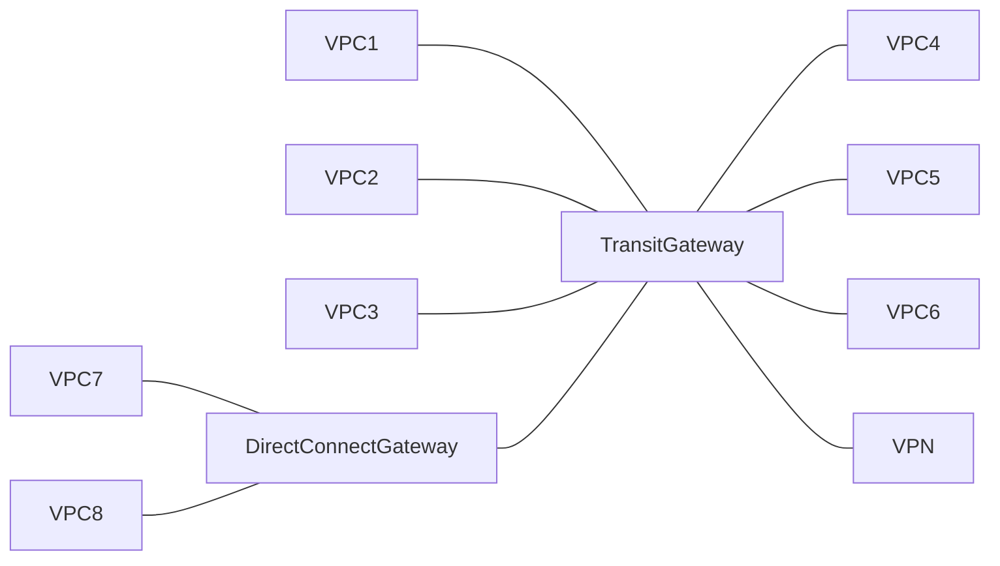

### Share Direct Connect Between Multi Accounts Pattern

這邊是配合 Direct Connect Gateway 與 Transit Gateway 來實現多帳戶間的Direct Connect共享  
作法上是用Direct Connect Gateway 建立一條私人連接至Transit Gateway, 而Transit Gateway 連接至多個不同帳戶的VPC

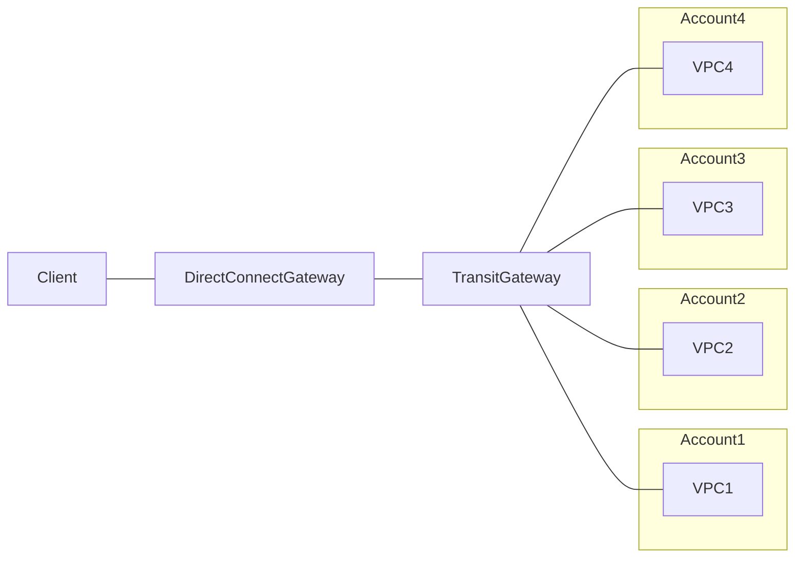

### site to ste vpn ECMP

- VPN 可以理解與VPN server建立一條加密隧道, 透過VPN訪問公共網路的資源都會透過該VPN server代理
- site to site vpn 可以理解成將兩個區網利用加密隧道連接起來, 使其類似變成同一個區網的概念 , 設置上需在VPC設置 Virtual
  Private Gateway, 在目標端點也需設置 Customer Gateway
- ECMP = Equal-Cost Multi-Path Routing, 可以理解成配發多條路徑, 使其可以達到負載平衡的效果
- 每個VPC 藉由 Transit Gateway 跟 某個終端進行連接時 都會有兩條tunnel, 一進一出
- 若有多個VPC 與同一個終端進行連接時, 會有多條tunnel
- 因此VPC數量愈多時, transit gateway 會有愈多的tunnel 與終端溝通, 此時透過ECMP 可以達到負載平衡的效果 增加連接的頻寬

這邊通常瓶頸應該是在 transit gateway 與終端的連接 這段, VPC與Transit Gateway 都在AWS內部 通常速度都很快  
因此才可以透過transit gateway 與 終端 之間ECMP 來達到增加頻寬的效果

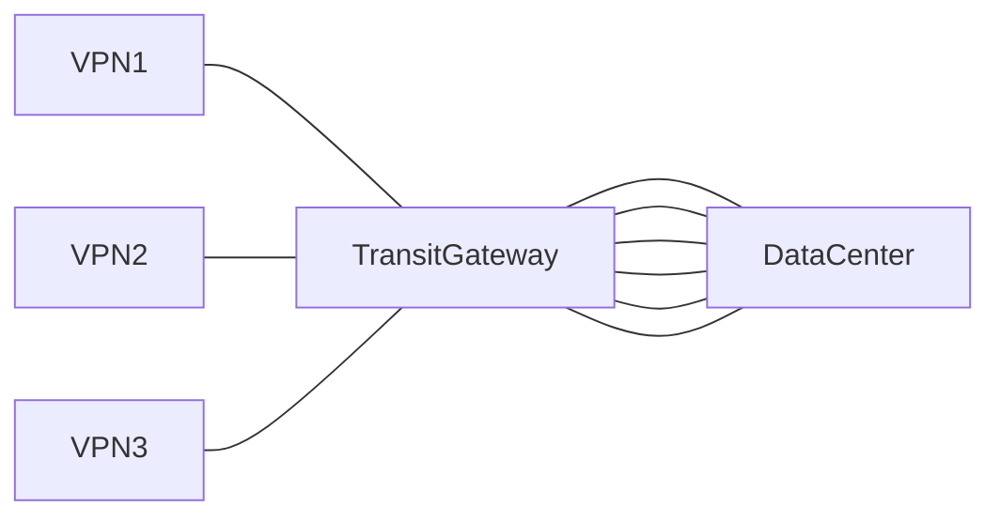

## Traffic mirror

- 可以將流量 進行 mirror 一份 導向其他地方
- 可以只capture一部分 或是全部
- FROM: ENI (原本流量進入點) , TO: ENI or NLB (mirror 流量的進入點)

以下例子為 將流入ec2的 mirror一份, 導向另一台分析流量的ec2, 前者不與後者有任何相依關係   
可以達到不透過前者內部分析流量的目的

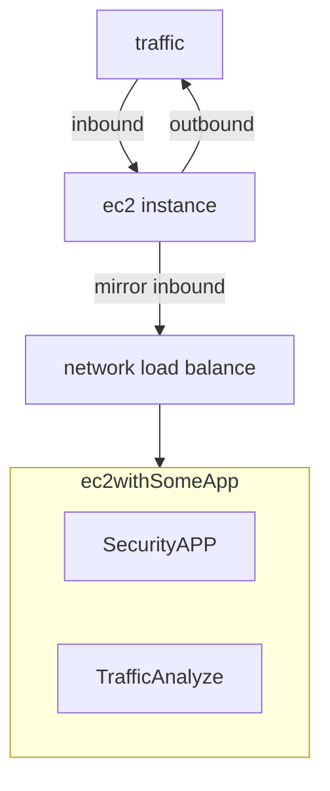

## IPv6

- AWS 所有ipv6都是public的
- format x.x.x.x.x.x.x.x , x 為 十六進制
- VPC可以開啟 IPv6 (public IP), 但即使如此 IPv4也還是會存在 (無法被關閉)
- EC2 instance 至少會有 IPv4的private internal, IPv6的 public
- 可以利用IPv4 or IPv6 與 Internet Gateway 進行連接

### troubleshooting

- 若無法啟動EC2, 通常較可能的是無可用的IPv4, 需申請新的CIDR
- 通常IPv6的CIDR都是非常大, 因此可排除

## Egress-only Internet Gateway

- 可以理解成IPv6版的NAT, IPv6限定
- 允許 instance outbound for IPv6 , 但會阻止任何至instance的inbound(從外部來的請求)
- 有狀態, 若是instance透過 Egress-only Internet Gateway 請求外部, 是可以取得response的
- 需更新 route table 設定IPv6 指向 Egress-only Internet Gateway, 否則會無法使用

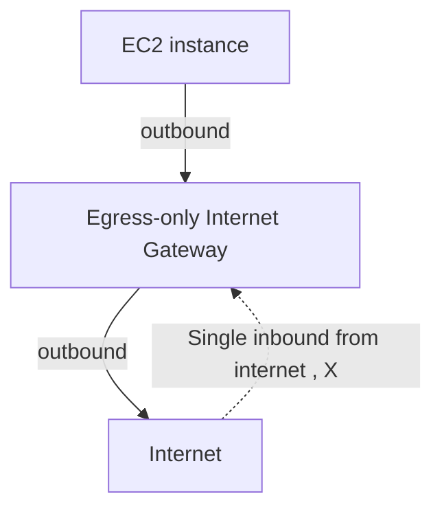

## Networking costs in AWS per GB

簡易說明AWS 流量費用

- 進入的流量都是免費的
- EC2 間流量也是免費
- 盡量使用private ip 傳輸, 可節省成本, 速度也較快
- 同AZ下傳輸可以節省最多成本 (免費, 但就犧牲HA)
- AWS流出的流量需計費
- S3 , 上傳免費, S3 傳出AWS , 0.09/GB, 若要增加傳輸速度(快50-500%)需增加額外費用 ($0.04 to $0.08 / GB)
- S3 與 CloudFront 之間任何流量都是免費 
- CloudFront 與 internet 之間流量 0.085/GB (比S3便宜一點) 
- CloudFront 是Caching Capability 延遲更低, 相較直接請求S3,透過CloudFront 請求S3 , 速度更快, 費用更低(可以至原本1/7)  
- S3 cross region replication 0.02/GB
- NAT Gateway 0.045/hour + 0.045/GB (資料處理) + 0.09/GB (流量,跨區, 同區免費)
- Gateway Endpoint 0.01/GB (同區), 比NAT Gateway 便宜

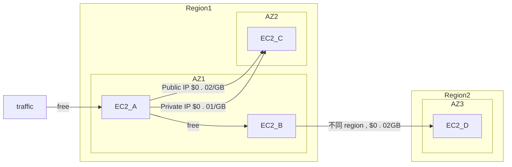


## Network Firewall

- 於VPC外層, 可以保護整個VPC
- layer 3 to layer 7 protection
- 可作用範圍 VPC to VPC, Outbound, Inbound, To/From Direct Connect, site to site vpn


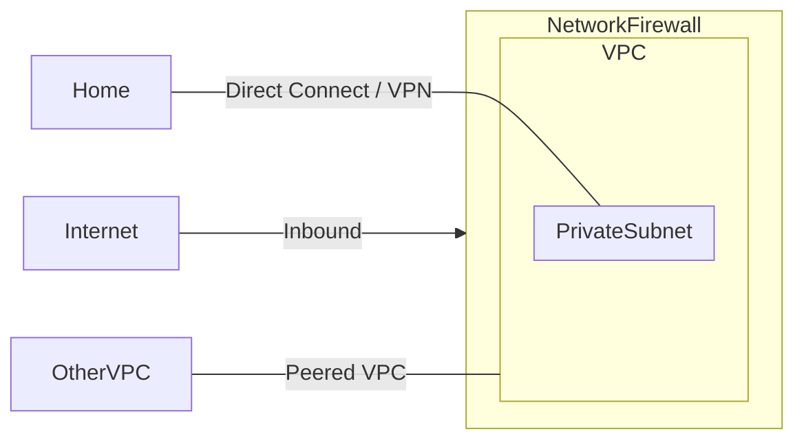


## hand-on

- create vpc
- create 4 subnets and attach to vpc (2 prepare for public, 2 prepare for private)
- create internet gateway and attach to vpc
- create 2 route tables (1 for public, 1 for private), and associate with subnet
- edit public route table to add IGW ## set public subnet
- create ec2 instance in public subnet
- create ec2 instance in private subnet and security group set ssh source from above security group ## set private
  instance sg
- try to ssh to private instance from public instance with private ip ## test bastion instance
- create nat-gateway, and add to private route table
- try to enter internet from private subnet ## test NAT Gateway
- install http server in bastion instance , echo "hello world" > /var/www/index.html
- set security group to allow http port 80 on inbound rule in bastion instance , curl bastion instance ## test secure
  group, 有狀態, 只需inbound rule , 即使取消 outbound rule 0.0.0.0/0 也不影響
- set NACL , inbound rule , rule number 80, http deny, curl bestion instance , ## test NACL, default 100 allow all, but
  set 80 deny for http, http will deny, if sets 140 , http will allow , 高優先 規則為主
- set NACL , outbound rule , deny for 0.0.0.0/0, curl bestion instance ## test NACL , 有狀態, 進出都需要符合條件,
  這邊出去被deny 會無法response,
- set VPC IPv6 CIDR, 在subnet設置CIDR block , 開啟配發 IPv6 address, 之後可在其中ec2 選擇配發ipv6, 需注意要新設定security
  group for ipv6 
