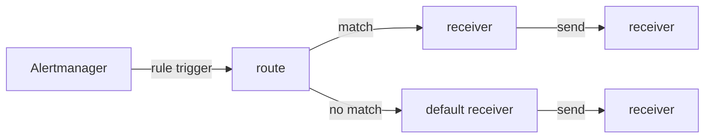

紀錄目前有使用到的alertmanager設定  

- route: 決定rule message發送到哪個receiver
- receiver: 決定message發送方式 (email, slack, webhook) , 發送目標
- inhibit_rules: 避免重複發送


match流程




## route


route主要判斷 trigger的rule message發送到哪個receiver  

- receiver: 預設的receiver, 若無規則match則使用此receiver
- group_by: 若特定的label有相同的值, 會判斷成同一組合併發送
- routes: 規則列表
  - match: 條件判斷
  - match_re: 正規表達式判斷
  - continue: 若已經符合該規則 是否繼續判斷下一個規則  

```yaml
route:
  receiver: 'default-receiver'
  group_by: [ 'job' ]
  routes:
  - match:
      severity: 'critical'
    receiver: 'critical-notices-channel'
    continue: true
  - match_re:
      job: '^kubernetes-.*'
    receiver: 'kubernetes-notices-slack-channel'
```
### label name 補充

#### alertname

alertname 為rule中的alert名稱 , 以下例子為 HostUnusualNetworkThroughputIn  

```yaml
      - alert: HostUnusualNetworkThroughputIn
        expr: sum by (instance) (rate(node_network_receive_bytes_total[2m])) / 1024 / 1024 > 100
        for: 5m
        labels:
          severity: warning
        annotations:
          summary: "異常流入網路吞吐量,實例:{{ $labels.instance }}"
          description: "網路流入流量 > 100 MB/s，目前值：{{ $value }}"
```


#### job

job 為prometheus中的job名稱, 以下例子為 prometheus

```yaml
scrape_configs:
  - job_name: "prometheus"  ## 任務名稱
    static_configs:
      - targets: ["localhost:9090"]  ## 該任務監測的主機  hostname:port , hostname可在 /etc/hosts 設置
        labels:
          instance: prometheus-server
```

## receiver

決定message發送方式 (email, slack, webhook) , 發送目標  

### email

```yaml
receivers:
  - name: 'mail-notifications'
    email_configs:
      - to: OOO@example.com
        from: xxxx@from.example.com
        smarthost: smtp-mail.oooo.com:587
        auth_username: xxxx@from.example.com
        auth_identity: xxxx@from.example.com
        auth_password: fycdytvssdftxlzvdnz
        send_resolved: true
```


### webhook

```yaml
receivers:
  - name: 'webhook-notifications'
    webhook_configs:
      - url: 'http://localhost:5001/alert'
        send_resolved: true
```

## inhibit_rules

避免重複發送  

這邊是若有 critical 的 alert, 同時又有 warning 的 alert, 此時兩則rule的 label(alertname, instance) 數值都都相同  
這邊warning的alert就會被inhibit, 不會發送  

```yaml
inhibit_rules:
  - source_match:
      severity: 'critical'
    target_match:
      severity: 'warning'
    equal: ['alertname', 'dev', 'instance']
```


## 參考範例


### Email


```

route:
  group_by: ['alertname']
  group_wait: 10s
  group_interval: 10s
  repeat_interval: 10m
  receiver: 'mail-notifications'

receivers:
  - name: 'mail-notifications'
    email_configs:
      - to: me@xxx.com
        from: ooo@xxx.com
        smarthost: smtp-mail.xxx.com:587
        auth_username: OOO@gg.com
        auth_identity: OOO@gg.com
        auth_password: sdfsdfvdnz
        send_resolved: true

inhibit_rules:
  - source_match:
      severity: 'critical'
    target_match:
      severity: 'warning'
    equal: ['alertname', 'instance']

```
