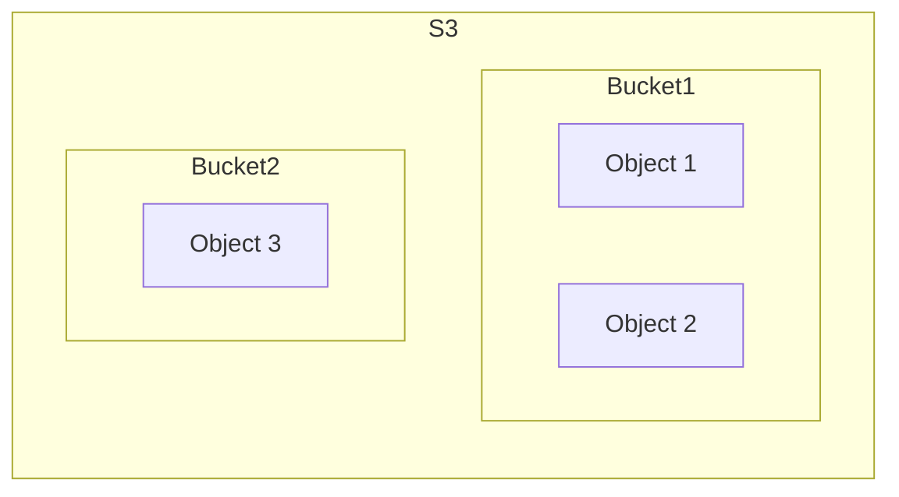
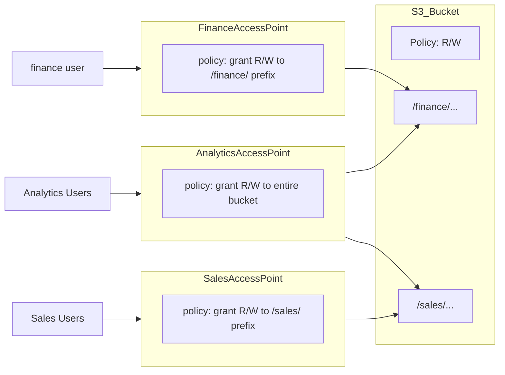
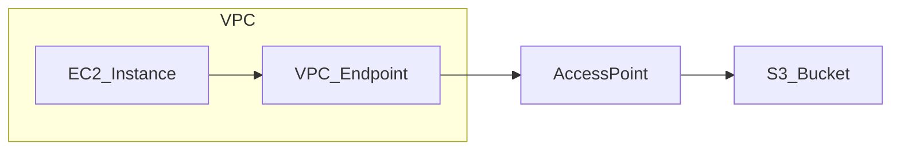
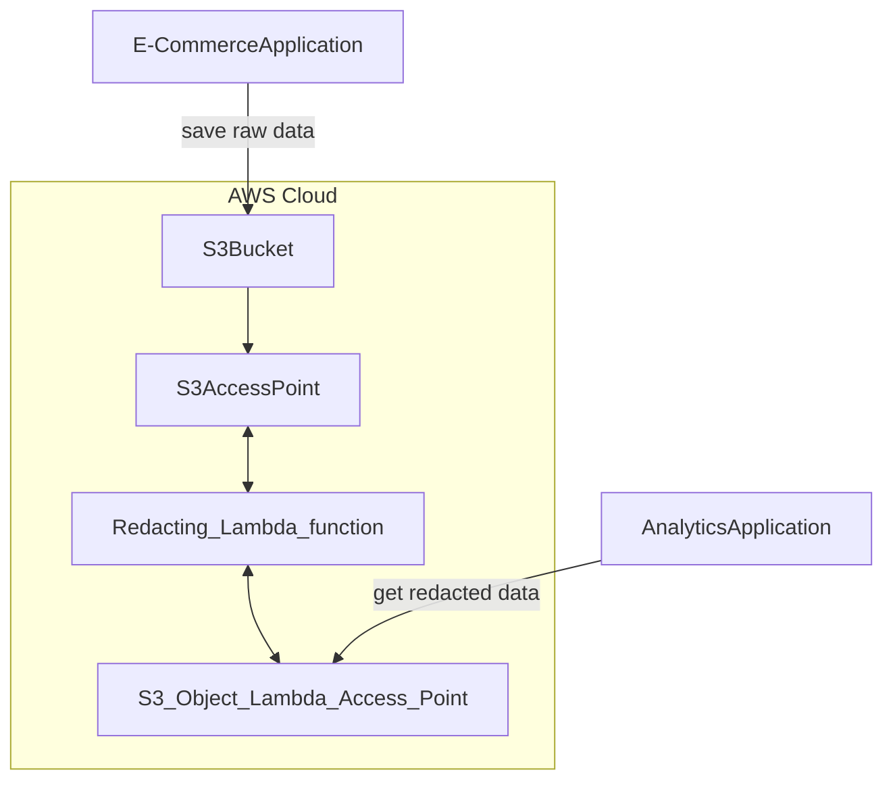

AWS的儲存模塊  

概念如下  



## Bucket

S3中的所有檔案都是被存放至Bucket  
可以理解成檔案的最頂層目錄  

- Bucket 為 region level  
- Bucket名稱必須為 global unique (只有名稱是global)

取名限制  

- 不能大寫且不能含有 '_'
- 3-63個字元
- 不能為IP
- 由小寫字母或數字開頭 結尾
- 不能 xn- 為前綴
- 不能 -s3alias 為後綴

其他 [參考](https://docs.aws.amazon.com/AmazonS3/latest/userguide/bucketnamingrules.html?icmpid=docs_amazons3_console)

## Object

存放的物件, 其實就是file, 每個object 含有一個 unique key

### key

object的辨識標誌

- key = prefix + objet name
- 實際上就是full path e.g. s3://my_bucket/my_file.txt
- object沒有所謂 directory的概念, 只是 UI上會讓你看起來有

### 檔案限制

- 單檔最大 5TB
- 超過需用 multi-part upload api d

### MetaData

每個object都有一個 list of text key / value pair  
可以用來存放 system or user metadata,

### Tags

Unique key / value pair 最多10個

### Version ID

若 versioning is enable, object就會產生 version ID

## Security

### Public Access

S3 是預設關閉 public access的, 若要讓外部可訪問object 需自行開啟

Bucket > your bucket > permissions  > Block public access (bucket settings) > Edit

- [ ] Block all public access

這邊只是開啟該bucket 可以被public access的權限 , 但bucket內部資源能不能被訪問還是要設定Policy  
bucket public access 開啟, 內部object也授權public可訪問 才可以真正被外部訪問

### Policy

Bucket內部資源 可利用policy進行權限限制

[policy example](https://docs.aws.amazon.com/AmazonS3/latest/userguide/example-bucket-policies.html?icmpid=docs_amazons3_console)

範例

```json
{
  "Id": "Policy1710138897798",
  "Version": "2012-10-17",
  "Statement": [
    {
      "Sid": "Stmt1710138896679",
      "Action": [
        "s3:GetObject"
      ],
      "Effect": "Allow",
      "Resource": "arn:aws:s3:::learn-s32/*",
      "Principal": "*"
    }
  ]
}
```

| key       | description                                                                   |
|-----------|-------------------------------------------------------------------------------|
| Id        | 此policy的unique id                                                             |
| Version   | policy的版本號                                                                    |
| Statement | 權限語句list                                                                      |
| Sid       | 該Statement的unique id                                                          |
| Effect    | 對該權限的結果                                                                       |
| Resource  | 該權限應用的bucket資源對象 格視為 'arn:aws:s3:::<bucket_arn>/*' , / 後表示bucket下object *表示通配 |
| Principal | * 表示開放公共權限, 其他如下                                                              |

#### Principal

```
"Principal":{"AWS":"arn:aws:iam::AccountIDWithoutHyphens:root"}
## 特定使用者
## Account ID: 5282-51XX-XOOO
## AccountIDWithoutHyphens 為不含'-'的帳戶ID e.g. 528251XXXOOO
## root 表示該帳戶的root用戶

"Principal":{"AWS":["arn:aws:iam::AccountID1WithoutHyphens:root","arn:aws:iam::AccountID2WithoutHyphens:root"]}
## 多個使用者

"Principal":{"AWS":"arn:aws:iam::AccountID1WithoutHyphens:user/myuserid"}
## 某帳號 特定user
## e,g, "Principal":{"AWS":"arn:aws:iam::528251XXXOOO:user/y40102"}
## 528251XXXOOO的user: y40102

```

## Static website

S3 可以存放靜態的html網頁

bucket > your bucket > properties > static website hosting > Edit > enable

index document: 設定你的靜態檔案檔名

之後將該檔名的html放置bucket中

若成功後 至static website hosting 位置查看, 可看到該靜態頁面的網址

須注意該htm與相依資源需要全部都需要 public access ,否則會403

## Versioning

需在 bucket level 開啟 versioning

buket > your bucket > properties > Bucket Versioning > Edit > enable

***需注意 開啟versioning後, 之前尚未versioning加入的檔案, version會變成null***

- 相同key 會覆蓋, 並會修改 'version' 的數值 1,2,3...
- 可以對 object 進行版本控制 (如 不小心刪除 , 可以輕鬆松rollback)

重複上傳後, 可以在 object level > show version 開啟  
就可以看到上傳的所有版本

若要退版本, 就直接找到最新版本的檔案 直接刪除就可以了

***需注意 若在 object level > show version 開啟的情況下,刪除則是真的刪除 無法回復***

若在 object level > show version 是關閉的情況下, 刪除則是標記刪除, 非真的被刪掉
之後若開啟 object level > show version 就可以看到之前 被刪除的檔案並配有一個對應的 Delete marker 檔案  
只要將 相對的 Delete marker 的檔案刪除, 就可以回復檔案

## Replication

分為 CRR 與 SRR

- Bucket 必須開啟 versioning
- Bucket 可以跨AWS帳號執行
- Bucket 間的複製為 異步執行
- S3 必須要有 適當的IAM permission

### SRR

同區域的複製

如  
eu-west-1 複製到 eu-west-2

使用場景 如 各系統 log蒐集

### CRR

不同區域的複製

如  
eu-west-1 複製到 ap-northeast-1

使用場景 如 資料搬遷 降低不同區域之間的延遲

### 注意事項

- replication 只會複製新的object 舊的並不會複製過去
- 若需要把舊的複製過去 需開啟 S3 Batch Replication , 此功能會把已存在與之前失敗的object 複製過去
- 刪除部分, 可以將 Delete Marking 複製過去 (Optional: 需在設定rule時 勾選Delete marker replication)
- versioning的紀錄也會被一起複製過去
- 若是用 VersionID 刪除的 不會被一起複製過去 刪除效果
- 複製 bucket不會有連鎖效果, bucket2 已經設定replicate到 bucket3, bucket1 也replicate到 bucket2, 此時創建object至bucket1,
  並不會sync至bucket3 , 簡單來說 就是只有真的是上傳到某bucket的 才會被replicate至其他, 若是因為replication進到bucket的
  不會再replicate至其他bucket

## class

### Standard

- 99.99% 可用性, 代表一段時間中 會有99.99%的時間可正常提供服務
- 用於需頻繁檢索
- 低延遲 , 高吞吐
- 可容忍aws兩個設施發生故障 ,依然可以正常服務

使用場景: 遊戲應用, 大數據分析, 內容分發

### Infrequent Access

- 數據很少需要被訪問
- 成本比S3 standard低
- 但被檢索時需要額外的檢索費用

S3 Standard-IA

- 可用性 99.9%, 可用性會略低一點點

使用場景: 災難數據回復, 資料備份

S3 One Zone-Infrequent Access (S3 One Zone-IA)

- duration 99.999999% , 但只在一個AZ(Available Zone)
- 可用性 99.5%, 可用性會更低一些

### Glacier

- 低成本的存儲方式, 用來歸檔或是備份
- 費用取決於 儲存 + 檢索 , 各檢索有不同的速率與費用

S3 Glacier Instance Retrieval

- 可以在幾毫秒內進行檢索 , 適用如 每季一次的需求 ..
- 最短儲存時間為90天  
  S3 Glacier Flexible Retrieval (formerly Amazon S3 Glacier)
- Expedited: 可以1-5分鐘內進行檢索, 支付 Expedited的檢索費嗽
- Standard: 可以3-5小時內進行檢索, 支付Standard的檢索費用
- Bulk: 可以5-12小時內進行檢索 , 支付Bulk的檢索費用
- 最短儲存時間為90天
  S3 Glacier Deep Archive
- 用於長期儲存
- Standard: 可以12小時內進行檢索, 支付 Standard的檢索費用
- Bulk: 可以48小時內進行檢索, 支付Bulk的檢索費用

### Intelligent-Tiering

- 根據object使用,會自動每個月幫你選擇最適用的S3 儲存模式
- 但每個月會需支付 少量的監控費用 與 object 層之間移動的費用
- 不需檢索費,
  <br/>
  實際是由多個iter組成的, 不須檢索費是因為預設有一個是頻繁檢索的iter
- Frequent Access Tier: 頻繁檢索層
- Infrequent Access Tier: 檔案沒被使用超過30天 會被分過來此層
- Archive Instant Access Tier: 檔案沒被使用超過90 會被分過來此層
- Archive Access Tier (Optional): 超過90-700+天
- Deep Archive Access Tier (Optional): 超過180-700+天

## life-cycle

- object進入至bucket後, 可以設定一些規則, 來自動將object轉移到其他class
- 也可以設置規則將object刪除(non-current or expired object)
- current or non-current 可以分開定義生命週期

prefix 範例

```
s3://etc-s3-bucket/api_log/20240318.zip
## full path

bucket_name = etc-s3-bucket

prefix = api_log/


```

## Notification

SQS 就是AWS的 Message Queue

從bucket添加notify目標

Bucket Level > Properties > Event Notifications > Create event notification

這邊可以設置 bucket中的object 做了哪些處理會trigger notification,

如

- s3:ObjectCreated:Put
- s3:ObjectCreated:Post
- s3:ObjectCreated:Copy
- s3:ObjectCreated:CompleteMultipartUpload

destination 可以選擇

- SNS
- SQS
- Lambda

### SQS

這邊選擇SQS 預設會有權限問題, 須將SQS設置可以讓S3可以發送訊息至SQS

SQS > your queue > Access Policy > Edit
參考, 這邊開放所有人都可以發送訊息至SQS

```json
{
  "Id": "Policy1710212853646",
  "Version": "2012-10-17",
  "Statement": [
    {
      "Sid": "Stmt1710212852237",
      "Action": [
        "sqs:SendMessage"
      ],
      "Effect": "Allow",
      "Resource": "arn:aws:sqs:ap-northeast-1:528252162167:demoSQS",
      "Principal": "*"
    }
  ]
}
```

bucket中觸發notify 至 SQS 後, SQS需要手動pull才會看的到訊息

## Performance

### request

同prefix下, 一秒根據方法可以接收3500,5500個request  
e.g.  
bucket/folder/sub2/file2 prefix = folder/sub1  
bucket/folder/sub2/file2 prefix = folder/sub2    
bucket/1/file prefix = 1  
bucket/2/file prefix = 2

| method               | performance |
|----------------------|-------------|
| GET/HEAD             | 5500        |
| PUT/POST/COPY/DELETE | 3500        |

如上述範例總共可以處理 GET/HEAD = 5500*4 = 22000 request/s

### file size

- 單檔推薦 '>' 100M
- 單檔 '<=' 5G
- 超過5G 使用multi-part upload , 大檔 分段上傳性能會比較好
- multi-part upload 最大 5TB

## Data Transfer tricks

### Byte-Range Fetch

S3 可以藉由指讀取單檔的範圍或是byte數量, 節省時間與流量

#### range

假設有一個大型檔案, 但只想要讀取第一部份前面, 第二部份後面, 就可以考慮這方式 , 且各部份讀取時是可以parallel的  
<br/>

#### byte

S3 可以藉由指定讀取單檔的部份內容, 節省時間與流量  
假設有一個大型檔案, 已知前50個byte是header, 只想讀取該部份, 就可以考慮這方式

### Select

S3可以在server端進行SQL-like的查詢,之後直接將結果返回  
此方式可以節省大量的傳輸費用與時間  
特別適用於 Glacier

## metadata

- object可以在物件上傳時定義metadata
- key:value pair
- define metadata names must be 'x-amz-meta-' prefix
- metadata key must be in lowercase
- metadata can be retrieved when get object

***需注意 無法利用metadata或tag 進行條件查詢***

## tag

- key:value pair for object
- useful for define permission ( only access specific tag object)
- useful for analytics purpose (using S3 analytics to group by tag)

***需注意 無法利用metadata或tag 進行條件查詢***

***若需要查詢, 需配合內部的資料庫設成 index, e.g. dynamoDB***'

## Encryption

S3 加密, 分成伺服器端加密 SSE, 與客戶端加密 CSE

SSE 可分

- SSE-S3: S3管理的key 進行加密
- SSE-KMS: AWS KMS 進行加密
- SSE-C: 客戶自己管理key 進行加密

### SSE-S3

- server-side 加密與key都是由aws處理, 用戶永遠都無法訪問
- 加密類型為 AES-256
- 用法為 上傳時 , header 加上 'x-amz-server-side-encryption': 'AES256'
- 實際上 bucket, object default 就都是AES256

### SSE-KMS

AWS KMS 為key management service, 可以用來管理加密key   
AWS CloudTrail 為AWS的log service, 可以記錄所有的API request, 配合KMS可以紀錄所有的key request

- server-side 加密由aws kms處理, 只要有調用過key的人都會留有紀錄
- KMS 可以被使用者控制
- 用法為 上傳時 , header 加上 'x-amz-server-side-encryption': 'aws:kms'
- 上傳與下載時都會需要調用KMS, 會有額外的費用

### SSE-C

- 客戶自己管理key, 並且將key傳給aws進行加密, aws不會保留key 用完即丟, 下載時也需要提供key
- 必須為 HTTPS, 因傳送時會有key, 若為HTTP, key會被明文傳送

| header                                          | value                                                   |
|-------------------------------------------------|---------------------------------------------------------|
| x-amz-server-side-encryption-customer-algorithm | AES256                                                  |
| x-amz-server-side-encryption-customer-key       | 使用此標頭可提供 256 位元 base64 編碼加密金鑰，讓 Amazon S3 用來對資料進行加密或解密。 |

### CSE

客戶端加密, 由客戶自己進行加密, 並且將加密後的檔案上傳至S3, 之後下下來自己解密

### 強制開啟傳輸加密

這邊需在bucket policy 設置需明確拒絕HTTP請求  
若允許HTTPS 但 沒明確拒絕 HTTP , 可能會造成不符合規則

#### bucket設置拒絕HTTP請求

secure transport = false時 , Deny 所有操作

```json
{
  "Id": "ExamplePolicy",
  "Version": "2012-10-17",
  "Statement": [
    {
      "Sid": "AllowSSLRequestsOnly",
      "Action": "s3:*",
      "Effect": "Deny",
      "Resource": [
        "arn:aws:s3:::DOC-EXAMPLE-BUCKET",
        "arn:aws:s3:::DOC-EXAMPLE-BUCKET/*"
      ],
      "Condition": {
        "Bool": {
          "aws:SecureTransport": "false"
        }
      },
      "Principal": "*"
    }
  ]
}
```

***若使用 Effect: Allow, aws:SecureTransport: True 是會造成匿名傳輸, 若非特殊需求 需避免該設定***

### Default Encrypt

S3 default encrypt is SSE-S3 , 可以在bucket level > Properties > Default encryption > Edit

SSE-C 只能用CLI, 無法在console上設定

若想要強制使用特定Encrypt method (SSE-KMS,SSE-C), 而非客戶端用 header隨意決定, 可以利用policy強制規範

範例: 若非SSE-KMS 則拒絕

```json
{
  "Id": "Policy1710230584711",
  "Version": "2012-10-17",
  "Statement": [
    {
      "Sid": "Stmt1710230552421",
      "Action": [
        "s3:PutObject"
      ],
      "Effect": "Allow",
      "Resource": "arn:aws:s3:::MyBucket",
      "Condition": {
        "StringNotEquals": {
          "s3:x-amz-server-side-encryption": "kms"
        }
      },
      "Principal": "*"
    }
  ]
}
```

範例: 若非SSE-C 則拒絕  
s3:x-amz-server-side-encryption-customer-algorithm is null 為真, 表示沒有使用SSE-C

```json

{
  "Id": "Policy1710230709052",
  "Version": "2012-10-17",
  "Statement": [
    {
      "Sid": "Stmt1710230704286",
      "Action": [
        "s3:PutObject"
      ],
      "Effect": "Allow",
      "Resource": "arn:aws:s3:::MyBucket",
      "Condition": {
        "Null": {
          "s3:x-amz-server-side-encryption-customer-algorithm": "true"
        }
      },
      "Principal": "*"
    }
  ]
}
```

### CORS

bucket 若設置靜態網頁 其中使用的資源若是來自其他domain, 需設置CORS

- 兩bucket皆須開放public access, bucket level > Permissions > Block public access > Edit
- 兩bucket皆須設定 policy 使可以被public access
- 靜態網頁的bucket 開啟 bucket level > Properties > Static website hosting > Edit
- 提供資源的bucket 需設定CORS, 將該static website host 加入

```json
[
  {
    "AllowedHeaders": [
      "Authorization"
    ],
    "AllowedMethods": [
      "GET"
    ],
    "AllowedOrigins": [
      "<url of first bucket with http://...without slash at the end>"
    ],
    "ExposeHeaders": [],
    "MaxAgeSeconds": 3000
  }
]
```

如 http://democors1.s3-website-ap-northeast-1.amazonaws.com

### MFA

- 可開啟MFA, 進行重要操作時, 需要MFA確認
- 如 永久刪除object, 停止版本控制,
- 若需開啟MFA, 必須設置Versioning enabled
- 必須為root user 才能設置MFA, 且僅能用 AWS CLI

```bash

aws s3api put-bucket-versioning --bucket DOC-EXAMPLE-BUCKET --versioning-configuration Status=Enabled,MFADelete=Enabled --mfa "arn:aws:iam::123456789012:mfa/root-account-mfa-device 123456" --profile root-mfa-delete-demo
## --profile 為使用特定的credential profile進行驗證, 無輸入則使用default  

```

### Access Logs

- 通常用於查核, 記錄所有訪問s3 bucket的log
- 無論是 authorized or denied from any account, 都會被存放至另一個S3 bucket
- 可以使用分析工具對log進行分析 e.g. AWS Athena
- log bucket 需與 被訪問的s3在同一個region

[s3 access log format](https://docs.aws.amazon.com/AmazonS3/latest/userguide/LogFormat.html)

***注意不要將log bucket 與 被記錄的bucket 設為同一個 會造成死循環 費用會暴增***

#### hand-on

bucket > properties > Server access logging > enable > 設置destination > 選擇log foramt > date key format

***設置完會自動更新bucket policy***

### Pre signed urls

主要用途是允許S3的物件在一段時間內向外開放 (即使是private bucket), 用於想共享S3物件,但又不想開放權限時

使用上就是產生一個 pre-signed的 url, 該url可以讓其他使用者在一端時間內 存取/上傳

使用場景

- 允許檔案下載
- 允許檔案上傳
- 媒體串流共享

#### hand-on

S3物件 > Open (會打開檔案, 該url後會帶有一串 pre-signed), 該url可被此url的擁有者訪問

or

S3物件 > Object actions > 設置pre-signed期限 > create url

### Access Point

類似 MQ 解偶中繼點, 若某個身分的使用者 因業務內容需訪問多個bucket時, 權限上會不容易控制  
這邊可以透過 Access Point 進行訪問,

- Access Point 可以簡化設置
- S3 policy 可設置大範圍policy
- 細部定義於 Access Point的 Policy
- 每個Access Point 都有自己的DNS name ( internet origin or VPC origin)



#### VPC Origin

- 可設置只有在VPC中的資源, 才能訪問該 AccessPoint
- 必須設置VPC Endpoint to Access Point (Gateway or Interface Endpoint)
- VPC Endpoint Policy 必須 allow access target bucket 與 Access Point



## S3 Object Lambda

可以再從S3取回物件時, Trigger lambda function 將物件進行一些處理, 直接取回 處理後的結果

- 可以節省 處理後資料的存儲空間

這邊假設有一個電商app,會持續上傳銷售資料至S3, 有一個分析team會需要取得銷售資料, 但期望的是這些資料已經被預先處理過   
這邊採用Object lambda, 在分析team取資料時, 會直接取得 lambda預處理過的結果


