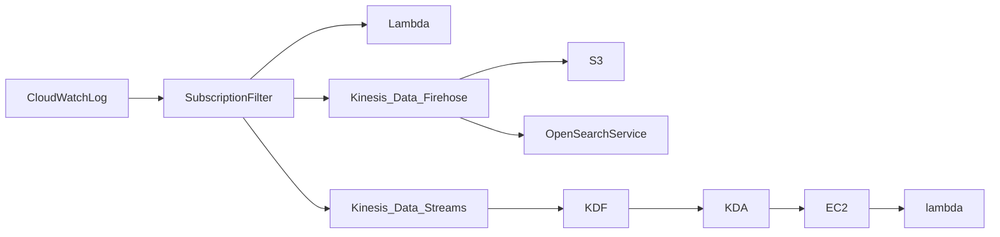
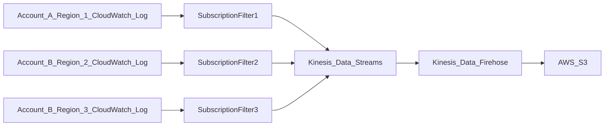
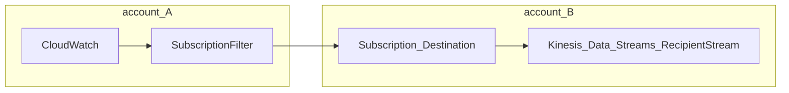

AWS指標監控模塊,類似Prometheus的腳色  
可以將各服務的數值作為指標送入CloudWatch   


## Metrics

- CloudWatch 對aws提供metrics
- metrics 簡單說就是一個time series的觀測值, 用於服務監控  (e.g. CPUUtilization)


## EC2 Monitoring

- 每五分鐘一個指標  (免費)  
- 可以開啟 detail monitoring (需要額外費用), 為每一分鐘一個指標, 可用於AutoScaling  
- 免費提供 10種 detail monitoring metrics 
- 無ram 與 disk usage,  

## Dashboard

- 可客製化dashboard
- global level 
- 可以跨帳號與regions建立圖表  
- 可以自動刷新(10s,1m,2m,5m,15m)
- 可修改timezone , time range  
- 免費額度為 3個dashboard, 最多可以使用50個metrics
- 付費為 每多一個 3美元/月  

## Log Group

cloudWatch的log instance, 用於存放log stream  

- Log group: 代表特定application  
- log stream: 特定 application/ log file / containers  的 log instance
- 可定義log的expiration policy , (never expire, 1 day to 10 day)
- 日誌預設加密 (類似S3 ) , 也可使用KMS  


### CloudWatch Logs - Source
 
這邊是日誌的來源  

- SDK, CloudWatch log agent, CloudWatch Unified Agent, 使用sdk可將自訂的log送入
- Elastic Beanstalk
- ECS 
- AWS Lambda
- VPC Flow logs 
- API Gateway
- CloudTail base on filter
- Route53: Log DNS query

### CloudWatch Logs - Destination

可將接收到的log 送至其他目標  

- S3
- kinesis Data Streams
- kinesis Data Firehose
- AWS Lambda
- OpenSearch


### metric filter

可將log的訊息過濾出來 轉為 cloudwatch的metric, 用於監控指標 或是 alert


### S3 Export 

- 可協助將CloudWatch log 輸出至 S3, 資料導出需要 12hour to become available  
- 該 API 叫做 CreateExportTask  
- 非即時輸出

### CloudWatch Logs Subscriptions 

- 可以從 CloudWatch Logs 取得 real-time log event 進行分析處理  
- 可將log 及時輸出至 ElasticSearch, Kinesis Data Stream, Kinesis Data Firehose or Lambda
- subscription filter: 可將log event進行 條件過濾並 分送至 目的地  





#### CloudWatch Logs Aggregation Multi-Account & Multi Region 

可將不同帳戶的log event 聚合至同一個目標  



跨帳號訂閱





recipient IAM role (Cross-Account)

```json
{
  "Statement": [
    {
      "Effect": "Allow",
      "Action": "kinesis:PutRecord",
      "Resource": "arn:aws:kinesis:region:999999999999:stream/RecipientStream"
    }
  ]
}
```


destination policy

```json

{
  "Version" : "2012-10-17",
  "Statement" : [
    {
      "Sid" : "",
      "Effect" : "Allow",
      "Principal" : {
        "AWS" : "111111111111"
      },
      "Action" : "logs:PutSubscriptionFilter",
      "Resource" : "arn:aws:logs:region:999999999999:destination:testDestination"
    }
  ]
}
```

### Live Tail

- 主要用於調適  
- 可設一些條件將進入log group 的log 進行過濾, 並即時串流於畫面上,  
- 需額外費用, 每日有一小時的免費額度  


## CloudWatch Logs Insights

- 用於cloudwatch logs group 查詢與分析 e.g. 查找log中特定IP含有ERROR的次數
- 查詢引擎, 有自己的查詢語法 , 非即時查詢, 而是depend on log
- 會自動解析出 來自AWS服務的log與JSONlog的 field
- 可根據條件進行filter, 聚合運算 , 排序, 限制數量
- 可將查詢條件加入 dashboard
- 可以跨多個AWS帳號查詢多個 log group

## CloudWatch Alarms 

- 可以被任何metric trigger alarms  
- 可定義複雜規則 ( sampling 百分比, max, min, mean ....)
- 一般用於單個metric trigger, 若需要多個metric trigger, 可用 compose alarms

### Alarm States

alarm state 可分為  
- ok: 尚未觸發
- insufficient data: 表示沒有足夠的data
- alarm: 已被觸發

### Period

- 評估metric的時間長度(秒) , e.g. CPU 80% 以上 180秒
- 可設 10s , 30s 或是 60倍數 sec  

### Datapoint of alarm  

這邊是指在 X個評估期中 滿足Y個才會被觸發  

e.g. 條件為 CPU 80% 以上持續180秒 , 若設置 2 of 3 , 表示 在540秒中 有兩組持續180秒 才會被觸發  


### Alarm Target

- EC2: Stop,Terminate,Reboot or Recover an EC2 instance
- AutoScaling: Trigger Auto Scaling Action  
- SNS: Send Notification to SNS (SNS可以跟lambda掛勾, 因此可以實現任何操作)  

### Compose Alarm

- 可以使用多個metrics作為條件進行trigger, 也可以說是多個alarm trigger  
- AND OR Conditions
- 多個metrics 可減少 alarm noise  e.g. CPU 與 IO 同時高負載 才trigger 發送 SNS  


### EC2 Instance Recovery  

用於 EC2 Instance的狀態監控  

StatusCheck 可分  
- Instance Status: 確保 EC2 VM
- System Status: 確保硬體

一旦損毀, 可觸發 Recovery, 相同的 Private,Public,ElasticIP,Placement group  


## CloudWatch 補充    

- 可以使用 log group中的 metric filter 創建的metrics 創建 alarm  
- 可以使用 CLI 測試 alarm 與 notification 

```bash
aws cloudwatch set-alarm-state --alarm-name "MyAlarm" --state-value ALARM --state-reason "Testing alarm state"
```

## CloudWatch Synthetic

- 簡單說就是 寫一個腳本模仿用戶行為, 用該腳本監控特定application  
- 可確認latency與available, 可儲存loading時間與 browserUI 截圖  
- 可整合CloudWatch Alarm e.g. 用戶 > route53 > app,   我們使用synthetic 監控app, app失效 trigger alarm, 執行lambda, 啟動另一組app, 並將route53指向新機器  
- 腳本script 支援 Node.js 與 Python  
- 可腳本化 headless chrome browser, 
- 可執行一次或 定期執行  


### 參考用途

- HeartBeat Monitor: Load URL, Screenshot and HTTP archive file (HAR文件記錄了訪問該URL時完整的HTTP請求和響應信息,可用於debug)  
- API Canary: 測試API基本功能  
- Broken link checker: 用於測試所有URL的是否正常  
- visual monitor: 比較 canary 時的 screen shot, 與基準 screen shot 差異  
- Canary Recorder: 這邊是可以錄製UI操作產生script (本用途是錄製後 可以直接於Synthetic作為腳本使用, Synthetic主要是模仿客戶端 驗證server application )    
- GUI workflow builder: 錄製的腳本也可以驗證GUI操作是否正常  


