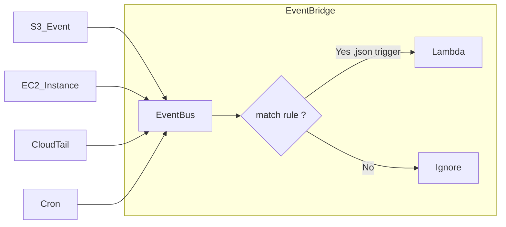
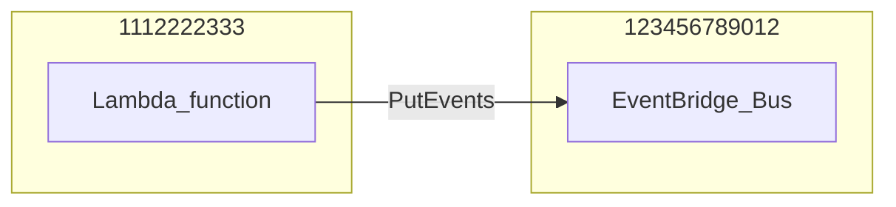

AWS的事件中心    

流程為所有Event都會被傳入 event bus, 其中透過Rule來過濾事件, 符合條件的事件, 會trigger 特定組件 (
e.g. lambda,SQS/SNS...), 不符合則是忽略



## Event Bus

可以視為 EventBridge的處理事件的中心, 所有事件都會傳入 Event Bus , 才開始後續動作

- Event Bus 可以藉由 AWS Account中的 Resource-based policies 來控制存取權限
- Event 進入至 Event Bus 後, 可以透過Rule來過濾事件
- Event Bus archive(需額外費用), 可以將事件封存 (一段期限或是永久), default archive為關閉, 若開啟, archive期限default為
  永久
- 可 replay event (如某個event可驅動特定lambda, 之後可無限重複使用該event來驅動該lambda)

## Event Bus Source

傳入Event Bus的來源, 可以是以下幾種

### AWS Service

來自AWS服務的所有事件

例如以下

- 定時執行任務 schedule or cron
- EC2 Instance被啟動
- CodeBuild 建立失敗
- S3 Upload object
- Trusted Advisor, 有新發現
- CloudTail 任何API被調用

### AWS Partner

也可以是 AWS合作的SaaS, e.g. Zendesk,DataDog,Auth0 ...   
可將這些服務所發生的事件傳入 Event Bus

### Custom Apps

自定義的app

## Event Bridge Rule

Event進入 event bus後 , Rule 會過濾事件的, 符合條件的事件, 才會trigger

### 創建Rule

### Rule type

擇一

- Rule with an event pattern : 特定event驅動
- Schedule: 定期性任務

### Event Source

擇一

- AWS service
- Other (Custom , partner or other)
- All Event

### Sample Event (Optional)

json格式, 定義 Event的範例, 主要用於開發或調適, 可驗證規則   

e.g. EC2狀態改變, 被停止  

```json
{
  "version": "0",
  "id": "651d5f8b-947c-4c0f-acb7-5ac4e41a1b8a",
  "detail-type": "EC2 Instance State-change Notification",
  "source": "aws.ec2",
  "account": "123456789012",
  "time": "2015-11-11T21:33:19Z",
  "region": "us-east-1",
  "resources": [
    "arn:aws:ec2:us-east-1:123456789012:instance/i-abcd3333"
  ],
  "detail": {
    "instance-id": "i-abcd3333",
    "state": "stopped"
  }
}
```

### Event Pattern

定義 Event的條件, 符合條件的事件才會trigger application

e.g. EC2被關閉或是終止

```json
{
  "source": [
    "aws.ec2"
  ],
  "detail-type": [
    "EC2 Instance State-change Notification"
  ],
  "detail": {
    "state": [
      "stopped",
      "terminated"
    ]
  }
}

```

## Schema Registry

- 可以將 event 的 json schema 產生 java/python/Typescript/go 的 code, 用於 marshalling / unmarshalling    
- 詳細用途 待驗證 ... 

## Resource-Base Policy

- 用於管理特定EventBus的存取權限 e.g. allow / deny 來自其他AWS Account or Region 的事件

允許其他AWS帳號的event 進入event bus

```json
{
  "Version": "2012-10-17",
  "Statement": [
    {
      "Effect": "Allow",
      "Principal": {
        "AWS": "1112222333"
        // AWS Account ID
      },
      "Action": "events:PutEvents",
      "Resource": "arn:aws:events:us-east-1:123456789012:event-bus/central-event-bus"
    }
  ]
}
```




## Input Transformation

這邊是將原始輸出 類似relabel, 輸出成其他 schema, 再利用該schema 的變數輸出成需求格式

sample event (可理解成原始的輸出範例)
```json
{
  "version": "0",
  "id": "7bf73129-1428-4cd3-a780-95db273d1602",
  "detail-type": "EC2 Instance State-change Notification",
  "source": "aws.ec2",
  "account": "123456789012",
  "time": "2015-11-11T21:29:54Z",
  "region": "us-east-1",
  "resources": ["arn:aws:ec2:us-east-1:123456789012:instance/i-abcd1111"],
  "detail": {
    "instance-id": "i-abcd1111",
    "state": "pending"
  }
}
```

input transformer (可理解成relabel後的新輸出,就是重新定義key的名稱, value用原始key去代 )

```json
{
  "timestamp" : "$.time",
  "instance" : "$.detail.instance-id",
  "state" : "$.detail.state",
  "resource" : "$.resources[0]"
}
```

Template (這邊就是用 transformer後的新key 根據需求輸出)

這邊template需為json格式,

```
{
  "timestamp": <timestamp>,
  "message": "<instance> is in state <state> at <timestamp>, with arn <resource>."
}
```
實際數值為  
```
{
  "timestamp": 2015 - 11 - 11 T21: 29: 54 Z,
  "message": "i-abcd1111 is in state pending at 2015-11-11T21:29:54Z, with arn arn:aws:ec2:us-east-1:123456789012:instance/i-abcd1111."
}
```


