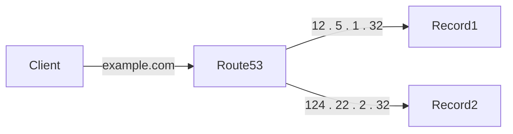

AWS的DNS服務

## Record Type

各類型 mapping 的資訊

| Type  | Description                      |
|-------|----------------------------------|
| A     | IPv4 address                     |
| AAAA  | IPv6 address                     |
| CNAME | map hostname to another hostname |
| NS    | name server                      |

## Hosted Zone

可理解成domain name的容器, 用來儲存DNS資訊 (同GO Daddy 或是 Namecheap 的domain name管理頁面)

e.g. coco77.online 之後可在該hosted zone下創建record , www.coco77.online , example.coco77.online ...

創建hosted zone, 可分兩種類型

- Public Hosted Zone: 用於儲放公開的DNS資訊, 可使domain資訊可被公開查詢
- Private Hosted Zone: 用於儲放私有的DNS資訊, 只能被VPC內部查詢

AWS註冊一個hosted zone, 每月至少0.5美元  
註冊hosted zone後就就可以在該hosted zone下 創建record

創建record, 選項有 record name, record type, value, alias, TTL, Routing Policy

### TTL

Time To Live, 設定DNS資訊的cache時間, 若TTL設置很短 , 則DNS server會更頻繁的查詢DNS資訊  
TTL設置很長, 雖然會減少DNS查詢次數, 但若資訊有異動, 需等待TTL時間後, 才會訪問DNS Server更新DNS資訊

AWS Route53 是流量計費, 訪問次數越多, 費用越高,  
AWS TTL Default 300s

### CNAME vs Alias

| Type  | Description                                                         |
|-------|---------------------------------------------------------------------|
| CNAME | hostname映射hostname ,但不能指向根域名 e.g.不能為example.com, 只能為www.example.com |
| Alias | hostname映射AWS資源 ,免費且無限制 works for root domain and non-root domain   |

#### CNAME Record

- CNAME 必須已經有 A or AAAA record
- CNAME 不能指向另一個 CNAME
- CNAME 不能指向根域名, e.g. example.com , 只能指向子域名, e.g. www.example.com
- CNAME也可指向AWS Resource, 但不推薦,流量計費, 使用alias record 免費且無限制更適合

#### Alias Record

- Maps a domain name to an AWS resource
- Alias record 為 A/AAAA record, 指向AWS resource (AWS resource都是為IPV4 or IPV6)
- 使用上為 A/AAAA record 中開啟Alias, 此時只能選擇AWS resource
- Alias record 不收費, 且無限制
- 不能設置TTL

AWS Resource: 可為 ELB, CloudFront, S3, API Gateway, Elastic Beanstalk, VPC interface endpoint ...
EC2 DNS name 不支援Alias record

### Routing Policy

可以理解成若一個domain name有多個record時的選擇策略

#### Simple

- 一個domain name 映射至一個資源或多個資源, 若為多個則client端隨機選擇一個
- 開啟Alias, 只可指向AWS resource
- 無法支援 health check

#### Weighted

- 簡單說就是在同一個domain name下, 可設置多個record, 並設置權重, 例如 80% 20%
- TTL 過期後, 會依據權重選擇record

#### Latency

- 根據client端 選擇最低的latency的record (base on region)
- 需注意該record是無法自己判斷導向ip latency的, 而是依據自己設定對應的region來判斷 (aws是利用各region與user
  計算latency數值)
- latency是由AWS自己計算的, 基於每個region 與各user的latency統計結果
- 設置多個record設置時需 皆需選擇region, 會依據client選擇latency最低region的record

### GeoLocation

- 根據client端的地理位置選擇最近的record
- 設置時 同一個domain name 可設置多個record, 並設置對應的location
- 需要建立default record (location選擇default), 有可能client端位置沒有對應的location record
- 應用場景為, 依據地理位置提供不同的服務, e.g. 依據地區提供不同語言的服務
- 支援 health check , 若最近的record不健康, 則會切換至次近的record

#### Failover

- 需配合health check 使用, 由DNS 根據健康度切換record (TTL過期後)
- 設置上為 同一個domain 設置兩個record, 並設置對應的health check 與優先級(primary or secondary)
- 若primary record健康度不佳, 則會切換至secondary record

#### Geoproximity

- 根據client端的地理位置選擇最近的record
- 可設置bias調整各record 與user距離權重 ,權重愈大, 該record包覆的地區愈大, 也可理解流量愈容易流向該record
- 1-99 , 愈大該record範圍愈大
- -1 - -99, 愈小該record範圍愈小
- record位置可以 設置參考AWS region位置, 也可自行設置經緯度
- 可以利用 Route53 Traffic Flow 來設置Geoproximity (UI, 可根據設定參數 提供可視化範圍)

#### IP-Based Routing

- 設置上為 同一個domain 設置多個record, 並設置對應的CIDR block
- 根據client端的IP位置選擇特定的record

範例

| domain      | record  | CIDR block     |
|-------------|---------|----------------|
| example.com | record1 | 12.5.0.0/16    |
| example.com | record2 | 124.22.2.32/16 |



#### MultiValue Answer

- 設置上為 同一個domain 設置多個record
- 與simple 多record類似, 但支援health check(若unhealthy, 則不會返回該record)
- 最多可設置8個record


### Third-Party DNS

若想要使用第三方DNS, 可以在third-party DNS設置NS record, 使domain指向 AWS Route53的domain

e.g.

namecheap: 註冊 www.example.com
route53: 註冊 hosted-zone awsexample.com 設置 www.awsexample.com
<br/>  
在namecheap設置NS record, 指向route53的NS record, www.example.com mapping to www.awsexample.com
之後就可以在route53設置 www.awsexample.com 的record的routing policy

## Health Check

基本上是基於 Health Checks 來監控, 需注意為 public resource限定

- monitor endpoint: 監控endpoint健康度
- Status of Other health check: 可設置多個endpoint,利用child health checker確認健康度, 並設置判斷方式, e.g. 多個都健康才為健康
- private hosted zone: 監控private hosted zone, 但不支援 health checker

### monitor endpoint

- 會有15個 global health checks 監控endpoint健康度
- 可設定不健康threshold, default >3 global health checks 偵測到不健康, 就會被標記為不健康
- interval 30s ,最低10s (費用高)
- 支援HTTP, HTTPS, TCP
- 若只要有 > 18% 的 global health checker 偵測到健康, 就會被標記為健康 , 反之則為不健康
- health check 是解析 status code , 2XX or 3XX 為健康, 其他為不健康
- 若是基於文本的健康檢查, 則是檢查前5120 bytes的內容, 若有找到指定的字串, 則為健康
- 需注意 firewall 需允許AWS health checker 的請求通過

### Status of Other health check (Calculated Health Check)

- 可設定多個endpoint與多個child health checker
- child health checker 健康度結果 可用AND OR NOT 來判斷health check 健康度 (e.g. AND 表示全部health才算health)
- child health checker 最多為256個

### Private Hosted Zone (state of cloudwatch alarm)

- Health Check 只能於 於VPC外部, 無法訪問 private endpoint
- Private Hosted Zone 監控需結合cloudwatch ,不支援 health check
- Cloudwatch Metric 與 Cloudwatch Alarm 來監控

### 查詢驗證

record 創建後 , 若是public 可用lookup or dig 測試是否正確

```
hccuse@hcuuse-PC ~> dig www.coco77.online

; <<>> DiG 9.18.12-0ubuntu0.22.04.1-Ubuntu <<>> www.coco77.online
;; global options: +cmd
;; Got answer:
;; ->>HEADER<<- opcode: QUERY, status: NOERROR, id: 52381
;; flags: qr rd ra; QUERY: 1, ANSWER: 1, AUTHORITY: 0, ADDITIONAL: 1

;; OPT PSEUDOSECTION:
; EDNS: version: 0, flags:; udp: 65494
;; QUESTION SECTION:
;www.coco77.online.		IN	A

;; ANSWER SECTION:
www.coco77.online.	1742	IN	A	54.238.9.101

;; Query time: 0 msec
;; SERVER: 127.0.0.53#53(127.0.0.53) (UDP)
;; WHEN: Tue Apr 09 05:40:50 CST 2024
;; MSG SIZE  rcvd: 62

###  www.coco77.online map 至  54.238.9.101 , A type , 1742為TTL (cache剩餘時間)  

```

```
hccuse@hcuuse-PC ~> nslookup www.coco77.online
Server:		127.0.0.53
Address:	127.0.0.53#53

Non-authoritative answer:
Name:	www.coco77.online
Address: 54.238.9.101
```

