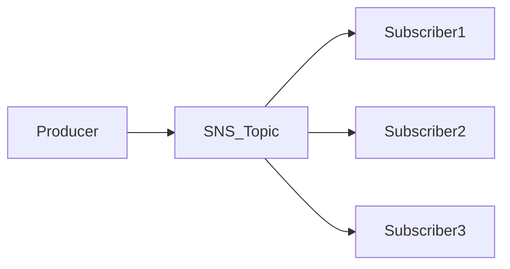
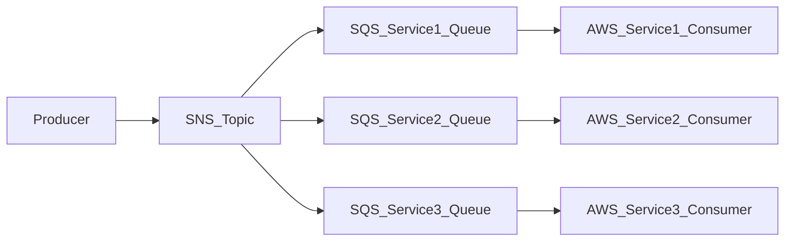
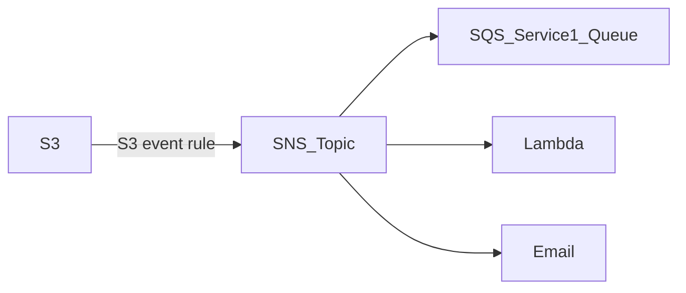
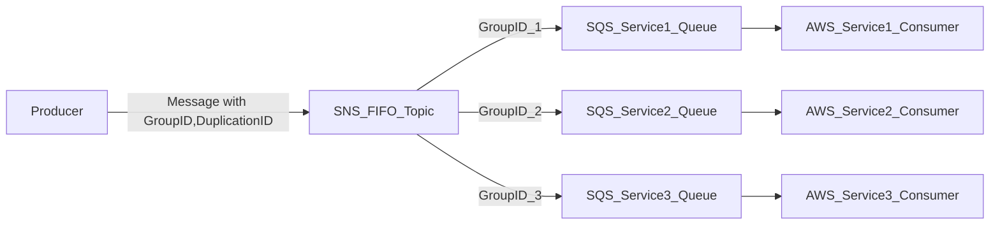
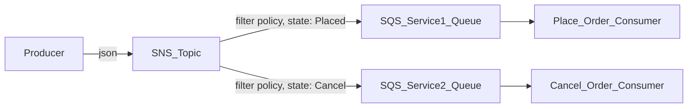

AWS的notification模塊  

Producer 可藉由推送訊息至相對應的SNS TOPIC 將訊息傳送給接收者 , SUB/PUB 模式

- Producer 只需推送訊息至SNS TOPIC
- Receiver(subscription) 只需listen SNS TOPIC
- Receiver 會接收Topic中的所有訊息 (new feature 可過濾)
- 每個topic 至多可有12500000 個 subscriptions
- 最多可有100000個 topic
- 傳送訊息至SNS TOPIC的方式通常為AWS服務, 如 AWS SDK, CloudWatch, Budgets, Lambda, S3, Auto Scaling Group, Lambda,
  DynamoDB, CloudFormation (
  state change), AWS DMS, RDS Event ...
- 推送方式有 HTTP, HTTPS, Email, Email-JSON, SQS, Application, Lambda , SMS ...等



## Publish

### Topic Publish

使用 SDK 推送訊息至topic

- 創建topic
- 創建subscription
- Publish message to the topic

### Direct Publish

直接推送訊息至endpoint

- 創建 platform application
- 創建 endpoint
- Publish message to the endpoint
- works with Google GCM,Apple APNS, Amazon ADM

## Security

### 加密

- 儲存訊息 default 類似S3的server side encryption
- 儲存訊息也可自訂KMS加密
- 儲存也可使用client-side encryption,加解密都靠client, 不依賴其他方式
- 傳輸訊息使用HTTPS

### Access control

這邊主要是定義 帳戶中的 user or group 可以訪問SNS API的權限

- IAM policies 控制訪問SNS API

e.g. 定義某個user 可以publish message 至特定 SNS topic

```json
{
  "Version": "2012-10-17",
  "Statement": [
    {
      "Effect": "Allow",
      "Action": [
        "sns:Publish"
      ],
      "Resource": "arn:aws:sns:us-east-1:123456789012:my-sns-topic"
    }
  ]
}
```

### SNS Access Policy

這邊是直接定義SNS TOPIC本身可被誰訪問 , 類似S3 bucket policy

- 跨帳戶訪問 SNS topic
- 允許其他服務訪問SNS topic

例: 允許S3 bucket publish message 至SNS topic

```json
{
  "Version": "2012-10-17",
  "Id": "MyPolicy",
  "Statement": [
    {
      "Sid": "Allow-S3-to-Publish",
      "Effect": "Allow",
      "Principal": {
        "AWS": "*"
      },
      "Action": "sns:Publish",
      "Resource": "arn:aws:sns:us-east-1:123456789012:my-sns-topic",
      "Condition": {
        "ArnLike": {
          "aws:SourceArn": "arn:aws:s3:::mybucket"
        }
      }
    }
  ]
}
```

## Fan out

這邊為SQS 與 SNS 的結合 , 透過SNS topic 來發送訊息至多個SQS queue



- 推送一次訊息至SNS topic, SNS topic 會將訊息發送至相關的SQS queue , 如下單後
  推訂單資訊至sns,再推至相對應的SQS (訂單處理, 通知物流, 通知會計等 ...)
- 解耦
- SQS 可持久化訊息, 延遲處理, 重試機制
- 可隨時增加新的SQS service queue

### Application: S3 Events 至多個目標

S3 event rule 一次只可推送一個目標, 但透過SNS, 可一次推送多個訊息至下游目標



## FIFO Topic

SNS 也有類似SQS的FIFO queue

- First In First Out
- 保證訊息的順序性 (By MessageGroupId)
- 保證訊息的唯一性 (By MessageDeduplicationId or Content-based deduplication)
- 可使用 SQS Standard Queue 與 FIFO Queue 作為 subscription
- 吞吐量有限制, 300 msg/s, 3000 msg/s (with batch), 同SQS FIFO
- 名稱必須 .fifo 結尾

## FanOut

這邊為 SNS FIFO + SQS FIFO 的結合 , 透過SNS FIFO topic 來發送訊息至多個SQS FIFO queue

需要fan out, 且保證訊息順序性, 唯一性(去重) , 可以使用這個組合  




## Message Filtering

subscription 預設接收topic中的所有訊息, 但可以透過filter policy 來過濾訊息  

- json policy (filter policy) 可用於過濾送至subscription的訊息
- 若無設置 filter policy, 預設接收所有訊息

如訊息為 

```json
{
  "order": "1305",
  "product": "apple",
  "quantity": "4",
  "state": "Placed"
}
```





## 其他注意事項

- 須注意 SNS TOPIC 的訊息是否加密, 可能會造成訊息無法被送出 (Email .... )
