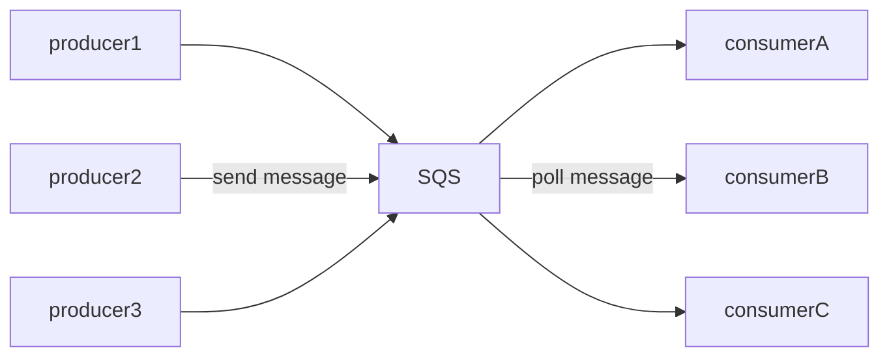
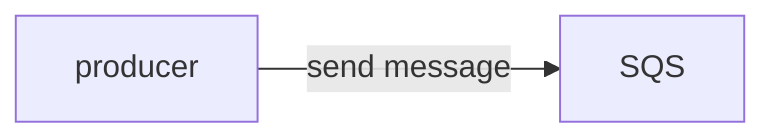
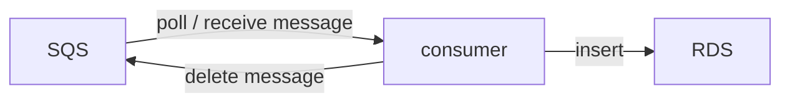
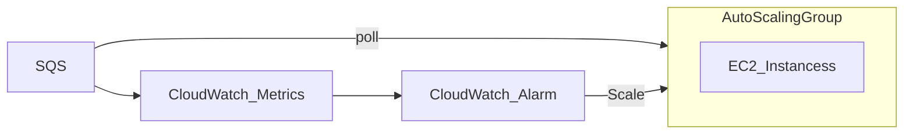
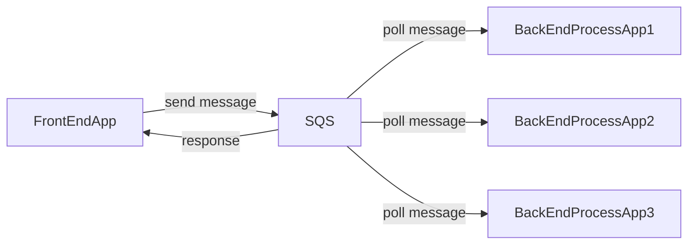
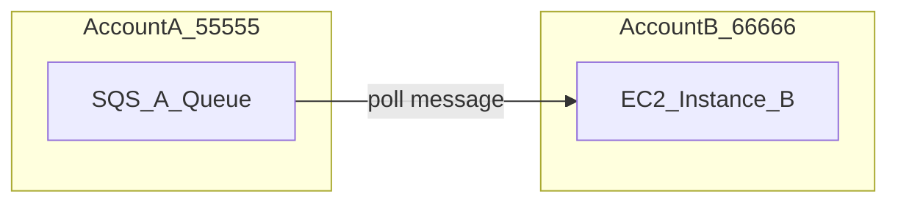
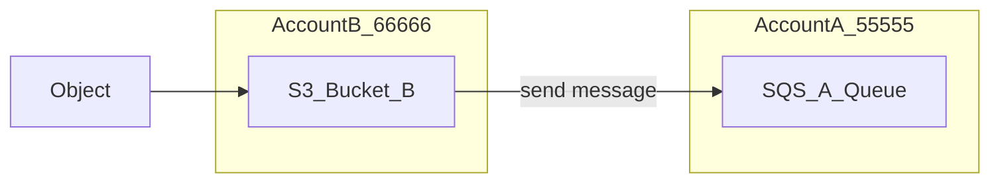
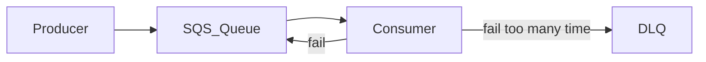
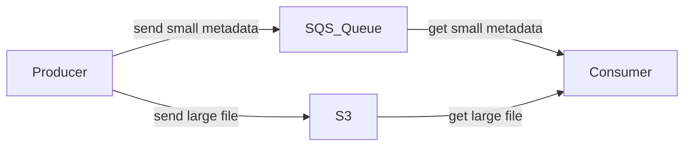

aws的訊息隊列, 用途與傳統MQ接近, 消峰,解偶 ... 

分為兩種, 差別於 FIFO具去重, 保證順序, 但吞吐量低, Standard 高性能,異步  

- Standard
- FIFO




### 基本特性

用法為 producer放入訊息, consumer消費訊息  

## Producing Message

- 利用 SendMessage API 將message送入 SQS 
- message 會被持久化, 直到被consumer 刪除
- 無吞吐限制  



## Consuming Message

- Consumer (跑在EC2 instance or Lambda)  
- poll message for SQS (最多一次接收10個message)
- 接到message後, 對該訊息進行處理 e.g. insert message into RDS  
- 處理完後, 會需要使用 DeleteMessage API 刪除該message,  



### Multiple EC2 instances Consumers 

- consumers 會並行消費訊息  
- message至少會被消費一次, 因訊息被poll後 依然存在於SQS中, 需要consumer調用DeleteMessage API 才會被真的刪除, 若處理訊息過慢, 此時有其他consumer poll, 很有可能被重複消費   
- 可藉由 水平擴展增加吞吐   


## 常見使用  

### SQS with Auto Scaling Group

可監控 SQS metrics (ApproximateNumberOfMessages) , 若累積Message過多, trigger alarm 進行EC2 scale  




### 解偶

透過SQS 進行解偶 ,可將前端請求 與 後端處理 完全分離 , 前端只需將請求內容放入SQS, 透過SQS緩衝, 也不會讓後端響應時間過長, 進而影響前端體驗, 而後端處理只需專注於處理訊息即可  



## Security

- 傳輸時 https 加密
- 儲存, 預設為SSE-SQS, 類似S3的 server side, 加密, 也可使用自定的 KMS 進行加密  
- 也可客戶端進行加解密, 不依賴SQS
- 訪問SQS, be a provider or consumer, 可使用IAM進行控制
- 跨帳號訪問, 可使用 SQS Access Policy


## SQS Queue Access Policy

### Cross Account Access



55555 & 66666 = account id  


B用戶 poll A用戶的 SQS Queue    

```json

"Version": "2012-10-17",
"Statement": [
    {
        "Effect": "Allow",
        "Principal": {
            "AWS": "666666"
        },
        "Action": "SQS:ReceiveMessage",
        "Resource": "arn:aws:sqs:us-east-1:55555:A_Queue"
    }
]

```


### Publish S3 Event Notification to SQS 

上傳檔案至S3, 需推送訊息至另一個帳號的 SQS Queue  




```json
{
  "Version": "2012-10-17",
  "Statement": [
    {
      "Effect": "Allow",
      "Principal": {
        "AWS": "*"
      },
      "Action": "SQS:SendMessage",
      "Resource": "arn:aws:sqs:us-east-1:55555:A_Queue",
      "Condition": {
        "ArnLike": {
          "aws:SourceArn": "arn:aws:s3:*:Bucket_B"
        },
        "StringEquals": {
          "aws:SourceAccount": "666666"
        }
      }
    }
  ]
}
```


Aws Simple Queue Service, 可以理解成aws的 message queue,

## Standard Queue

- 無法保證順序性
- 可能被消費至少一次
- 無限制的高吞吐, 且queue中訊息無限制上限
- low latency


### Visibility Timeout

- Visibility Timeout
- 主要功能為設置一段時間內, 當queue中的特定message被consumer poll時, 該message是無法被其他consumer看見的, 該時間稱為
  visibility timeout
- 若不設定 visibility timeout, 則default 30s
- 這段時間用意就是給該consumer處理message的時間, 處理完後需將message刪除, 若timeout後(可能執行失敗或是處理時間過長),
  就會給其他consumer處理的機會, 極端情況下, 需考慮重複處理的問題
- 若時間內來不及處理, 可以使用 ChangeMessageVisibility API 來延長時間,

### Dead Letter Queue(DLQ)

- Optional, 需要手動啟用
- 若某message是個無法被成功處理的事件,失敗後等待visibility timeout, 會繼續被poll, 最終成為一個死循環, Dead Letter Queue
  就是一個兜底的機制
- 簡單來說就是可以設置一個上限值(maximum receives), 當某個事件被重複處理依然無法被消化掉, 就會將該事件放入DLQ,避免造成死循環
- 主要是一個兜底的debug機制, 用來追蹤無法被處理的事件
- 為 FIFO queue
- DLQ 會被retention機制影響, 需在過期前處理這些無法失敗的訊息 , 否則會被刪除 , 一般來說推薦 retention period 設定為 14 天



舉例: 訊息送入SQS, consumer1 polling, 至visibility timeout, consumer2 polling .. 重複至maximum receives, 就會被送入DLQ

#### Redrive

- DLQ 中的訊息已釐清原因, 可以將DLQ的message重新發送到原本的queue

### Delay Queue

- Delivery Delay
- message被傳入queue後, 可以延遲一段時間後才能被consumer poll
- 預設為0 , 最大為15分鐘

### long polling

- Receive Message Wait Time
- 主要目的是減少 polling API被調用的次數, 增加SQS效率
- 作法為 poll時, 若queue中沒有message, 就會等待一段時間
- 期間有訊息, 就會立即回應
- 等待時間, 最小為 1s, 最大為 20s
- 需再queue level 開啟 , 或是在 ReceiveMessage API 中設定 WaitTimeSeconds 參數
-

### 小結

- Visibility Timeout: 被poll時, 不被其他consumer看見的時間
- Dead Letter Queue: message多次重試仍無法被消費, 會被放入DLQ
- Delay Queue: 被放入queue後, 可以延遲一段時間後才能被consumer poll
- Long Polling: 減少polling API被調用的次數, 增加SQS效率

## SQS Client

- Message size 最大為256KB
- 若需要傳送大型檔案, 可以使用 SQS Extended Client Library , 透過 S3 儲存檔案, 並將 S3 的 URL(metadata) 傳送到 SQS 中



## SQS API

- CreateQueue: 創建queue (需設定RetentionPeriod,message在queue中的保留時間)
- DeleteQueue: 刪除queue, 包含其中的所有訊息
- PurgeQueue: 清空queue中的所有訊息
- SendMessage: 傳送訊息到queue (需設置DelaySeconds, 延遲多久後才能被poll)
- ReceiveMessage: 用於poll訊息
- MaxNumberOfMessages: 一次最多poll幾個訊息, default 1, 最大10 (for ReceiveMessage)
- ReceiveMessageWaitTimeSeconds: 用於poll訊息, 設定等待時間 (long polling)
- DeleteMessage: 用於poll後, 刪除訊息
- ChangeMessageVisibility: polling 並處理訊息時, 可動態調整訊息的visibility timeout
- Batch APIs(SendMessage,DeleteMessage,ChangeMessageVisibility): 可以一次poll多個訊息, 一次刪除多個訊息,
  一次改變多個訊息的visibility timeout, 可以減少API的調用次數


## FIFO Queue

- 創建名稱必須以 .fifo 結尾
- First In First Out,保證訊息的順序性 (同group id下)
- 去重處理,保證queue中不會有重複內容 (藉由duplicate ID 或是 Content-based deduplication 則一作為基準)
- 較低的吞吐量, 無batch, 300 msg/s, 有batch, 3000 msg/s

### FIFO ID 介紹

- MessageDeduplicationId: 用於設定訊息送入FIFO的唯一性 (global, 即使不同MessageGroupId, 也不同有重複的MessageDeduplicationId)
- MessageGroupId: 用於設定訊息的分組, 同一組GroupId的訊息, 會遵循FIFO的順序性

### 防止重複處理機制

訊息被送入queue 與被消費時, 都會進行重複處理機制

- Message 送入FIFO時, 會檢查 MessageDeduplicationId (若是Content-based, 則是內容), 若有重複, 則會被丟棄, 確保唯一性
- 被消費時也會確認MessageDeduplicationId(若是Content-based, 則是內容), 若有重複, 則會被丟棄, 確保唯一性

### 其他機制

其他與standard queue相同 , 如 Visibility Timeout, Dead Letter Queue, Delay Queue, Long Polling ...
