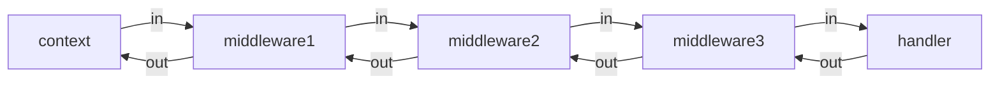
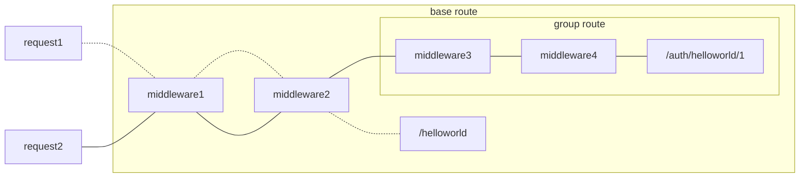

go老牌輕量級API框架之一  

這邊紀錄echo的基礎使用

## QuickStart

基本的Hello World

- main.go

```go
package main

import (
 "github.com/labstack/echo/v4"
 "tutorial/handler"
)

func main() {
 e := echo.New()
 e.GET("/helloworld", handler.HelloWorld)
 e.Logger.Fatal(e.Start(":8080"))
}
```

- handler

```go
package handler

import (
 "github.com/labstack/echo/v4"
)

type HelloWorldOutput struct {
 Message string `json:"message"`
}

func HelloWorld(ctx echo.Context) error {

 return ctx.JSON(200, HelloWorldOutput{
  Message: "Hello World",
 })
}
```

response

```bash
curl --location 'localhost:8080/helloworld'
```

```json
{
  "message": "Hello World"
}
```

## Binding

同gin用法  
透過Bind可以將request的json body綁定到struct上

- main.go

```go
package handler

import (
 "github.com/labstack/echo/v4"
)

type UserInput struct {
 Name  string `json:"name"`
 Email string `json:"email"`
}

type UserOutput struct {
 Name    string `json:"name"`
 Email   string `json:"email"`
 Message string `json:"message"`
}

// 可以直接把request的body直接绑定到struct上
func RegisterUser(ctx echo.Context) error {
 var user UserInput

 if err := ctx.Bind(&user); err != nil {
  return err
 }
 return ctx.JSON(200, UserOutput{
  Name:    user.Name,
  Email:   user.Email,
  Message: "Get New User",
 })
}
```

- handler

```
package handler

import (
 "github.com/labstack/echo/v4"
)

type HelloWorldOutput struct {
 Message string `json:"message"`
}

func HelloWorld(ctx echo.Context) error {

 return ctx.JSON(200, HelloWorldOutput{
  Message: "Hello World",
 })
}
```

- body

```json
{
  "name": "dev123",
  "email": "ee@gmail.com"
}
```

- response

```bash
curl --location 'localhost:8080/register' \
--header 'Content-Type: application/json' \
--data-raw '{
    "name": "dev123",
    "email": "ee@gmail.com"
}'
```

```json
{
  "name": "dev123",
  "email": "ee@gmail.com",
  "message": "Get New User"
}
```

## middleware

負責handler前後處理, pattern 上比較類似 recursion 概念



- handler

基本上無論middleware或是 handler, 基本上都是HandlerFunc Type

```go
type HandlerFunc func (c Context) error
```

- middleware

可以理解成 回傳一個handler function, 該function 定義 下一個handler的前後處理

```go
func Middleware1(next echo.HandlerFunc) echo.HandlerFunc {
    return func(ctx echo.Context) error {
        fmt.Println("Middleware1 in")
        err := next(ctx) // 下一個handler (可以是main handler 或是下一個 middleware)
        fmt.Println("Middleware1 out")
        return err
    }
}

func Middleware2(next echo.HandlerFunc) echo.HandlerFunc {
    return func(ctx echo.Context) error {
        fmt.Println("Middleware2 in")
        err := next(ctx)
        fmt.Println("Middleware2 out")
        return err
    }
}
```

- main.go

```go
package main

import (
 "github.com/labstack/echo/v4"
 "tutorial/handler"
 "tutorial/middleware"
)

func main() {
 e := echo.New()
 e.Use(middleware.Middleware1)
 e.Use(middleware.Middleware2)

 e.GET("/helloworld", handler.HelloWorld)
 e.POST("/register", handler.RegisterUser)
 e.GET("/mw", handler.ForMiddleware)
 e.Logger.Fatal(e.Start(":8080"))
}
```

- stdout

```bash
curl --location 'localhost:8080/mw'
```

```
   ____    __
  / __/___/ /  ___
 / _// __/ _ \/ _ \
/___/\__/_//_/\___/ v4.12.0
High performance, minimalist Go web framework
https://echo.labstack.com
____________________________________O/_______
                                    O\
⇨ http server started on [::]:8080
Middleware1 in
Middleware2 in
main handler
Middleware2 out
Middleware1 out

```

### 適用場景

這邊舉一些適用場景

- logging, 針對request/response屬性輸出log
- 產生trace id
- authentication / authorization

## error handling

echo 提供echo.NewHTTPError() 來處理錯誤, 作用是直接response error code, 若無自定義訊息, 會針對狀態碼自動使用預設訊息

- main.go

```go
package main

import (
 "github.com/labstack/echo/v4"
 "tutorial/handler"
 "tutorial/middleware"
)

func main() {
 e := echo.New()
 e.Use(middleware.Middleware1)
 e.Use(middleware.Middleware2)
 e.GET("/helloworld", handler.HelloWorld)
 e.POST("/register", handler.RegisterUser)
 e.GET("/mw", handler.ForMiddleware)
 e.GET("/error403", handler.ErrorHandling1)
 e.Logger.Fatal(e.Start(":8080"))
}
```

- handler

```go
package handler

import (
 "github.com/labstack/echo/v4"
)

func ErrorHandling1(ctx echo.Context) error {
 return echo.NewHTTPError(403)
 // return echo.echo.NewHTTPError(403,"test permission deny")
}
```

- response

```bash
curl --location 'localhost:8080/error403'
```

```json
{
  "message": "Forbidden"
}
```

## Retrieve Data From Request

- main.go

```go
package main

import (
 "github.com/labstack/echo/v4"
 "tutorial/handler"
 "tutorial/middleware"
)

func main() {
 e := echo.New()
 e.Use(middleware.Middleware1)
 e.Use(middleware.Middleware2)
 e.GET("/helloworld", handler.HelloWorld)
 e.POST("/register", handler.RegisterUser)
 e.GET("/mw", handler.ForMiddleware)
 e.GET("/error403", handler.ErrorHandling1)
 e.GET("/getform", handler.FormData)
 e.POST("/postform", handler.FormData)
 e.GET("/query", handler.QueryData)
 e.GET("/path/:name", handler.PathData)
 e.Logger.Fatal(e.Start(":8080"))
}
```

### Form Data

#### Get

- handler

```go
package handler

import "github.com/labstack/echo/v4"

type FormDataOutput struct {
 Name string `json:"name"`
 Age  string `json:"age"`
}

func FormData(ctx echo.Context) error {
 name := ctx.FormValue("name")
 age := ctx.FormValue("age")
 return ctx.JSON(200, FormDataOutput{
  name, age,
 })
}
```

- response

```bash
curl --location 'localhost:8080/getform?age=10&name=foo'
```

```json
{
  "name": "foo",
  "age": "10"
}
```

#### Post

- handler

同get

- response

```bash
curl --location 'localhost:8080/postform' \
--form 'age="10"' \
--form 'name="foo"'
```

```json
{
  "name": "foo",
  "age": "10"
}
```

### Query Parameters

echo 中與 GET form 很類似

- handler

```go
package handler

import "github.com/labstack/echo/v4"

type QueryParamOutput struct {
 Name string `json:"name"`
 Age  string `json:"age"`
}

func QueryData(ctx echo.Context) error {
 name := ctx.QueryParam("name")
 age := ctx.QueryParam("age")
 return ctx.JSON(200, FormDataOutput{
  name, age,
 })
}
```

- response

```bash
curl --location 'localhost:8080/query?name=qoo&age=20'
```

```json
{
  "name": "qoo",
  "age": "20"
}
```

### Path Parameters

- handler

```go
package handler

import "github.com/labstack/echo/v4"

func PathData(ctx echo.Context) error {
 name := ctx.Param("name")
 return ctx.String(200, name)
}
```

- response

```bash
curl --location 'localhost:8080/path/cool'
```

```
cool
```

## Response

- main.go

```go
package main

import (
 "github.com/labstack/echo/v4"
 "tutorial/handler"
 "tutorial/middleware"
)

func main() {
 e := echo.New()
 e.Use(middleware.Middleware1)
 e.Use(middleware.Middleware2)
 e.GET("/helloworld", handler.HelloWorld)
 e.POST("/register", handler.RegisterUser)
 e.GET("/mw", handler.ForMiddleware)
 e.GET("/error403", handler.ErrorHandling1)
 e.GET("/getform", handler.FormData)
 e.POST("/postform", handler.FormData)
 e.GET("/query", handler.QueryData)
 e.GET("/path/:name", handler.PathData)
 e.GET("/string", handler.ResponseString)
 e.GET("/json", handler.ResponseJson)
 e.GET("/sendfile", handler.Sendfile)
 e.GET("/sendattach", handler.SendAttach)
 e.GET("/sendstream", handler.SendStram)
 e.Logger.Fatal(e.Start(":8080"))
}

```

### string

- handler

```go
package handler

import "github.com/labstack/echo/v4"

func ResponseString(ctx echo.Context) error {
 return ctx.String(200, "test string")
}
```

- response

```
curl --location 'localhost:8080/json'
```

```
test string
```

### json

- handler

```go
package handler

import "github.com/labstack/echo/v4"

type User struct {
 Name  string `json:"name" xml:"name"`
 Email string `json:"email" xml:"email"`
}

func ResponseJson(ctx echo.Context) error {
 resp := &User{
  Name:  "foo",
  Email: "no@reply.com",
 }

 return ctx.JSON(200, resp)
}
```

- response

```
curl --location 'localhost:8080/json'
```

```json
{
  "name": "foo",
  "email": "no@reply.com"
}
```

### Send File

可以將特定檔案內容response出去

- handler

```go
package handler

import "github.com/labstack/echo/v4"

func Sendfile(ctx echo.Context) error {
 return ctx.File("./sendfile.txt")
}
```

- file

file 若為相對路徑, 是箱對於 main.go 的目錄

```
.
├── go.mod
├── go.sum
├── handler
│   ├── 01_Hello_world.go
│   ├── 02_bind.go
│   ├── 03_middleware.go
│   ├── 04_error_handling.go
│   ├── 05_formData.go
│   ├── 06_querydata.go
│   ├── 07_pathdata.go
│   ├── 08_response.go
│   └── 09_responsefile.go
├── main
├── main.go
├── middleware
│   └── PseudoAuth.go
├── readme.md
└── sendfile.txt
```

file 內容

```
hccuse@hcuuse-PC ~/I/y/G/h/h/l/G/e/tutorial> cat sendfile.txt 
Hello File
```

- response

```bash
curl --location 'localhost:8080/sendfile'
```

```
Hello File
```

### Send Attachment

幾乎與sendfile相同, 差在header中會多一個 Content-Disposition,  
這個header會告訴browser端, 該檔案是要下載的, 而非直接開啟

```
Content-Disposition: attachment; filename="sendfile.txt"
```

- handler

```go
package handler

import "github.com/labstack/echo/v4"

func Sendfile(ctx echo.Context) error {
 return ctx.File("./sendfile.txt")
}

func SendAttach(ctx echo.Context) error {
 return ctx.Attachment("./sendfile.txt", "sendfile.txt")
}
```

### SendStram

不會一次將檔案過去,而是以stream的方式分段回傳,

開一個小buffer即可傳輸,可節省記憶體,

header會多Transfer-Encoding: chunked, 代表是分段回傳  
content-type 會表示檔案類型 e.g. image/jpeg

``

- handler

```go
package handler

import (
 "github.com/labstack/echo/v4"
 "os"
)

func SendStram(ctx echo.Context) error {
 f, err := os.Open("./duck.jpeg")
 if err != nil {
  return err
 }
 return ctx.Stream(200, "image/jpeg", f)
}
```

- response

```bash
curl --location 'localhost:8080/sendstream'
```

直接顯示圖片

## Redirect

跳轉連結

- main.go

```go
package main

import (
 "github.com/labstack/echo/v4"
 "tutorial/handler"
 "tutorial/middleware"
)

func main() {
 e := echo.New()
 e.Use(middleware.Middleware1)
 e.Use(middleware.Middleware2)
 e.GET("/helloworld", handler.HelloWorld)
 e.POST("/register", handler.RegisterUser)
 e.GET("/mw", handler.ForMiddleware)
 e.GET("/error403", handler.ErrorHandling1)
 e.GET("/getform", handler.FormData)
 e.POST("/postform", handler.FormData)
 e.GET("/query", handler.QueryData)
 e.GET("/path/:name", handler.PathData)
 e.GET("/string", handler.ResponseString)
 e.GET("/json", handler.ResponseJson)
 e.GET("/sendfile", handler.Sendfile)
 e.GET("/sendattach", handler.SendAttach)
 e.GET("/sendstream", handler.SendStram)
 e.GET("/redirect", handler.Redirect)
 e.Logger.Fatal(e.Start(":8080"))
}

```

- handler

```go
package handler

import "github.com/labstack/echo/v4"

func Redirect(ctx echo.Context) error {
 return ctx.Redirect(302, "https://www.google.com")
}
```

- response

```bash
localhost:8080/redirect
```

跳轉至 [https://www.google.com](https://www.google.com)

## Hook

可以在response之前或之後 trigger function

- main.go

```go
package main

import (
 "github.com/labstack/echo/v4"
 "tutorial/handler"
 "tutorial/middleware"
)

func main() {
 e := echo.New()
 e.Use(middleware.Middleware1)
 e.Use(middleware.Middleware2)
 e.GET("/helloworld", handler.HelloWorld)
 e.POST("/register", handler.RegisterUser)
 e.GET("/mw", handler.ForMiddleware)
 e.GET("/error403", handler.ErrorHandling1)
 e.GET("/getform", handler.FormData)
 e.POST("/postform", handler.FormData)
 e.GET("/query", handler.QueryData)
 e.GET("/path/:name", handler.PathData)
 e.GET("/string", handler.ResponseString)
 e.GET("/json", handler.ResponseJson)
 e.GET("/sendfile", handler.Sendfile)
 e.GET("/sendattach", handler.SendAttach)
 e.GET("/sendstream", handler.SendStram)
 e.GET("/redirect", handler.Redirect)
 e.GET("/hooknoresp", handler.HookNoResp)
 e.GET("/hookresp", handler.HookResp)
 e.Logger.Fatal(e.Start(":8080"))
}
```

- handler

```go
package handler

import (
 "github.com/labstack/echo/v4"
 "net/http"
)

func HookResp(ctx echo.Context) error {
 ctx.Response().Before(func() {
  println("before response")
 })
 ctx.Response().After(func() {
  println("after response")
 })
 return ctx.String(200, "test")
}

func HookNoResp(ctx echo.Context) error {
 ctx.Response().Before(func() {
  println("before response")
 })
 ctx.Response().After(func() {
  println("after response")
 })
 return ctx.NoContent(http.StatusNoContent)
}
```

### Before

Before: response之前trigger function

這邊故意不回傳response, 只會trigger before response

- stdout

```bash
curl --location 'localhost:8080/hooknoresp'
```

```
⇨ http server started on [::]:8080
Middleware1 in
Middleware2 in
before response
Middleware2 out
Middleware1 out
```

### After

After: response之後trigger function

這邊正常回傳response, 可在response之前 與 response之後分別trigger function

```bash
curl --location 'localhost:8080/hookresp'
```

```
⇨ http server started on [::]:8080
Middleware1 in
Middleware2 in
before response
after response
Middleware2 out
Middleware1 out
```

## Routing

簡單說是註冊handler ,http method 至某個uri

最常見的為 Echo.Any(path string handler), 如

```go
e.GET("/hello", handler.HelloWorld)
```

### Match Any / wildcard

這邊uri 是搭配 ***通配符*** 行進行批配 e.g. /users/*

以下都會符合

- /users/
- /users/1
- /users/1/file/1
- /users/Any....

需注意uri上的通配符只能有一個, 若有多個 只會批配至第一組  
e.g. `/v1/*/images/*` 實際上等同 `/v1/*`

### Path Matching Order

uri 在同prefix下的批配順序優先級為

- static
- Param
- Match Any

```go
e.GET("/users/:id", func (c echo.Context) error {
return c.String(http.StatusOK, "/users/:id")
})

e.GET("/users/1", func (c echo.Context) error {
return c.String(http.StatusOK, "/users/1")
})

e.GET("/users/1/files/*", func (c echo.Context) error {
return c.String(http.StatusOK, "/users/1/files/*")
})

```

這邊若 優先批配順序為

1. /users/1
2. /users/:id
3. /users/1/files/*

```
curl --location 'localhost:8080/users/1'
# 這邊其實兩個符合的 /usrs/1 與 /users/:id, 但因static 優先級比較高 所以優先match /users/1  
# response /users/1

curl --location 'localhost:8080/users/1/files'
# response /users/:id

curl --location 'localhost:8080/users/1/files/5'
# response /users/1/files/*
```

## Group Routing

這邊兩種線代表若 request 各level的 handler, 分別會trigger 哪些middleware



- main.go

```go
package main

import (
 "tutorial/handler"
 "tutorial/middleware"
)

func main() {
 e := echo.New() // base level route

 g := e.Group("/auth")                                 //  group level route
 g.Use(middleware.Middleware3, middleware.Middleware4) // group level middleware
 g.GET("/helloworld/1", handler.HelloWorld)            // group level handler
 g.GET("/helloworld/2", handler.HelloWorld)            // group level handler

 e.Use(middleware.Middleware1, middleware.Middleware2) // base level middleware
 e.GET("/helloworld", handler.HelloWorld)              // base level handler

 e.Logger.Fatal(e.Start(":8080"))

}

```

### trigger group route

需注意若trigger group route 也會先觸發 base route 的 middleware,

- stdout

```bash
curl --location 'localhost:8080/auth/helloworld/1'
```

```
⇨ http server started on [::]:8080
Middleware1 in
Middleware2 in
Middleware3 in
Middleware4 in
main handler: Hello World
Middleware4 out
Middleware3 out
Middleware2 out
Middleware1 out
```

### trigger base route

若trigger base level route, 則不會trigger group route

- stdout

```bash
curl --location 'localhost:8080/helloworld'
```

```
⇨ http server started on [::]:8080
Middleware1 in
Middleware2 in
main handler: Hello World
Middleware2 out
Middleware1 out
```

## List Routes

可以把register的所有route 用json列出來

- main.go

```go
package main

import (
 "encoding/json"
 "github.com/labstack/echo/v4"
 "net/http"
 "os"
 "tutorial/handler"
 "tutorial/middleware"
)

func main() {
 e := echo.New()

 g := e.Group("/auth")
 g.Use(middleware.Middleware3, middleware.Middleware4)
 g.GET("/helloworld/1", handler.HelloWorld)
 g.GET("/helloworld/2", handler.HelloWorld)

 e.Use(middleware.Middleware1, middleware.Middleware2)
 e.GET("/helloworld", handler.HelloWorld)
 e.POST("/register", handler.RegisterUser)
 e.GET("/mw", handler.ForMiddleware)
 e.GET("/error403", handler.ErrorHandling1)
 e.GET("/getform", handler.FormData)
 e.POST("/postform", handler.FormData)
 e.GET("/query", handler.QueryData)
 e.GET("/path/:name", handler.PathData)
 e.GET("/string", handler.ResponseString)
 e.GET("/json", handler.ResponseJson)
 e.GET("/sendfile", handler.Sendfile)
 e.GET("/sendattach", handler.SendAttach)
 e.GET("/sendstream", handler.SendStram)
 e.GET("/redirect", handler.Redirect)
 e.GET("/hooknoresp", handler.HookNoResp)
 e.GET("/hookresp", handler.HookResp)

 // routing

 e.GET("/hello", handler.HelloWorld)

 e.GET("/users/:id", func(c echo.Context) error {
  return c.String(http.StatusOK, "/users/:id")
 })
 e.GET("/users/1", func(c echo.Context) error {
  return c.String(http.StatusOK, "/users/1")
 })
 e.GET("/users/1/files/*", func(c echo.Context) error {
  return c.String(http.StatusOK, "/users/1/files/*")
 })

 data, _ := json.MarshalIndent(e.Routes(), "", "  ")
 os.WriteFile("routes.json", data, 0644)

 e.Logger.Fatal(e.Start(":8080"))
}
```

```
hccuse@hcuuse-PC ~/I/y/G/h/h/l/G/e/tutorial> cat routes.json 
[
  {
    "method": "GET",
    "path": "/users/:id",
    "name": "main.main.func1"
  },
  {
    "method": "GET",
    "path": "/string",
    "name": "tutorial/handler.ResponseString"
  },
  {
    "method": "GET",
    "path": "/sendfile",
    "name": "tutorial/handler.Sendfile"
  },
  {
    "method": "GET",
    "path": "/auth/helloworld/1",
    "name": "tutorial/handler.HelloWorld"
  }
...
```

## Cookie

| cookie field |
|--------------|
| Path         |
| Domain       |
| Expires      |
| Secure       |
| HttpOnly     |

- main.go

```go
package main

import (
 "encoding/json"
 "github.com/labstack/echo/v4"
 "net/http"
 "os"
 "tutorial/handler"
 "tutorial/middleware"
)

func main() {
 e := echo.New()

 g := e.Group("/auth")
 g.Use(middleware.Middleware3, middleware.Middleware4)
 g.GET("/helloworld/1", handler.HelloWorld)
 g.GET("/helloworld/2", handler.HelloWorld)

 e.Use(middleware.Middleware1, middleware.Middleware2)
 e.GET("/helloworld", handler.HelloWorld)
 e.POST("/register", handler.RegisterUser)
 e.GET("/mw", handler.ForMiddleware)
 e.GET("/error403", handler.ErrorHandling1)
 e.GET("/getform", handler.FormData)
 e.POST("/postform", handler.FormData)
 e.GET("/query", handler.QueryData)
 e.GET("/path/:name", handler.PathData)
 e.GET("/string", handler.ResponseString)
 e.GET("/json", handler.ResponseJson)
 e.GET("/sendfile", handler.Sendfile)
 e.GET("/sendattach", handler.SendAttach)
 e.GET("/sendstream", handler.SendStram)
 e.GET("/redirect", handler.Redirect)
 e.GET("/hooknoresp", handler.HookNoResp)
 e.GET("/hookresp", handler.HookResp)

 // routing

 e.GET("/hello", handler.HelloWorld)

 e.GET("/users/:id", func(c echo.Context) error {
  return c.String(http.StatusOK, "/users/:id")
 })
 e.GET("/users/1", func(c echo.Context) error {
  return c.String(http.StatusOK, "/users/1")
 })
 e.GET("/users/1/files/*", func(c echo.Context) error {
  return c.String(http.StatusOK, "/users/1/files/*")
 })

 data, _ := json.MarshalIndent(e.Routes(), "", "  ")
 os.WriteFile("routes.json", data, 0644)

 e.POST("/cookie", handler.WriteCookie)
 e.GET("/cookie", handler.ReadCookie)
 e.GET("/cookie/all", handler.ReadAllCookies)

 e.Logger.Fatal(e.Start(":8080"))
}
```

- handler

```go
package handler

import (
 "fmt"
 "github.com/labstack/echo/v4"
 "net/http"
 "time"
)

func WriteCookie(ctx echo.Context) error {
 cookie := new(http.Cookie)
 cookie.Name = "username"
 cookie.Value = "dev123"
 cookie.Expires = time.Now().Add(24 * time.Hour)
 ctx.SetCookie(cookie)
 return ctx.String(http.StatusOK, "write cookie")
}

func ReadCookie(ctx echo.Context) error {
 cookie, err := ctx.Cookie("username")
 if err != nil {
  return err
 }
 fmt.Println("Cookie Name:", cookie.Name)
 fmt.Println("Cookie Value:", cookie.Value)
 fmt.Println("Cookie Expires:", cookie.Expires) // 無法被讀取 , request只會有cookie的name和value, 不包含時間, 過期後 會直接讀不到 cookie
 cookiename, err := ctx.Cookie("username")
 if err != nil {
  return err
 }
 fmt.Println(cookiename)
 return ctx.String(http.StatusOK, "read cookie")
}

func ReadAllCookies(c echo.Context) error {
 for _, cookie := range c.Cookies() {
  fmt.Println(cookie.Name)
  fmt.Println(cookie.Value)
 }
 return c.String(http.StatusOK, "read all the cookies")
}
```

### write

```bash
curl --location --request POST 'localhost:8080/cookie' \
--header 'Cookie: username=dev123'
```

response

```
write cookie
```

### read

```bash
curl --location 'localhost:8080/cookie' \
--header 'Cookie: username=dev123'
```

- stdout

```
Cookie Name: username
Cookie Value: dev123
Cookie Expires: 0001-01-01 00:00:00 +0000 UTC
username=dev123
```

- response

```
read cookie
```

### read all

```bash
curl --location 'localhost:8080/cookie/all' \
--header 'Cookie: username=dev123'
```

- stdout

```
username
dev123
```

- response

```
read all the cookies\
```
