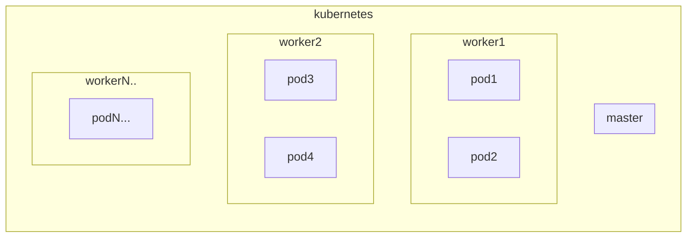
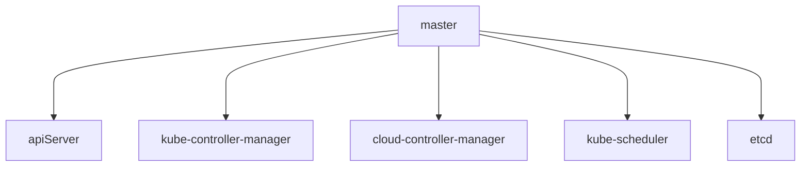
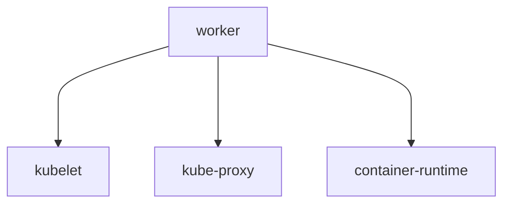
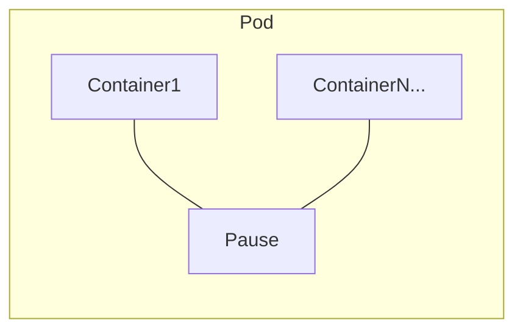
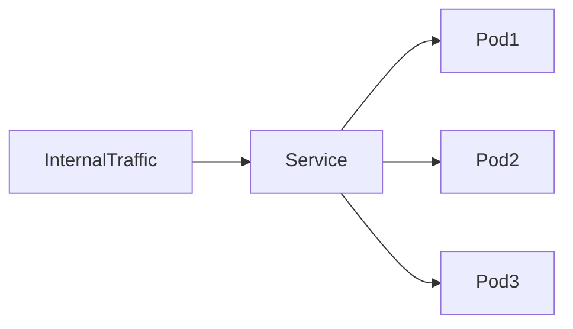
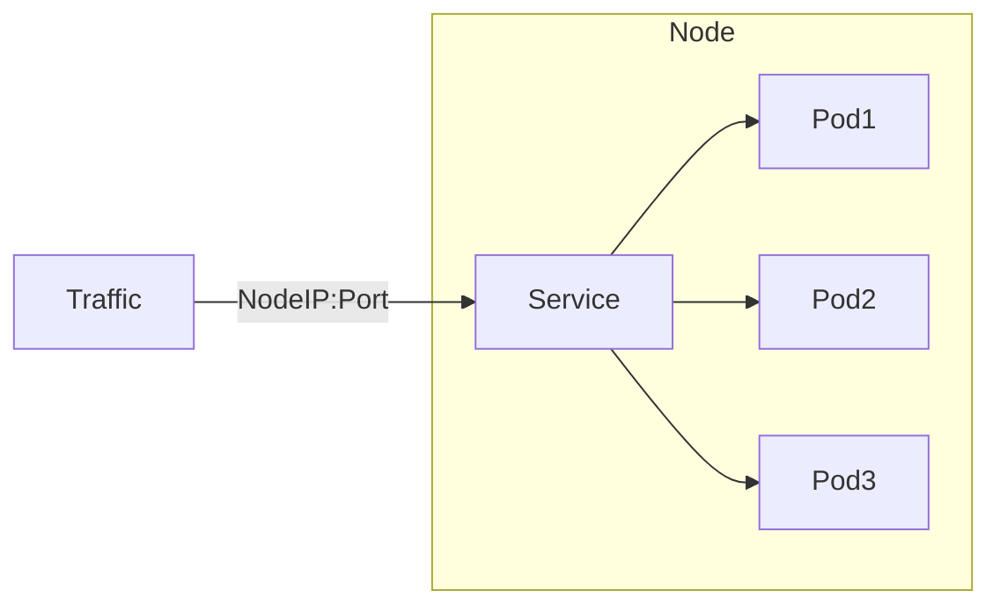
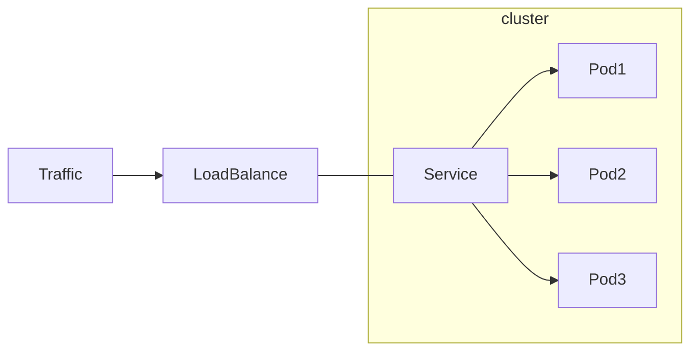
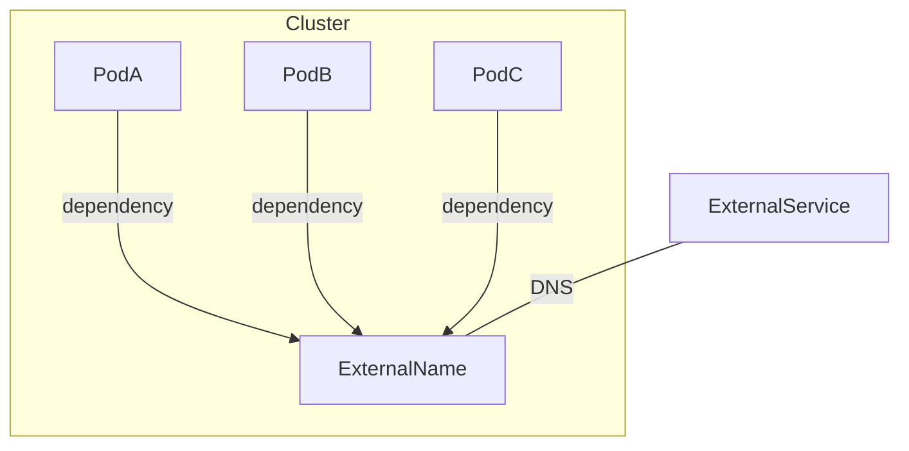
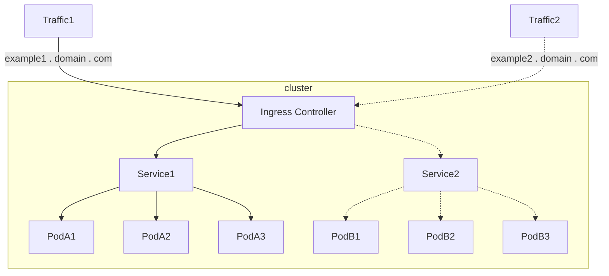

近期有機會用到, 把之前的筆記整理上來, 順便review一下

## cluster

- master node: 維持kubernetes cluster基礎設施的節點, 自帶taint, 任務不會被調度至master上
- worker node: 工作節點, scheduler會把任務分配至該節點上

## Node 基礎組件

- master node
- worker node

### master Node

- ApiServer: 基於restful的api服務，提供kubernetes的所有操作
- Kube-controller-manager: kubernetes的資源管理器, 負責管理各個類型的資源控制器
- cloud-controller-manager(Optional): 負責與第三方雲端平台的控制器API交互
- Kube-scheduler: 基於調度算法將各個pod調度至各個節點上
- etcd: 分布式key-value資料庫, 負責記錄整個kubernetes集群的狀態, 可理解成kubernetes的資料庫

### Worker Node

kubelet: 負責管理該node上的容器生命週期

kube-proxy: 負責該Node上的proxy load balance  (若有service的cluster IP 被請求, 背後若是node的pod, 就會被轉進來) 與
service的服務發現(會監控api-server,若有apply新資源,對依照資源類型執行相對應的操作,如 設置ipvs規則,pod啟動...)
這邊proxy為 level 4 (tcp/udp)

container-runtime: container的運行工具, e.g. docker, containerd, CRI-O...

## Pod 基礎組件

kubernetes 最小單位

- Pause: root container, 負責Pod的基礎設施(使pod內部變成類主機), 生命週期
    - 網路機制: 使其形成類似本機網路, 內部container可直接使用localhost通訊
    - hostname: 共用hostname
    - 文件機制: 內部文件系統共享
    - PID: 內部進程PID皆會相同

## resource

kubernetes 內部抽象化資源

### 基本cluster元件

| type      | description                      |
|-----------|----------------------------------|
| Namespace | 用於隔絕資源                           |
| Node      | 非實際藉由k8s創建, 只是將存在的Node抽象化為k8s的資源 |

### Service

為 level4 的代理, 為內部Pod提供一個endpoint, 可從內/外部訪問, 並提供負載均衡

| type               | description                                                                                      |
|--------------------|--------------------------------------------------------------------------------------------------|
| ClusterIP(default) | 提供僅供內部使用的ip, 自動負載均衡 application                                                                  |
| NodePort           | 開啟特定Port (30000-32767)並將服務暴露至外部網路,基於ClusterIP, KubeProxy會將 nodeIP:port 轉至該service, nodeIP可以是任意節點 |
| LoadBalancer       | 將雲端服務商的load balance 抽象化成 service, 並與pod進行連結                                                      |
| ExternalName       | 可將外部的url轉成 kubernetes內部的DNS, 同namespace下更可直接使用service name訪問                                     |

- clusterIP

- NodePort

- Load Balancer

- ExternalName

### Ingress

反向代理`外部流量`至內部service , 為 level7 的代理

- Ingress: 反向代理rule的 抽象化資源, 可理解成config概念
- Ingress controller: 負責將存在的Ingress資源轉換成對應的rule, 並將rule應用至實際的代理服務, 可理解成web server概念

***Ingress Controller**

### Volume

Pod內部的資料持久化, 列出常見的

| Type     | description             |
|----------|-------------------------|
| EmptyDir | Pod中共享目錄, 目錄生命週期與Pod綁定  |
| HostPath | Pod中共享目錄, 且目錄同時會掛載於實體節點 |
| NFS      | Pod中共享目錄, 且目錄掛載於NFS     |

...

kubernetes volume的抽象化元件

| Type                  | description                                   |
|-----------------------|-----------------------------------------------|
| PersistentVolume      | k8s的持久化物件,可將volume機制抽象化為k8s內部資源               |
| PersistentVolumeClaim | 可理解成PV 需求的抽化化物件, 會自行綁定符合條件的PV, 可靜態或動態(自行創建pv) |

### Config

可將設定檔/環境變數/密碼等資訊抽象化為k8s內部資源

| Type        | description                                        |
|-------------|----------------------------------------------------|
| ConfigMap   | 明文設定檔/key value                                    |
| Secret      | 具加密/編碼的 設定檔/ key value (default: Opaque 為base64)   |
| DownwardAPI | 將Pod的資訊(metadata)共享至container內 (透過 環境變數 or volume) |

### Auth

身份驗證的抽象化資源

| Type           | description |
|----------------|-------------|
| ServiceAccount | Pod身份驗證     |
| UserAccount    | 管理員或開發者身份驗證 |

RBAC

| Type               | description                     |
|--------------------|---------------------------------|
| Role               | namespace level role            |
| RoleBinding        | attach role to resource         |
| ClusterRole        | cluster level role              |
| ClusterRoleBinding | attach cluster role to resource |

