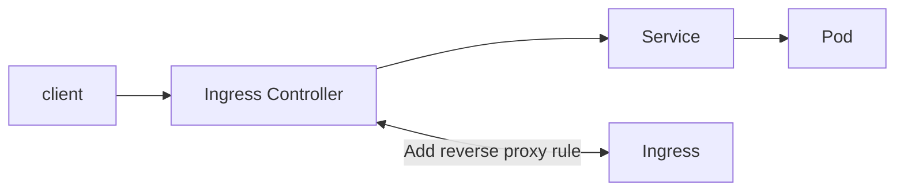
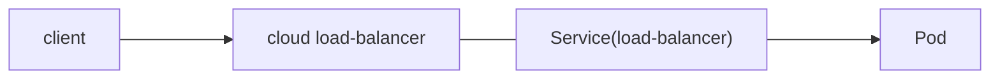
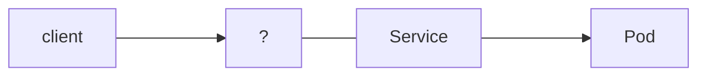

主要目的是將外部流量設置level7 反向代理至kubernetes cluster內部的service, 並將流量導向到對應的pod

這部份會有兩個組件, ingress 與 ingress controller
- Ingress: 可以理解成kubernetes反向代理的設定檔, 用來定義流量如何反向代理至特定pod, 用傳統web server比喻, 它就像nginx中/etc/nginx/conf.d/下的設定檔
- Ingress controller: 這邊可以理解成 真正實際實現反向代理的元件, 外部流量近來後, 會把相對應的流量導向目標pod, 用傳統web server比喻, 它就像nginx service

兩者關係概念, 就是當你創建一個ingress (反向代理規則), ingress controller就會發現該rule, 並將該rule轉換成設定檔, 並且reload
但兩者實際上都是獨立的元件, 設定檔並無相依關係, 不會互相影響




## Ingress Controller

- 實際上可以理解為kubernetes的web server, 但只負責處理反向代理的部份, 並且將流量導向到對應的pod上
- 工作方式就是監聽流量進行反向代理至Pod, 並將新發現的ingress 轉換成反向代理的rule 套用, 並reload
- 非kubernetes內建的元件, 需要自行佈署
- cluster 層級, 無關namespace  
- 有不同類型的ingress controller (nginx,haproxy,apache...)
- port 8443 ingress-nginx admission controller
- port 80 / 443
- 分為 雲端load balance 與 baremetal本地 佈署


這邊舉例 controller以 nginx 類型為主  

### 類型

- cloud provider: 這部份是結合cloud provider提供的服務, 簡單說是把雲端上的load balancer抽象化成 service(load-balancer), 該service就是 ingress controller的入口




- baremetal

[參考](https://kubernetes.github.io/ingress-nginx/deploy/baremetal/)



- Metallb: 可做為on-premise ingress controller的 load-balancer service 解決方案  
  - layer2: 通過ARP來宣告IP, 用於較簡易架構的服務
  - BGP: 用於大規模跨網段佈署, 路由器需支援BGP, 常用於異地數據中心, 混合雲環境

- NodePort: 將NodePort Service 綁定特定ingress rule,
- Via the host network: 類似一般nginx用法, 直接代理至 service


### Config簡介

controller需自行佈署, 這邊簡單解析一下佈署的config

這邊會分成
- ingress controller: 這邊處理是處理ingress的設定, 並且產生相對應的設定檔,
- ingress-nginx-admission: admission-webhook, 是kubernetes的機制, 主要是ApiServer準備將資源持久話至etcd前, 用來驗證ingress的設定是否合法 (e.g. annotations設定是否有缺少, 設定檔與資源的一致性... )


設定檔由多個部分組成,這邊用nginx-ingress-controller為例

- Namespace: 主要用來隔離環境, 用來放置ingress controller的元件
- ServiceAccount: 為ingress controller創建一個service account, 確保身份驗證
    - ingress-nginx: 用於ingress controller的身份驗證
    - ingress-nginx-admission: 用於ingress controller的webhook身份驗證
- configmap: 存儲基本設定, 可以讓 ingress controller讀取
- ClusterRole:
    - ingress-nginx: 確保ingress controller有權限操作cluster的元件
    - ingress-nginx-admission: 確保Admission Webhook有權限操作cluster的元件
- ClusterRoleBinding: 榜定clusterRole至對應的service account
- Deployment: 定義環境變數,probe,port,而內部controller pod主要負責動態產生nginx的反向代理設定
- Service:
  - ingress-nginx-controller: 暴露ingress controller的http ,https port
  - ingress-nginx-admission: 暴露webhook port
- Job:
  - ingress-nginx-admission-create: 創建webhook 憑證
  - ingress-nginx-admission-patch: 更新webhook 憑證
- ingressClass: 定義該該ingress的名稱 與ingress的類型是由哪個ingress controller處理 , 如為 controller: k8s.io/ingress-nginx, 此外若要啟動多個controller,也是metadata的name 可將controller做區分


## Ingress

- kubernetes的反向代理設定檔的抽象化物件, 用來定義流量如何反向代理至特定pod
- 無論使用哪種ingress controller, ingress設定檔都 相同, 並且不會因為ingress controller的不同而有所改變
- ingressClass 是標記該controller是哪種web server type, controller的pod 是藉由--arg 相依
- Ingress 的rule 是藉由 ingressClass 標記 注入rule至 controller

config, 主要是由 `test2.com` 可被導向 名為 `info`service後的pod的8010

```yaml
apiVersion: networking.k8s.io/v1
kind: Ingress
metadata:
  name: nginx-ingress
  annotations:
    nginx.ingress.kubernetes.io/rewrite-target: /
  namespace: dev
spec:
  ingressClassName: nginx  ## 這邊是表示使用哪個ingress controller
  rules:
  - host: "test2.com"
    http:
      paths:
      - path: /
        pathType: Prefix
        backend:
          service:
            name: info
            port:
              number: 8010
```

ingress controller config宣告 `ingressClassName` 位置

```yaml
    spec:
      containers:
      - args:
        - /nginx-ingress-controller
        - --election-id=ingress-nginx-leader
        - --controller-class=k8s.io/ingress-nginx
        - --ingress-class=nginx   <<<<<<<<<<<<<<<<<<<<<<<<<<<<< 這個地方
        - --configmap=$(POD_NAMESPACE)/ingress-nginx-controller
        - --validating-webhook=:8443
```


## 實際測試

### 共用config


demo app port 8010, 由clusterIP service, satefulset 組成  
該app 為 api, 會回傳創建時產生的uuid  

```yaml
apiVersion: apps/v1
kind: StatefulSet
metadata:
  name: info1
  namespace: dev
spec:
  serviceName: "info"
  replicas: 1
  selector:
    matchLabels:
      app: info1
  template:
    metadata:
      labels:
        app: info1
    spec:
      containers:
        - name: info
          image: y40103/info:2.0
          ports:
            - containerPort: 8010
---
apiVersion: v1
kind: Service
metadata:
  name: info1
  namespace: dev
spec:
  ports:
    - protocol: TCP
      port: 80
      targetPort: 8010
  selector:
    app: info1
---
apiVersion: apps/v1
kind: StatefulSet
metadata:
  name: info
  namespace: dev
spec:
  serviceName: "info"
  replicas: 1
  selector:
    matchLabels:
      app: info2
  template:
    metadata:
      labels:
        app: info2
    spec:
      containers:
        - name: info
          image: y40103/info:2.0
          ports:
            - containerPort: 8010
---
apiVersion: v1
kind: Service
metadata:
  name: info2
  namespace: dev
spec:
  ports:
    - protocol: TCP
      port: 80
      targetPort: 8010
  selector:
    app: info2
```


ingress
```yaml
apiVersion: networking.k8s.io/v1
kind: Ingress
metadata:
  name: nginx-ingress
  annotations:
    nginx.ingress.kubernetes.io/rewrite-target: /
  namespace: dev
spec:
  ingressClassName: nginx  # IngressController config中定義的 ingressClass 名稱
  rules:
    - host: "test2.com"
      http:
        paths:
          - path: /
            pathType: Prefix
            backend:
              service:
                name: info1
                port:
                  number: 8010
    - host: "test3.com"
      http:
        paths:
          - path: /
            pathType: Prefix
            backend:
              service:
                name: info2
                port:
                  number: 8010
```


### Cloud provider 

[參考](https://kubernetes.github.io/ingress-nginx/deploy/)

```bash
kubectl apply -f kubectl apply -f https://raw.githubusercontent.com/kubernetes/ingress-nginx/controller-v1.10.1/deploy/static/provider/cloud/deploy.yaml
```

實作待補充,   


### NodePort ingress

[參考](https://github.com/kubernetes/ingress-nginx/blob/main/docs/deploy/index.md#bare-metal-clusters)

簡單說就是該ingress controller組件中的service為 NodePort, 藉由該service 可藉由訪問代理 根據hostname 導向其他service  

```bash
kubectl apply -f https://raw.githubusercontent.com/kubernetes/ingress-nginx/controller-v1.10.1/deploy/static/provider/baremetal/deploy.yaml
# 佈署controller 
```

確認 controller service 為 NodePort

```bash
kubectl get svc -n ingress-nginx
#NAME                                 TYPE        CLUSTER-IP     EXTERNAL-IP   PORT(S)                      AGE
#ingress-nginx-controller             NodePort    10.96.40.93    <none>        80:30436/TCP,443:30556/TCP   6m44s
#ingress-nginx-controller-admission   ClusterIP   10.96.247.29   <none>        443/TCP                      6m44s
```

```bash
curl test2.com:30436
#ID: cdb25b50-1688-41c6-96c9-a18d3c9d4086
#
curl test3.com:30436
#ID: 9b6aec0d-09b1-4463-96c1-c701820e08bd
#
```
