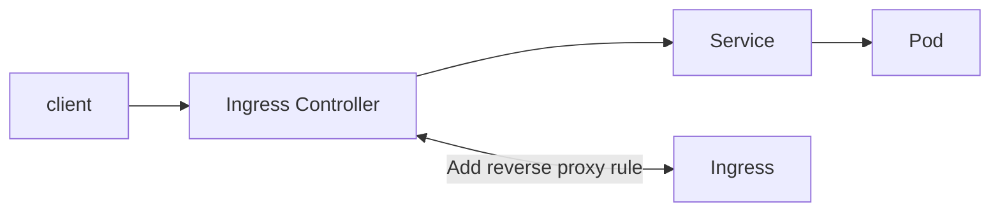
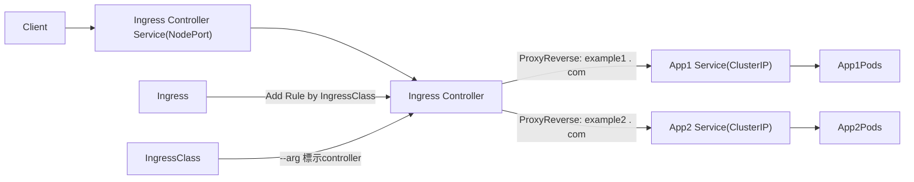

主要目的是將外部流量設置level7 反向代理至kubernetes cluster內部的service, 並將流量導向到對應的pod

這部份會有兩個組件, ingress 與 ingress controller
- Ingress: 可以理解成kubernetes反向代理的設定檔, 用來定義流量如何反向代理至特定pod, 用傳統web server比喻, 它就像nginx中/etc/nginx/conf.d/下的設定檔
- Ingress controller: 這邊可以理解成 真正實際實現反向代理的元件, 外部流量近來後, 會把相對應的流量導向目標pod, 用傳統web server比喻, 它就像nginx service

兩者關係概念, 就是當你創建一個ingress (反向代理規則), ingress controller就會發現該rule, 並將該rule轉換成設定檔, 並且reload
但兩者實際上都是獨立的元件, 設定檔並無相依關係, 不會互相影響



## Ingress

- kubernetes的反向代理設定檔的抽象化物件, 用來定義流量如何反向代理至特定pod
- 無論使用哪種ingress controller, ingress設定檔都 相同, 並且不會因為ingress controller的不同而有所改變

```yaml
apiVersion: networking.k8s.io/v1
kind: Ingress
metadata:
  name: nginx-ingress
  annotations:
    nginx.ingress.kubernetes.io/rewrite-target: /
  namespace: dev
spec:
  ingressClassName: nginx
  rules:
  - host: "test.com"
    http:
      paths:
      - path: /
        pathType: Prefix
        backend:
          service:
            name: nginx
            port:
              number: 80

  - host: "test2.com"
    http:
      paths:
      - path: /
        pathType: Prefix
        backend:
          service:
            name: info
            port:
              number: 8010
```


## Ingress Controller

- 實際上可以理解為kubernetes的web server, 但只負責處理反向代理的部份, 並且將流量導向到對應的pod上
- 工作方式就是監聽流量進行反向代理至Pod, 並將新發現的ingress 轉換成反向代理的rule 套用, 並reload
- 非kubernetes內建的元件, 需要自行佈署
- 有多種架構方案與不同類型的ingress controller


### Config簡介

controller需自行佈署, 這邊簡單解析一下佈署的config

這邊會分成
- ingress controller: 這邊處理是處理ingress的設定, 並且產生相對應的設定檔,
- ingress-nginx-admission: admission-webhook, 是kubernetes的機制, 主要是ApiServer準備將資源持久話至etcd前, 用來驗證ingress的設定是否合法 (e.g. annotations設定是否有缺少, 設定檔與資源的一致性... )


設定檔由多個部分組成,這邊用nginx-ingress-controller為例

- Namespace: 主要用來隔離環境, 用來放置ingress controller的元件
- ServiceAccount: 為ingress controller創建一個service account, 確保身份驗證
    - ingress-nginx: 用於ingress controller的身份驗證
    - ingress-nginx-admission: 用於ingress controller的webhook身份驗證
- configmap: 存儲基本設定, 可以讓 ingress controller讀取
- ClusterRole:
    - ingress-nginx: 確保ingress controller有權限操作cluster的元件
    - ingress-nginx-admission: 確保Admission Webhook有權限操作cluster的元件
- ClusterRoleBinding: 榜定clusterRole至對應的service account
- Deployment: 定義環境變數,probe,port,而內部controller pod主要負責動態產生nginx的反向代理設定
- Service:
  - ingress-nginx-controller: 暴露ingress controller的http ,https port
  - ingress-nginx-admission: 暴露webhook port
- Job:
  - ingress-nginx-admission-create: 創建webhook 憑證
  - ingress-nginx-admission-patch: 更新webhook 憑證
- ingressClass: 定義該該ingress的名稱 與ingress的類型是由哪個ingress controller處理 , 如為 controller: k8s.io/ingress-nginx, 此外若要啟動多個controller,也是metadata的name 可將controller做區分
- ValidatingWebhookConfiguration:

### 常見方案

ingress controller 有多種方案, 舉一些目前可能會使用到的

- cloud provider: 這部份是結合cloud provider提供的服務, 簡單說是把雲端上的load balancer抽象化成 service(load-balancer), 該service就是 ingress controller的入口
- bare metal: 這邊是直接設置service(NodePort)作為ingress controller的入口, 透過nodePort將流量導向到ingress controller, 但由於nodePort expose的port範圍為30000-32767, 這邊會需要手動特別設置iptable之類的設置, 在每一個節點將 80 or 443 的流量 導向到ingress controller的nodePort上
- bare metal+MetalLb:
  - MetalLB: 這東西簡單說就是可以設定一個ip range, 之後若在本地端設置 load-balancer的service, 就會自動從該range分配一組ip給該service, 可以理解讓本地可以使用load balancer service的一個手段
  - 若將metalLb的load balance service 取代 bare metal 的 nodePort service , 似乎可以省略每個節點都需要另外設定iptable設定

且除了有不同的方案之外, 也可自行選擇 ingress controller種類 e.g. nginx, traefik, haproxy...等等
可針對需求自行佈署相對應的ingress controller


### bare metal

實體機 Ingress Controller 佈署

- ingress: 定義反向代理的rule
- ingress controller: 負責將ingress的rule轉為config 進行反向代理

以下用nginx做對比

| ingress元件          | Nginx元件                  |
|--------------------|--------------------------|
| ingress controller | Nginx Server             |
| ingress            | /etc/nginx/conf.d/*.conf |
| IngressClass       | 表示WebServer的種類 , nginx   |

當ingress controller存在, 若創建ingress, controller會偵測ingress,並將rule建立至controller中

#### 測試Pod

兩組clusterIP對應兩組 app, 80 and 8010 port

```yaml
apiVersion: apps/v1
kind: StatefulSet
metadata:
  name: nginx
  namespace: dev
spec:
  serviceName: "nginx"
  replicas: 3
  selector:
    matchLabels:
      app: nginx
  template:
    metadata:
      labels:
        app: nginx
    spec:
      containers:
        - name: nginx
          image: nginx:latest
          ports:
            - containerPort: 80
---
apiVersion: v1
kind: Service
metadata:
  name: nginx
  namespace: dev
spec:
  selector:
    app: nginx
  ports:
    - protocol: TCP
      port: 80
      targetPort: 80
---

apiVersion: apps/v1
kind: StatefulSet
metadata:
  name: info
  namespace: dev
spec:
  serviceName: "info"
  replicas: 3
  selector:
    matchLabels:
      app: info
  template:
    metadata:
      labels:
        app: info
    spec:
      containers:
        - name: info
          image: y40103/info:2.0
          ports:
            - containerPort: 8010
---
apiVersion: v1
kind: Service
metadata:
  name: info
  namespace: dev
spec:
  ports:
    - protocol: TCP
      port: 80
      targetPort: 8010
  selector:
    app: info
```


#### Ingress Controller

controller佈署後, 與後續其他資源有相關的主要元件有

- deployment(controller)
- Service(NodePort)
- IngressClass


佈署 bare metal ingress controller

```yaml
kubectl apply -f  bare-metal-ingress-controller.yaml
```



會佈署在 namespace: ingress-nginx

```bash
kubectl get svc -n ingress-nginx
#NAME                                 TYPE        CLUSTER-IP      EXTERNAL-IP   PORT(S)                      AGE
#ingress-nginx-controller             NodePort    10.96.251.118   <none>        80:32608/TCP,443:31434/TCP   43m
#ingress-nginx-controller-admission   ClusterIP   10.96.113.215   <none>        443/TCP                      43m
```

- bare metal ingress controller 的service, 官方config 預設NodePort
- host:32608 可以反向代理至後面Pod , host 可用ingress制定rule 反向代理至Pod
- ingressClass 是標記該controller是哪種web server type, controller的pod 是藉由--arg 相依
- Ingress 的rule 是藉由 ingressClass 標記 注入rule至 controller


#### Ingress

佈署controller後

設置反向代理規則,

```yaml
apiVersion: networking.k8s.io/v1
kind: Ingress
metadata:
  name: nginx-ingress
  annotations:
    nginx.ingress.kubernetes.io/rewrite-target: /
  namespace: dev
spec:
  ingressClassName: nginx  # IngressController config中定義的 ingressClass 名稱
  rules:
    - host: "test.com"
      http:
        paths:
          - path: /
            pathType: Prefix
            backend:
              service:
                name: nginx
                port:
                  number: 80


    - host: "test2.com"
      http:
        paths:
          - path: /
            pathType: Prefix
            backend:
              service:
                name: info
                port:
                  number: 8010

```

```bash
kubectl get ingress -n dev
#NAME            CLASS   HOSTS                ADDRESS      PORTS   AGE
#nginx-ingress   nginx   test.com,test2.com   172.25.3.2   80      4h14m
```

查看controller log, 確認ingress rule有無異常

```bash
kubectl logs -f ingress-nginx-controller-5cdfb74dc-7c8jh -n ingress-nginx

#異常log
#I0603 01:57:01.620744      10 controller.go:210] "Backend successfully reloaded"
#I0603 01:57:01.620872      10 controller.go:221] "Initial sync, sleeping for 1 second"
#I0603 01:57:01.621019      10 event.go:364] Event(v1.ObjectReference{Kind:"Pod", Namespace:"ingress-nginx", Name:"ingress-nginx-controller-5cdfb74dc-7c8jh", UID:"0936ec43-f2d1-4b13-ad18-92d5a5fd85a9", APIVersion:"v1", ResourceVersion:"1730", FieldPath:""}): type: 'Normal' reason: 'RELOAD' NGINX reload triggered due to a change in configuration
#W0603 02:02:21.745040      10 controller.go:330] ignoring ingress nginx-ingress in dev based on annotation : ingress does not contain a valid IngressClass
#I0603 02:02:21.745066      10 main.go:107] "successfully validated configuration, accepting" ingress="dev/nginx-ingress"
#I0603 02:02:21.749408      10 store.go:436] "Ignoring ingress because of error while validating ingress class" ingress="dev/nginx-ingress" error="ingress does not contain a valid IngressClass"
#W0603 02:05:25.779985      10 controller.go:330] ignoring ingress nginx-ingress in dev based on annotation : ingress does not contain a valid IngressClass
#I0603 02:05:25.780013      10 main.go:107] "successfully validated configuration, accepting" ingress="dev/nginx-ingress"
#W0603 02:09:43.300435      10 controller.go:330] ignoring ingress nginx-ingress in dev based on annotation : ingress does not contain a valid IngressClass
#I0603 02:09:43.300460      10 main.go:107] "successfully validated configuration, accepting" ingress="dev/nginx-ingress"

#正常log
#I0603 02:47:05.889709      10 controller.go:210] "Backend successfully reloaded"
#I0603 02:47:05.889980      10 event.go:364] Event(v1.ObjectReference{Kind:"Pod", Namespace:"ingress-nginx", Name:"ingress-nginx-controller-5cdfb74dc-7c8jh", UID:"0936ec43-f2d1-4b13-ad18-92d5a5fd85a9", APIVersion:"v1", ResourceVersion:"1730", FieldPath:""}): type: 'Normal' reason: 'RELOAD' NGINX reload triggered due to a change in configuration
#172.25.3.3 - - [03/Jun/2024:02:47:50 +0000] "GET / HTTP/1.1" 200 54 "-" "curl/7.88.1" 79 0.003 [dev-info-8010] [] 10.244.1.5:8010 54 0.004 200 ae0739a70333d426d6ca1bb9bd7f1c51
#172.25.3.3 - - [03/Jun/2024:02:47:52 +0000] "GET / HTTP/1.1" 200 54 "-" "curl/7.88.1" 79 0.005 [dev-info-8010] [] 10.244.2.6:8010 54 0.004 200 82470641e7adc3c3b9a8a5370355843a
#172.25.3.3 - - [03/Jun/2024:02:47:54 +0000] "GET / HTTP/1.1" 200 615 "-" "curl/7.88.1" 78 0.002 [dev-nginx-80] [] 10.244.2.4:80 615 0.002 200 ff8596da638ec0bdd44120ce1f2e650f
#I0603 02:48:01.610245      10 status.go:304] "updating Ingress status" namespace="dev" ingress="nginx-ingress" currentValue=null newValue=[{"ip":"172.25.3.2"}]
#I0603 02:48:01.618464      10 event.go:364] Event(v1.ObjectReference{Kind:"Ingress", Namespace:"dev", Name:"nginx-ingress", UID:"356e3d50-0fab-43fd-9ca2-8e983aec7a97", APIVersion:"networking.k8s.io/v1", ResourceVersion:"6875", FieldPath:""}): type: 'Normal' reason: 'Sync' Scheduled for sync


```


#### 實際測試


```bash
curl test2.com:32608
#ID: 2c8a393e-40bb-4528-be19-5b8ac4216a50

curl test.com:32608
#<!DOCTYPE html>
#<html>
#<head>
#<title>Welcome to nginx!</title>
#<style>
#html { color-scheme: light dark; }
#body { width: 35em; margin: 0 auto;
#font-family: Tahoma, Verdana, Arial, sans-serif; }
#</style>
#</head>
#<body>
#<h1>Welcome to nginx!</h1>
#<p>If you see this page, the nginx web server is successfully installed and
#working. Further configuration is required.</p>
#
#<p>For online documentation and support please refer to
#<a href="http://nginx.org/">nginx.org</a>.<br/>
#Commercial support is available at
#<a href="http://nginx.com/">nginx.com</a>.</p>
#
#<p><em>Thank you for using nginx.</em></p>
#</body>
```

