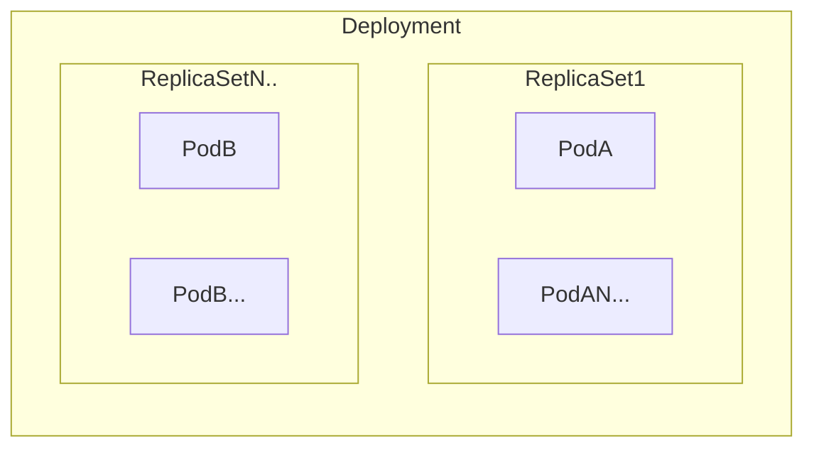
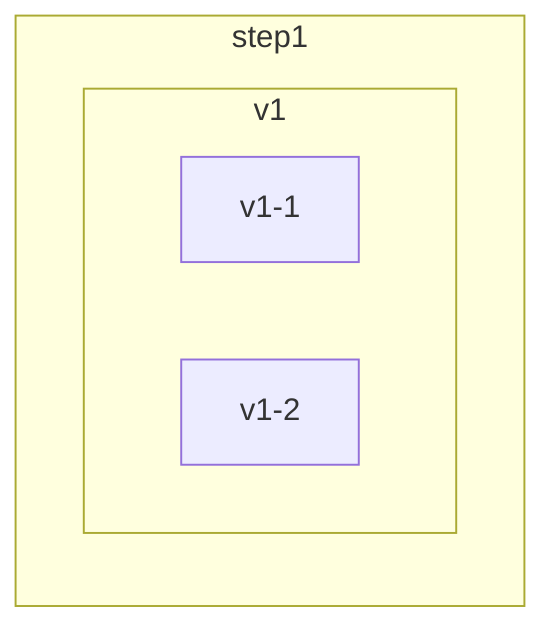
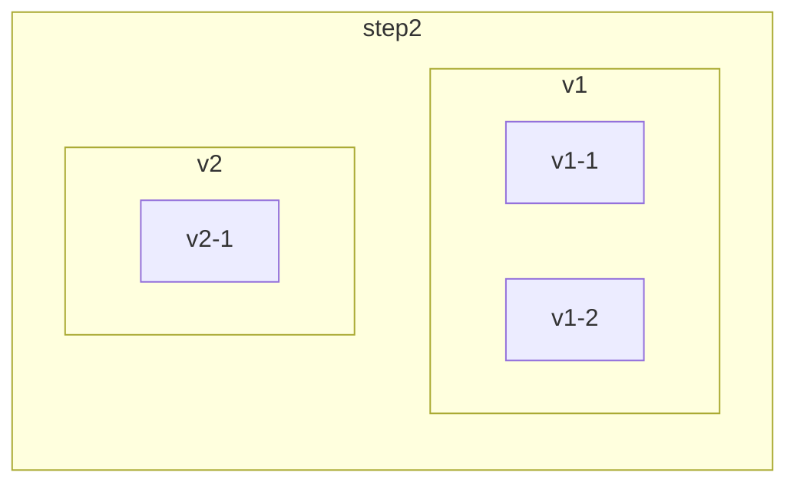
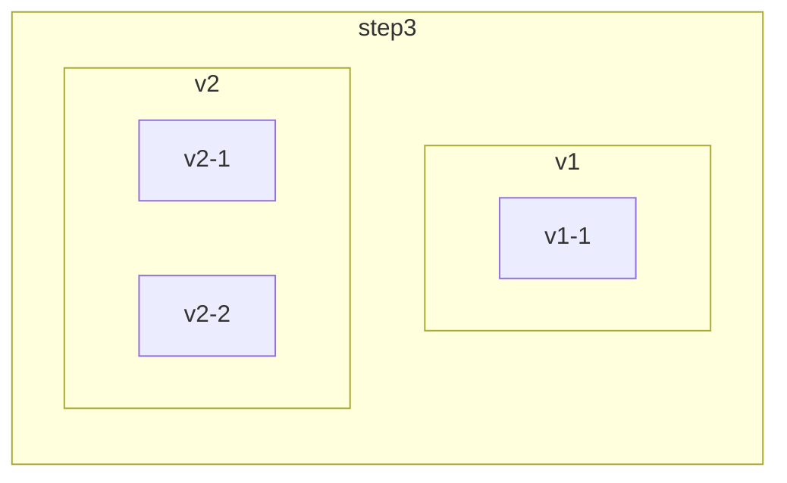
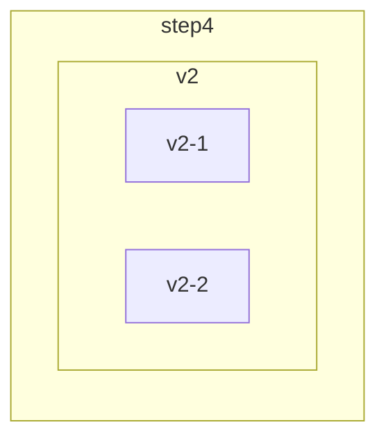

i

kubernetes創建Pod的方式  

- 自主式創建: 利用kubernetes直接創建  
  kubernetes > Pod  
- 間接式創建: 利用pod-controller 創建, 此類型的Pod若被刪除, 會自動再次被創建  
  kubernetes > Pod-controller > Pod  

常見的Pod Controller

| controller type           | content                                                                                             |
|---------------------------|-----------------------------------------------------------------------------------------------------|
| ReplicationController     | 比較原始的Pod控制器,已經被ReplicaSet取代,主要作用為保證pod運行                                                            |
| ReplicaSet                | 同上,並支援Pod數量變更,image版本更變 (RC + matchExpression label 可多 In,NotIn,Exsits,DoesNotExists, RC只能靠完整label) |
| Deployment                | 同上,並支援滾動升級,版本退回 (RS+滾動)                                                                             |
| Horizontal Pod AutoScaler | 可以根據cluster負載自動調整Pod數量                                                                              |
| DaemonSet                 | 在cluster中指定Node執行一個副本,通常用於啟動 daemon                                                                 |
| Job                       | 該創建的Pod,只要完成任務後就會立刻退出,用於一次性任務                                                                       |
| Cronjob                   | 該創建的Pod,會週期性執行,用於週期性任務                                                                              |
| StatefulSet               | 管理有狀態的application                                                                                   |

## Deployment

Deployment > ReplicaSet(一組, 滾動時會多組, 新與舊) > Pod(一組RS會控制多組)



- 包含ReplicaSet所有功能
- 可 rolling update / rollback
- 可 pause / resume

### image更新策略

- Recreate : 撤銷當前全部需更新的Pod, 啟動新一批的Pod
- RollingUpdate (預設) : 進行 新增一部分新版本pod, 然後撤銷舊版本pod, 滾動更新至全部為新版本, 更新過程中會有新舊兩個版本

rollingUpdate 概念,









### 設定檔

```yaml
apiVersion: apps/v1
kind: Deployment
metadata:
  name: deploy-nginx # deployment 名稱
  namespace: dev
  annotations:
    kubernetes.io/change-cause: "Initial deploy of nginx"
spec:
  replicas: 3  # 需維持的 pod 數量
  revisionHistoryLimit: 3 # 保留歷史版本數量 預設 10
  paused: false # 暫停佈署 預設 false
  progressDeadlineSeconds: 600 # 佈署 timeout 時間 (second) 預設 600
  strategy: # 策略
    type: RollingUpdate # 滾動更新策略
    rollingUpdate: # 滾動更新
      maxSurge: 30% # 啟動過程中 可能會額外增加比當前 pod 更多的最大數量用於滾動 預設 25%
      maxUnavailable: 30% # 啟動中 可能會終止部份 Pod 終止造成不可用的最大數量 預設 25%
  selector: # 綁定的 pod
    matchLabels:
      app: nginx-pod
    matchExpressions:
      - { key: app, operator: In, values: [ nginx-pod ] }
  template: # 這邊用於定義被控制的 pod
    metadata:
      labels:
        app: nginx-pod
    spec:
      containers:
        - name: nginx
          image: nginx:1.22.0
```

```bash
kubectl get deploy -n dev -o wide
#NAME           READY   UP-TO-DATE   AVAILABLE   AGE     CONTAINERS   IMAGES         SELECTOR
#deploy-nginx   3/3     3            3           3m30s   nginx        nginx:1.22.0   app=nginx-pod,app in (nginx-pod)

kubectl get rs -n dev -o wide
#NAME                      DESIRED   CURRENT   READY   AGE     CONTAINERS   IMAGES         SELECTOR
#deploy-nginx-5dfc949ff7   3         3         3       2m38s   nginx        nginx:1.22.0   app=nginx-pod,app in (nginx-pod),pod-template-hash=5dfc949ff7

kubectl get pod -n dev -o wide
#NAME                            READY   STATUS    RESTARTS   AGE   IP           NODE          NOMINATED NODE   READINESS GATES
#deploy-nginx-5dfc949ff7-kz5w9   1/1     Running   0          17s   10.244.1.3   dev-worker    <none>           <none>
#deploy-nginx-5dfc949ff7-mbqzk   1/1     Running   0          17s   10.244.1.2   dev-worker    <none>           <none>
#deploy-nginx-5dfc949ff7-z5f8w   1/1     Running   0          17s   10.244.2.2   dev-worker2   <none>           <none>
```

### deployment 狀態說明

| NAME         | READY | UP-TO-DATE | AVAILABLE | AGE |
|--------------|-------|------------|-----------|-----|
| deploy-nginx | 3/3   | 3          | 3         | 14s |

- up-to-date: 已更新至最新版的Pod數量
- available: 可用的Pod數量

#### update

```bash
# 直接修改 yaml 後
kubectl apply -f deploy.yaml

# or

kubectl edit deploy deploy-nginx -n dev

kubectl annotate deployment deploy-nginx kubernetes.io/change-cause="Updated nginx image to 1.25.5" -n dev
# 需標記版本變更 , 之後rollback 可查看歷史紀錄  

```

```bash
kubectl get deploy -n dev -o wide
#NAME           READY   UP-TO-DATE   AVAILABLE   AGE   CONTAINERS   IMAGES         SELECTOR
#deploy-nginx   3/3     3            3           22m   nginx        nginx:1.25.5   app=nginx-pod,app in (nginx-pod)

kubectl get rs -n dev -o wide
#NAME                      DESIRED   CURRENT   READY   AGE    CONTAINERS   IMAGES         SELECTOR
#deploy-nginx-5dfc949ff7   0         0         0       23m    nginx        nginx:1.22.0   app=nginx-pod,app in (nginx-pod),pod-template-hash=5dfc949ff7
#deploy-nginx-6b9db475d4   0         0         0       9m5s   nginx        nginx:1.3      app=nginx-pod,app in (nginx-pod),pod-template-hash=6b9db475d4
#deploy-nginx-f4ff8498c    3         3         3       2m6s   nginx        nginx:1.25.5   app=nginx-pod,app in (nginx-pod),pod-template-hash=f4ff8498c
```

## rollback

| rollout command | content                                 |
|-----------------|-----------------------------------------|
| status          | 顯示當前版本升級狀態                              |
| history         | 顯示版本控制歷史紀錄 版本變化操作需加上--record 否則只會顯示None |
| pause           | 暫停進行版本控制過程                              |
| resume          | 繼續進行被暫停的版本控制過程                          |
| restart         | 重啟版本控制過程                                |
| undo            | 回滾至上一個版本                                |

```bash
kubectl rollout history deploy -n dev
#deployment.apps/deploy-nginx 
#REVISION  CHANGE-CAUSE
#1         Initial deploy of nginx1.22
#2         <none>
#3         Updated nginx image to 1.25.5
```

```bash
kubectl rollout undo deployment deploy-nginx --to-revision=1 -n dev
## rollback 至 特定版號

kubectl get deploy -n dev -o wide
#AME           READY   UP-TO-DATE   AVAILABLE   AGE   CONTAINERS   IMAGES         SELECTOR
#deploy-nginx   3/3     3            3           50m   nginx        nginx:1.22.0   app=nginx-pod,app in (nginx-pod)


kubectl rollout history deploy -n dev
#deployment.apps/deploy-nginx 
#REVISION  CHANGE-CAUSE
#2         <none>
#3         Updated nginx image to 1.25.5
#4         Initial deploy of nginx1.22
```

### DaemonSet

Node等級的控制器 ,用於保證所有Node都會運行一個特定Pod, 一般用於日誌收集或Node監控之類。 若每個Node都需要特定服務,
每個Node都只需要一個, 這類Pod就適合使用DaemonSet類型

- 每當cluster新增node, 指定的Pod會自動新增至新node
- 每當該node從cluster移除時, 該Pod也會被自動GC

適用場景

- 運行cluster 存儲 daemon, 如每個node運行 Gluster. ceph
- 每個node上運行 log收集 daemon, 如 fluentd, logstash
- 每個node上運行監控 daemon, 如Prometheus Node Exporter

```yaml
apiVersion: apps/v1
kind: DaemonSet
metadata:
  name: daemon-nginx # deployment
  namespace: dev
  labels:
    controller: daemonset
spec:
  #----------------------------- daemon主要設定
  revisionHistoryLimit: 3 #保留歷史紀錄
  updateStrategy: # 更新策略
    type: RollingUpdate #滾動更新策略
    rollingUpdate: #滾動更新
      maxUnavailable: 1 #最大不可用數量
  selector: #選擇器 通過該選擇器決定管理哪些pod
    matchLabels:
      app: nginx-pod
    matchExpressions:
      - key: app
        operator: In
        values:
          - nginx-pod
  #------------------------------
  template: # pod template
    metadata:
      labels:
        app: nginx-pod
    spec:
      containers:
        - name: nginx
          image: nginx:1.22.0
          ports:
            - containerPort: 80
```

```bash
kubectl get nodes -n dev
#NAME                STATUS   ROLES           AGE     VERSION
#dev-control-plane   Ready    control-plane   6m34s   v1.30.0
#dev-worker          Ready    <none>          6m14s   v1.30.0
#dev-worker2         Ready    <none>          6m14s   v1.30.0


kubectl get pod -n dev -o wide
#NAME                 READY   STATUS    RESTARTS   AGE   IP           NODE          NOMINATED NODE   READINESS GATES
#daemon-nginx-gnpcj   1/1     Running   0          33s   10.244.1.3   dev-worker    <none>           <none>
#daemon-nginx-vt6gl   1/1     Running   0          33s   10.244.2.4   dev-worker2   <none>           <none>
```

### Job

用於批量執行一次性任務 (一次同時處理指定數量任務 每個任務只執行一次)

- 當Job創建的Pod執行成功時, Job將紀錄成功結束的Pod數量
- 當成功結束的Pod達到指定數量時, Job執行成功

config有label引導 or 無label 引導, 這邊紀錄無label版本

```yaml
apiVersion: batch/v1
kind: Job
metadata:
  name: job-busybox # deployment
  namespace: dev
  labels:
    controller: job
spec:
  #----------------------------- job主要設定
  completions: 6 # 代表執行總共啟動一次性Pod 6次
  parallelism: 3 # 最多同時啟動三個Pod
  template: # pod template
    spec:
      restartPolicy: Never #  重啟策略需注意 僅能Never, OnFailure , 完全不重啟,失敗重啟 , 禁止always,因運行成功也會自動關閉 會死循環   
      containers:
        - name: busybox
          image: busybox:latest
          command: [ "/bin/sh","-c","for i in 9 8 7 6 5 4 3 2 1; do echo $1;sleep 2;done" ]
```

某任務執行6次, 最大同時三組並行

```yaml
kubectl get pod -n dev -o wide
#NAME                READY   STATUS      RESTARTS   AGE   IP           NODE          NOMINATED NODE   READINESS GATES
#job-busybox-42d8b   0/1     Completed   0          34s   10.244.2.5   dev-worker2   <none>           <none>
#job-busybox-7cjb6   1/1     Running     0          7s    10.244.1.6   dev-worker    <none>           <none>
#job-busybox-bnz85   0/1     Completed   0          34s   10.244.1.5   dev-worker    <none>           <none>
#job-busybox-dp46v   1/1     Running     0          8s    10.244.2.7   dev-worker2   <none>           <none>
#job-busybox-k26vj   1/1     Running     0          8s    10.244.2.6   dev-worker2   <none>           <none>
#job-busybox-nq9sj   0/1     Completed   0          34s   10.244.1.4   dev-worker    <none>           <none>
```

### cronjob

用於週期性執行任務

```yaml
apiVersion: batch/v1
kind: CronJob
metadata:
  name: job-busybox # deployment
  namespace: dev
  labels:
    controller: cronjob
spec:
  #---------------------------------- cronjob 主要設定
  schedule: "* * * * *" # 同crontab格式，這個示例是每分鐘執行一次。根據實際需求修改。
  concurrencyPolicy: "Forbid" # 併發執行策略, 用於前一次任務未結束, 可是已到下一次執行週期的時間點
  # 可輸入:
  # Allow: 允許Job併發
  # Forbid: 禁止Job併發
  # Replace: 直接用新的任務替換掉正在執行的任務
  failedJobsHistoryLimit: 1 # 若失敗，保留的歷史紀錄，預設為1
  successfulJobsHistoryLimit: 3 # 若成功，保留的歷史紀錄，預設為3
  startingDeadlineSeconds: 60 # 啟動作業後的 timeout 時長，根據需求調整
  suspend: false # 暫停 , 若該cronjob 暫時不需要又不想將該服務停止，可以設定為true。預設為false
  #----------------------------------
  jobTemplate: # job template設定
    metadata:
      labels:
        app: busybox-pod
    spec:
      completions: 1
      parallelism: 1
      manualSelector: true
      selector:
        matchLabels:
          app: busybox-pod
        matchExpressions:
          - key: app
            operator: In
            values:
              - busybox-pod
      template: # pod template
        metadata:
          labels:
            app: busybox-pod
        spec:
          restartPolicy: Never
          containers:
            - name: busybox
              image: busybox:latest
              command: [ "/bin/sh","-c","for i in 9 8 7 6 5 4 3 2 1; do echo $1;sleep 2;done" ] # 每兩秒打印一次，總執行時間20秒
```

測試

```yaml
apiVersion: batch/v1
kind: CronJob
metadata:
  name: cronjob-busybox # deployment
  namespace: dev
  labels:
    controller: cronjob
spec:
  #---------------------------------- cronjob 主要設定
  schedule: "*/1 * * * *" # 每分鐘執行
  #----------------------------------
  jobTemplate: # job template設定
    spec:
      completions: 1
      parallelism: 1
      template: # pod template
        spec:
          restartPolicy: Never
          containers:
            - name: busybox
              image: busybox:latest
              command: [ "/bin/sh","-c","for i in 9 8 7 6 5 4 3 2 1; do echo $1;sleep 2;done" ] # 每兩秒打印一次 總執行時間20秒
```

每分鐘執行一次

```bash
kubectl get cronjob -n dev
#NAME              SCHEDULE      TIMEZONE   SUSPEND   ACTIVE   LAST SCHEDULE   AGE
#cronjob-busybox   */1 * * * *   <none>     False     1        7s              24s
kubectl get pod -n dev -o wide
#NAME                             READY   STATUS      RESTARTS   AGE    IP           NODE          NOMINATED NODE   READINESS GATES
#cronjob-busybox-28613411-fgkww   0/1     Completed   0          2m3s   10.244.1.7   dev-worker    <none>           <none>
#cronjob-busybox-28613412-6pvfx   0/1     Completed   0          63s    10.244.2.8   dev-worker2   <none>           <none>
#cronjob-busybox-28613413-kwcjp   1/1     Running     0          3s     10.244.2.9   dev-worker2   <none>           <none>
```

### StatefulSet

為了解決有狀態的service的問題 (對應 deployment 與 replicationSet 為無狀態設計) , 應用場景

- 穩定持有化的存儲, 若Pod重啟調度後, 是否能訪問到之前相同的volume, 基於PVC實現
- 穩定的網路標誌, 重啟調度後 其PodName與Hostname 不變, 基於headless Service (無cluster IP 的 service) 來實現, 依靠此特性,
  可藉由 hostname.domain 在 pod之間連至特定pod, 重啟依然有效(deployment 重啟後 pod name 會有變化)
- Pod Dns Name `<pod name>.<service name>.<namespace>.svc.cluster.local`
- 有序佈署, 有序擴展 即Pod是有順序的, 在佈署或者擴展的時候依據定義的順序依次執行 (下一個Pod被執行前, 上一個Pod必須為
  Running or Ready), 基於 init container 來實現
- 有序收縮 , 有序刪除

常見應用場景 db cluster, db pod 即使損毀 被重啟 依然可以抓到原本db存儲位置


```yaml
apiVersion: apps/v1
kind: StatefulSet
metadata:
  name: stateful-nginx
  namespace: dev
spec:
  selector:
    matchLabels:
      app: nginx
  serviceName: svc-nginx  # 後續配合的service名稱, 這邊是必須的 否則不會產生綁定pod的dns
  replicas: 3
  template: # pod template
    metadata:
      labels:
        app: nginx
    spec:
      containers:
        - name: nginx
          image: nginx:latest
          ports:
            - containerPort: 80
              name: web
```

這邊新增一個headless service測試效果

```yaml
apiVersion: v1
kind: Service
metadata:
  labels:
    app: nginx
  name: svc-nginx
  namespace: dev
spec:
  ports:
    - port: 80
      protocol: TCP
      targetPort: 80
  clusterIP: None
  selector:
    app: nginx
```

```bash

kubectl get pod -n kube-system -o wide
# get dns ip
#NAME                                        READY   STATUS    RESTARTS      AGE   IP           NODE                NOMINATED NODE   READINESS GATES
#coredns-7db6d8ff4d-s6hjj                    1/1     Running   1 (93m ago)   40h   10.244.0.2   dev-control-plane   <none>           <none>
#coredns-7db6d8ff4d-w7xsf                    1/1     Running   1 (93m ago)   40h   10.244.0.3   dev-control-plane   <none>           <none>
#...
kubectl get pod -n dev -o wide
#NAME               READY   STATUS    RESTARTS   AGE     IP           NODE          NOMINATED NODE   READINESS GATES
#stateful-nginx-0   1/1     Running   0          6m24s   10.244.2.2   dev-worker2   <none>           <none>
#stateful-nginx-1   1/1     Running   0          6m21s   10.244.1.2   dev-worker    <none>           <none>
#stateful-nginx-2   1/1     Running   0          6m18s   10.244.1.3   dev-worker    <none>           <none>
kubectl get svc -n dev
#NAME        TYPE        CLUSTER-IP   EXTERNAL-IP   PORT(S)   AGE
#svc-nginx   ClusterIP   None         <none>        80/TCP    3m37s
nslookup stateful-nginx-0.svc-nginx.dev.svc.cluster.local 10.244.0.2
#Server:         10.244.0.2
#Address:        10.244.0.2#53
#
#Name:   stateful-nginx-0.svc-nginx.dev.svc.cluster.local
#Address: 10.244.2.2
#
nslookup stateful-nginx-1.svc-nginx.dev.svc.cluster.local 10.244.0.2
#Server:         10.244.0.2
#Address:        10.244.0.2#53
#
#Name:   stateful-nginx-1.svc-nginx.dev.svc.cluster.local
#Address: 10.244.1.2
#
nslookup stateful-nginx-2.svc-nginx.dev.svc.cluster.local 10.244.0.2
#Server:         10.244.0.2
#Address:        10.244.0.2#53
#
#Name:   stateful-nginx-2.svc-nginx.dev.svc.cluster.local
#Address: 10.244.1.3
```


