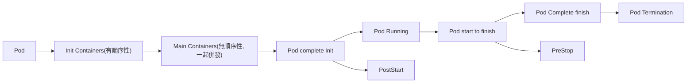

Pod config 設定

## imagePullPolicy

image pull policy

- Always: 總是從 remote repository 取得 image
- IfNotPresent: local repository 存在, 就使用 local repository, 不存在則從 remote repository 取得 image
- Never: 只使用local repository 取得 image

## command

用於Pod初始化後 執行的一個命令

需注意的點為 command會覆蓋掉dockerfile中的 entrypoint

若只有args 沒有 command 會執行dockerfile entrypoint結合 args

command,args都有 , 則會忽略dockerfile entrypoint

```yaml
apiVersion: v1
kind: Pod
metadata:
  name: pod-base
  namespace: dev
  labels:
    test: env
spec:
  containers:
    - name: nginx
      image: nginx:1.22.0 # 目前不存在於local
    - name: busybox
      image: busybox:latest
      command: [ "/bin/sh","-c","touch /tmp/hello.txt;while true;do /bin/echo $(date +%T) >> /tmp/hello.txt;sleep 3;done;" ]
```

## env

可藉由env對 container傳遞環境變量

```yaml
apiVersion: v1
kind: Pod
metadata:
  name: pod-base
  namespace: dev
  labels:
    test: env
spec:
  containers:
    - name: nginx
      image: nginx:1.22.0 # 目前不存在於local
    - name: busybox
      image: busybox:latest
      command: [ "/bin/sh","-c","touch /tmp/hello.txt;while true;do /bin/echo $(date +%T) >> /tmp/hello.txt;sleep 3;done;" ]
      env:
        - name: "username"
          value: "admin"
        - name: "password"
          value: "123456"
```

```bash
kubectl exec pod-base -n dev -c busybox -it -- sh -c 'echo $username'
# 驗證指令

kubectl exec pod-base -n dev -c busybox -it -- sh -c 'echo $password'
# 驗證指令
```

## ports

container port 設置

hostPort,hostIP 為container 映射至外部的port,IP, 若有多個Pod會衝突, 因此不會特別設置, 讓系統自行調度

```yaml
apiVersion: v1
kind: Pod
metadata:
  name: pod-base
  namespace: dev
  labels:
    test: env
spec:
  containers:
    - name: nginx
      image: nginx:1.22.0
      ports:
        - name: nginx-port # port名稱 在Pod中必須為唯一
          containerPort: 80
          protocol: TCP # 預設 tcp
#       hostPort: # 在實際主機上映射出的Port # 通常不會設置 若有同樣的服務 會衝突
#       hostIP: # 指定綁定的外部主機IP # 通常不會設置 讓系統自行調度
```

```bash
kubectl describe pod pod-base -n dev

#    Port:           80/TCP
#    Host Port:      0/TCP

```

## resources

主要用來做硬體的資源限制
若某個Node 有多個Pod在運行
其中一個Pod突然佔用資源異常 可能佔用其他Pod的資源 全部Pod被影響
若有做資源限制 可以, 異常Pod資源不足時 會被重啟 , 使其不影響至整體服務

- limit: 用於限制container 最大佔用資源 超過會被重啟
- request: 用於限制container 最小佔用資源 , 若硬體資源不足 會無法啟動 e.g 設定ram 10g 若系統ram 不足10g 系統就會放棄該container

```yaml
apiVersion: v1
kind: Pod
metadata:
  name: pod-base
  namespace: dev
  labels:
    test: env
spec:
  containers:
    - name: nginx
      image: nginx:1.22.0
      resources:
        limits: #硬體資源最大限制
          cpu: "2"
          memory: "10Gi"
        requests: #硬體資源最小限�
          cpu: "1"
          memory: "10Mi"
```

```bash
kubectl describe pod pod-base -n dev
# 驗證
#    Limits:
#      cpu:     2
#      memory:  10Gi
#    Requests:
#      cpu:        1
#      memory:     10Mi
```

## 生命週期

### Pod 啟動流程



### Pod 狀態

- Pending: apiserver已指示創建Pod資源 但尚未被調度完成或是還在pull image
- Running: Pod已被調度至某Node, 且所有container接被成功啟動
- Succeeded: Pod中的所有container接已成功完成任務並停止
- Fail: 所有container都已經中止, 至少其中之一container失敗,返回非0狀態
- Uknown: apiserver無法取得目前Pod資訊, 通常是網路失效導致

### Init Container

- 若init container運行失敗 , kubernetes 會不段嘗試重啟
- container需依照 一開始定義的順序執行, 且a init container執行完成後 b init container才會被啟動 依序下去
- init container 使用 linux namespace , 他們可訪問secret權限, 而應用container 不能
- 常見用場景
    - 提供 main container 偵測需要或相依的服務已存在 ... 如nginx mysql redis
    - 啟動前, 預先從repo 重新佈署新版本code

這邊實測故意讓 init2失敗 會發現pod會啟動失敗

svc dns default
`<service name>.<namespace>.svc.<cluster domain name>`
e.g. svc1.dev.svc.cluster.local

```yaml
apiVersion: v1
kind: Pod
metadata:
  name: pod-base
  namespace: dev
  labels:
    test: env
spec:
  containers:
    - name: main-container
      image: nginx:1.22.0
      ports:
        - name: nginx-port
          containerPort: 80
  initContainers:
    - name: init1
      image: busybox:latest
      command: [ 'sh','-c','until nslookup svc1.dev.svc.cluster.local ; do echo waiting for svc-base1...;sleep 2; done;' ]
    - name: init2
      image: busybox:latest
      command: [ 'sh','-c','until nslookup svc2.dev.svc.cluster.localXXXXXX ; do echo waiting for svc-base2...;sleep 2; done;' ]  ## 故意raise error


---

kind: Service
apiVersion: v1
metadata:
  name: svc1
  namespace: dev
spec:
  ports:
    - port: 80
      targetPort: 9376

---
kind: Service
apiVersion: v1
metadata:
  name: svc2
  namespace: dev
spec:
  ports:
    - port: 80
      targetPort: 9377
```

```bash
kubectl get pod -n dev -o wide
# NAME       READY   STATUS     RESTARTS   AGE   IP           NODE           NOMINATED NODE   READINESS GATES
# pod-base   0/1     Init:1/2   0          4s    10.244.1.8   kind-worker2   <none>           <none>
```

### PostStart PostStop

為main container提供生命週期的hook, 這些hook可以在main container啟動完成後 或是 準備結束前 被trigger

PostStart

- 啟動後立即觸發。
- PostStart 的執行不會影響容器的正常啟動流程，即使 PostStart 中的命令尚未執行完成，容器也會繼續其初始化程序。
- 適用場景: 初始化應用程序，配置環境，或者進行資源訪問等。

PostStop

- 停止之前觸發
- PostStop 尚未完成, 容器不會被停止, 但若超過grace period, 會被強制停止
- 適用場景: 釋放資源, 保存狀態, 或者進行清理操作等。

<br/>

這邊範例為 容器啟動時 執行特定命令,container結束 先停止nginx

```yaml
    apiVersion: v1
    kind: Pod
    metadata:
      name: pod-hook-exec
      namespace: dev
      labels:
        test: env
    spec:
      containers:
        - name: main-container
          image: nginx:1.22.0
          ports:
            - name: nginx-port
              containerPort: 80
          lifecycle:
            postStart:
              exec: # 在main container 啟動時 執行命令
                command: [ "/bin/sh","-c","echo postStart123 > /tmp/postStart.txt" ]
            preStop:
              exec:
                command: [ "/bin/sh","-c","nginx -s quit; while killall -0 nginx; do sleep 1; done" ]
```

```
kubectl exec pod-hook-exec -n dev -c main-container -it -- bash
## 驗證
```

```
ls /tmp/
postStart.txt
```

## Probe

偵測 container是否健康
若偵測不健康 會自動重啟

- Startup Probe: 只在容器啟動時執行一次, 執行該動作後, 需執行成功 , 啟動後才會變成變成 READY 1/1
- liveness probes: 利用(exec http tcp)檢測當前 container是否正常運行, 不正常則停止, 並嘗試重啟container, 主要目的為偵測pod的健康情況
- readiness probes: 利用(exec http tcp)檢測當前 container是否可提供服務, 不能, k8s會轉發流量, 主要目的為
  保證pod為正常可提供服務狀態, 才開始對外提供服務

probe手段

- exec command: 執行特定命令, 若回傳0, 則健康
- httpGet: http get 特定 uri, 200 則健康
- tcpSocket: 檢查特定port 是否有在監聽

```yaml
apiVersion: v1
kind: Pod
metadata:
  name: pod-liveness-exec
  namespace: dev
  labels:
    test: env
spec:
  containers:
    - name: nginx
      image: nginx:1.22.0
      ports:
        - name: nginx-port
          containerPort: 80
      livenessProbe:
        httpGet:
          path: /index.html
          port: 80
      readinessProbe:
        tcpSocket:
          port: 80
        initialDelaySeconds: 5    # 啟動後 五秒後才開始啟動probe
        periodSeconds: 10         # 每 10 秒探测一次
      startupProbe: # 這邊main container啟動後至少需等待 Delay 5s + sleep 5s, 才會變成READY
        exec:
          command: ## 測試15s
            - /bin/sleep
            - "15"
        initialDelaySeconds: 5
        periodSeconds: 5
        failureThreshold: 15  # 連續失敗30次才會被標記為失敗, 花費時間為 periodSeconds * failureThreshold = 150秒
        timeoutSeconds: 60 # default 1s
```

```bash
kubectl get pod -n dev -o wide
# 啟動後 五秒後才開始啟動probe, 啟動後 sleep 15s , 因此至少需等待 20s, 才會變成READY

#NAME                READY   STATUS    RESTARTS   AGE   IP            NODE           NOMINATED NODE   READINESS GATES
#pod-liveness-exec   0/1     Running   0          7s    10.244.1.10   kind-worker2   <none>           <none>


#NAME                READY   STATUS    RESTARTS   AGE   IP            NODE          NOMINATED NODE   READINESS GATES
#pod-liveness-exec   0/1     Running   0          20s   10.244.2.10   kind-worker   <none>           <none>

#NAME                READY   STATUS    RESTARTS   AGE   IP            NODE          NOMINATED NODE   READINESS GATES
#pod-liveness-exec   1/1     Running   0          21s   10.244.2.10   kind-worker   <none>           <none>
```

## 調度策略

調度分為幾個部份, 預選 . 優選, 若無Node通過預選, 則Pod就會持續為Pending狀態, 直到滿足條件的Node出現

預選: 需先過濾掉不滿足條件的Node (可自己選擇, 舉例常見的)

- PodFitsResources: Node上的資源是否大於Pod需求
- PodFitsHost: 若Pod被指定NodeName, 檢查該NodeName是否與Node匹配
- PodFitsHostPorts: 該Node的Port與新Pod申請的Port衝突
- PodSelectorMatches: 過濾掉與Pod指定label不匹配的Node
- NoDiskConflict: 已經mount的volume 與 指定Pod不衝突, 除非只進行讀取

優選: 根據預選後的Node, 從中選擇優先級最高的Node

- LeastRequestedPriority: 計算ram cpu 使用率決定權重, 使用率低低, 權重愈高, 簡單說, 找閒的node 但遇到極端條件容易誤判 如
  cpu 10% , ram 90% 與 cpu 50 ram 50
- BalancedResourceAllocation: ram cpu, 使用率愈近, 權重愈高, 可以避免極端值問題
- imageLocalityPriority:  若該node已存在要申請pod的images, 該node權重愈高

最後根據各條件的權重進行計算, 找出優選

### 調度種類

- 自動調度: 由scheduler自行控制
- 定向調度: 由 NodeName 或 NodeSelector 決定
- 親和性調度: 由 NodeAffinity, PodAffinity, PodAntiAffinity 決定
- 污點(容忍)調度: 由調度的位置污點決定 Taints, Toleration

必須為 worker node 才能被調度 , 盡量避免 master

```bash
kubectl get nodes -l 'node-role.kubernetes.io/control-plane'
# 顯示 master node

kubectl get nodes -l '!node-role.kubernetes.io/control-plane'
# 顯示所有worker node
```
### 自動調度

不用作任何調度設定, scheduler 會自動調度


### 定向調度

- 可直接指定node name
- 若是指定label

當前label

```bash
kubectl get nodes --show-labels
## show nodes label
##NAME                STATUS   ROLES           AGE   VERSION   LABELS
##dev-control-plane   Ready    control-plane   20m   v1.30.0   beta.kubernetes.io/arch=amd64,beta.kubernetes.io/os=linux,kubernetes.io/arch=amd64,kubernetes.io/hostname=dev-control-plane,kubernetes.io/os=linux,node-role.kubernetes.io/control-plane=,node.kubernetes.io/exclude-from-external-load-balancers=
##dev-worker          Ready    <none>          19m   v1.30.0   beta.kubernetes.io/arch=amd64,beta.kubernetes.io/os=linux,kubernetes.io/arch=amd64,kubernetes.io/hostname=dev-worker,kubernetes.io/os=linux
##dev-worker2         Ready    <none>          19m   v1.30.0   beta.kubernetes.io/arch=amd64,beta.kubernetes.io/os=linux,kubernetes.io/arch=amd64,kubernetes.io/hostname=dev-worker2,kubernetes.io/os=linux
```

```yaml

apiVersion: v1
kind: Pod
metadata:
  name: pod-nodeSelector
  namespace: dev
spec:
  containers:
    - name: nginx
      image: nginx:1.22.0
  nodeSelector:
    kubernetes.io/hostname: dev-worker # 調度到 label kubernetes.io/hostname=dev-worker 的node上
---
apiVersion: v1
kind: Pod
metadata:
  name: pod-node
  namespace: dev
spec:
  containers:
    - name: nginx
      image: nginx:1.22.0
  nodeName: dev-worker2 # 指定至dev-worker2 上
```

```bash
kubectl get pod -n dev -o wide
#NAME        READY   STATUS    RESTARTS   AGE   IP           NODE          NOMINATED NODE   READINESS GATES
#pod-node1   1/1     Running   0          5s    10.244.2.4   dev-worker2   <none>           <none>
#pod-node2   1/1     Running   0          5s    10.244.1.3   dev-worker    <none>           <none>
```

### 親和性調度

- nodeAffinity: 以node為目標, 解決node調度問題
- podAffinity: 以pod為目標, 解決Pod與哪些已存在的Pod佈署在同一個區域
- podAntiAffinity: 以pod為目標, 解決pod不能與哪些已存在的Pod佈署在同一個區域

應用場景:

- 兩個Pod提供的服務有相依性, 放在同一個Node可提昇效能 e.g. app與db podAffinity
- 佈署load balance服務, 某服務用load balance分流, 通常不會希望佈署在同一個node上 否則該node損壞 該服務會直接停止
  podAntiAffinity

需注意 預設pod無法被調度到master上


#### 設定補充

Key Operator

Affinity Key Operator 參考

| operator      | explain        |
|---------------|----------------|
| IN            | label的值在某個列表中  |
| NotIn         | lable的值不在某個列表中 |
| Gt            | label的值大於某個值   |
| Lt            | labbel的值小於某個值  |
| Exists        | 某個label存在      |
| DoesNotExists | 某個lable不存在     |

- 調度上若為 `nodeSelectorTerms` 下有`多個條件, 只須滿足一個`
- 若為 `matchExpressions` 下有`多個選項, 則需同時滿足`

```yaml
- matchExpressions: #需同時滿足
    - key: nodeenv           #批配label的key 該node含該key
      operator: Exists
    - key: ondeenv           #批配label的key為 nodeenv,且value為xxxx or yyyy
      operator: In
      values: [ 'xxxx','yyyy' ]
    - key: nodeenv           #批配label的key為 nodeenv,且value大於 xxx的節點
      operator: Gt # Gt大於 Lt小於
      values: 'xxx'
```

- 滿足條件可設置為
  - requiredDuringSchedulingIgnoredDuringExecution: 硬限制, 調度器調度`必須`滿足條件, 否則失敗
  - preferredDuringSchedulingIgnoredDuringExecution: 軟限制, 調度器調度`盡量`滿足條件, 無法滿足也沒關係, 會忽略條件,
    若有辦法滿足則直接調度
  - 軟硬限制 可同時使用,也可單獨使用

topologyKey

- 這個是指定 調度器的調度範圍, 可以理解成先filter一次, 再從中找符合者
- 這個key是指 node的 label key
- 被調度的node, 皆必須含有該label key 若有三node 其中一個label key不含有該key, 則就不在被選擇的範圍中

使用場景舉例

- 若有些node有打上 GPU=XXXX, 這樣若設置 topologyKey=GPU, 這樣調度時會只考慮有 GPU key的node, e.g. matchExpression demo=node-test ,topologyKey=GPU, 這樣就會調度至 node label中含有 GPU=OOO 且 demo=node-test 的 node


#### nodeAffinity

Node只有親和性, 無反親性
Node親和性為直接參考Node本身
注意事項

- 若同時使用 定向 與 親和性 則需兩者同時滿足才會調度
- nodeAffinity 若`nodeSelectorTerms`下 有多組 matchExpressions `則滿足一組 就會被調度`
- nodeAffinity 若`matchExpressions`下 有多組 key,operator,value `則需滿足所有 才能被調度`
- 若調度完後 , label或其他條件產生變化 , 導致條件不符合, 會忽略變化後條件


```YAML
apiVersion: v1
kind: Pod
metadata:
  name: pod-node-aff-req
  namespace: dev
spec:
  containers:
    - name: nginx
      image: nginx:1.22.0
  affinity: #親和性設定
    nodeAffinity: # node親和性
      requiredDuringSchedulingIgnoredDuringExecution: # 硬限制
        nodeSelectorTerms: # 以下list condition 只需滿足其一
          - matchExpressions: #批配label的key value , 以下list需全滿足
              - key: "kubernetes.io/hostname"
                operator: In
                values: [ 'dev-worker2' ] # 不存在則失敗
      preferredDuringSchedulingIgnoredDuringExecution: # 軟限制 , 即使不滿足也可以創建
        - weight: 1
          preference:
            matchExpressions: # 批配於 label demo2=yyy 的node
              - key: demo1
                operator: In
                values: [ 'yyy' ]
        - weight: 2
          preference:
            matchExpressions: # 批配於 label demo1=xxx 的node
              - key: demo2
                operator: In
                values: [ 'xxx' ]
```

以上會被調度至 node label為 `kubernetes.io/hostname=dev-worker2` 的node上,
實際上並無nodeenv1=yyy與nodeenv2=xxx的node,
但因為是 軟限制, 因此不滿足也會被創建

#### podAffinity

Pod有親和性與反親和性
Pod親和性, 非直接參考該Pod本身, 而是參考該Pod的某個東西, 想跟該Pod某個東西一樣
e.g. 小明在A教室, 小華參考的是小明的位置 , 因此小華也會去A教室
e.g 參考A Pod的hostname, 因此B Pod會去同 hostname的地方

第一組為被參考Pod
第二組為PodAffinity範例 會參考第一組Pod的label, 並執行調度

```yaml
apiVersion: v1
kind: Pod
metadata:
  name: pod-pod-aff-refer
  namespace: dev
  labels:
    demo: node-test
spec:
  containers:
    - name: nginx
      image: nginx:1.22.0
---
apiVersion: v1
kind: Pod
metadata:
  name: pod-pod-aff-req
  namespace: dev
spec:
  containers:
    - name: nginx
      image: nginx:1.22.0
  affinity: #親和性設定
    podAffinity: # pod 親和性
      requiredDuringSchedulingIgnoredDuringExecution: # 硬限制
        - labelSelector:
            matchExpressions:
              - key: demo
                operator: In
                values: ['node-test']
          topologyKey: kubernetes.io/hostname
      preferredDuringSchedulingIgnoredDuringExecution: # 軟限制
        - weight: 1
          podAffinityTerm:
            labelSelector:
              matchExpressions:
                - key: demo
                  operator: In
                  values: ['xxxx']
            topologyKey: kubernetes.io/hostname
        - weight: 2
          podAffinityTerm:
            labelSelector:
              matchExpressions:
                - key: demo
                  operator: In
                  values: ['oooo']
            topologyKey: kubernetes.io/hostname
```
以上範例會將pod調度至
- node label必須有 `kubernetes.io/hostname` 的key 且`必須`有存在 label為 `demo=node-test`的 Pod
- 其他則為非必須 但盡量滿足 偏好也有 `demo=xxxx` 與 `demo=oooo` 的 pod 也同時存在
- 當前存在兩個node, dev-worker1 與 dev-worker2, 若創建的參考pod被調度至其中之一, 下面那組就會跟上同一組

```bash
kubectl get pod -n dev -o wide
#NAME                READY   STATUS    RESTARTS   AGE   IP            NODE          NOMINATED NODE   READINESS GATES
#pod-pod-aff-refer   1/1     Running   0          16m   10.244.2.9    dev-worker2   <none>           <none>
#pod-pod-aff-req     1/1     Running   0          16m   10.244.2.10   dev-worker2   <none>           <none>
```


#### podAntiAffinity

反親和性, 簡單說就是滿足該條件的不調度至上面

```yaml
apiVersion: v1
kind: Pod
metadata:
  name: pod-pod-aff-refer
  namespace: dev
  labels:
    demo: node-test
spec:
  containers:
    - name: nginx
      image: nginx:1.22.0
---
apiVersion: v1
kind: Pod
metadata:
  name: pod-antipod-aff-req
  namespace: dev # 參考pod的ns
spec:
  containers:
  - name: nginx
    image: nginx:1.22.0
  affinity: #親和性設定
    podAntiAffinity: # pod 反親和性
      requiredDuringSchedulingIgnoredDuringExecution: # 硬限制
      - labelSelector:
          matchExpressions: #批配 參考於某Pod 的 label 為 xxx,yyyy
            - key: kubernetes.io/hostname
              operator: In
              values: ['node-test']
        topologyKey: kubernetes.io/hostname
```
以上範例會將 第二個pod創建在與 參考pod不同的node上

```bash
kubectl get pod -n dev -o wide
#NAME                  READY   STATUS    RESTARTS   AGE   IP            NODE          NOMINATED NODE   READINESS GATES
#pod-antipod-aff-req   1/1     Running   0          4s    10.244.1.6    dev-worker    <none>           <none>
#pod-pod-aff-refer     1/1     Running   0          4s    10.244.2.11   dev-worker2   <none>           <none>
```

### 污點(容忍)調度

能理解成是一種特性, 通常用於全域的情況,

場景舉例:
- 某機器上有GPU, 可是平常時候希望大部份非需要GPU的資源不要被調度於此機器上, 此時就可以利用taint特性, 某則大部分Pod都需要設定反親和該GPU的策略(用想的就很累), 若有需要gpu的情況, 就可在該Pod上使用tolerence , 忽略排斥GPU的taint,
- master node 也是一個例子, 天生自帶taint, 並不會有pod被調度至該master
- 另外就是 CNI e.g. calico or flannel , 每個node都會運行一個CNI, 包含master, 就可以知道 CNI 是用 DaemonSet 進行CNI POD組件的建立, 且有設定 tolerance, 使在master也可以運行 , kubeProxy也是同理

在以上調度方法中, 皆無法把node調度至master, 是因為master預設就擁有taint: NoSchedule


#### taint


主要以node為對象, 給node預標記上 taint effect , 可依 taint effect調度 ,

格式 key=value:effect

taint 可分為
- PreferNoSchedule: kubernetes將盡量避免調度至該 taint 的 node 上
- NoSchedule: kubernetes將不會把Pod調度具有該taint的node上, 但不影響已存在該Node的Pod
- NoExecute: kubernetes將不會把Pod調度到具有該taint的node, 且也會把已存在於該Node的Pod撤銷(可設定時間 , 在某個時間內所有Pod需離開該Node)

設置taint

```bash
kubectl taint nodes <node_name> <key>=<value>:<effect>
# 範例label  kubernetes.io/hostname=dev-worker1
# 設置 taint value可以為空  e.g.  kubernetes.io/hostname=:NoSchedule or kubernetes.io/hostname=dev-worker1:NoSchedule


kubectl taint nodes <node_name> <key>:<effect>-
# 刪除 taint

kubectl taint nodes <node_name> <key>-
# 刪除所有 taint
```

or use yaml
e.g.
```yaml
apiVersion: v1
kind: Node
metadata:
  name: dev-worker
spec:
  taints:
    - key: tag
      value: test-taint
      effect: PreferNoSchedule
```


測試
1. 準備一個worker node (僅有一個worker 無其他node)
2. 設置taint於worker tag:test-taint:PreferNoSchedule 創建pod1 (key為tag, value為 test-taint , 類型為 PreferNoSchedule, )
3. 修改worker taint為 tag:test-taint:NoSchedule 創建 pod2
4. 修改worker taint為 tag:test-taint:NoExecute 創建 pod3

預期結果
pod1 會創建成功於node1, node2會創建失敗(不斷嘗試重啟), pod3創建失敗, 且pod1,pod2會消失


```bash
kubectl get nodes
#NAME                STATUS   ROLES           AGE    VERSION
#dev-control-plane   Ready    control-plane   102s   v1.30.0
#dev-worker          Ready    <none>          82s    v1.30.0
```


```bash
kubectl taint nodes dev-worker tag=test-taint:PreferNoSchedule
# 給予 PreferNoSchedule taint
# taint格式為 key=value:PreferNoSchedule

kubectl run pod1 --image=nginx:latest -n dev
# 創建 pod1

kubectl get pod -n dev -o wide
# 驗證 pod 狀態
# 該taint 可忍受被調度, 但有其他選擇 會以其他為優先


kubectl taint node dev-worker tag=test-taint:NoSchedule
# 給予 Noschedule taint

kubectl run pod2 --image=nginx:latest -n dev
# 創建 pod2

kubectl get pod -n dev -o wide
# 驗證 pod 狀態
# 該taint不能被調度, 因此pod2無可選擇的node ,保持pending, 但該node原本就有的pod1 不受影響


kubectl taint node dev-worker tag=test-taint:NoExecute
# 給予 NoExecute taint

kubectl get pod -n dev -o wide
# 驗證 pod 狀態
# 該taint 完全不能被調度, 若有已存在的pod, 會被刪除,

kubectl run pod3 --image=nginx:latest -n dev
# 創建 pod3 (嘗試再該node創建 但會失敗)

kubectl get pod -n dev -o wide
# 驗證 pod 狀態 , pod2 , pod3 持續pending 因無可選node

kubectl taint node dev-worker tag:PreferNoSchedule-
kubectl taint node dev-worker tag:NoSchedule-
kubectl taint node dev-worker tag:NoExecute-
# 刪除所有taint

kubectl delete pod pod2 -n dev

kubectl delete pod pod3 -n dev
```

#### tolerations

存為 pod-tor.yaml ,準備建立具有容忍屬性的pod, 若滿足條件, 該Node有taint 依然可以被調度至該node的可能性

pod.spec.tolerations
```yaml
tolerations:
- keys: "key1" # 需所有條件滿足
  operator: "Equal"
  value: "value"
  effect: "NoSchedule"
- keys: "key1" # 需滿足所有條件
  operator: "Equal"
  value: "value"
  effect: "NoExecute"
  tolerationSeconds: 3600
- keys: "key2" # 不考慮value 只要是key2 且 NoSchedule 就可以滿足
  operator: "Exists"
  effect: "NoSchedule"
- operator: "Exists" # 不考慮key value 所有 Noschedule 都可以滿足
  effect: "NoSchedule"
- operator: "Exists" # 完全忽略taint, 該Pod可在任何地方被調度
```

```bash
kubectl taint nodes <node-name> node-role.kubernetes.io/master:PerferNoSchedule
# 若有多個master , 建議在master使用 PreferNoSchedule , 可在真的沒資源時, 才使用master
```

測試

pod-taint.yaml
```yaml
apiVersion: v1
kind: Pod
metadata:
  name: pod-taint
  namespace: dev # 參考pod的ns
spec:
  containers:
  - name: nginx
    image: nginx:1.22.0
  tolerations:
  - key: "tag"           # tolerance key
    operator: "Equal"    # operator
    value: "dev-worker"  # value
    effect: "NoExecute"  # ignore taint
```

```bash
kubectl taint node dev-worker tag=dev-worker:NoExecute
# 給予 NoExecute taint

kubectl apply -f pod-taint.yaml
# 創建 pod-tor

kubectl get pod -n dev -o wide
# 驗證 pod 狀態
# 因pod-taint可以容忍NoExecute 因此可以成功被創建
```

可被調度
```bash
kubectl get pod -n dev -o wide
#NAME        READY   STATUS    RESTARTS   AGE   IP           NODE         NOMINATED NODE   READINESS GATES
#pod-taint   1/1     Running   0          7s    10.244.1.3   dev-worker   <none>           <none>
```


