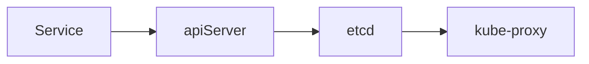

Service為 kubernetes中的抽象概念, 用於定義一個內/外訪問Pod的方式  
真正起作用的元件為每個Node上的kube-proxy,  
當Service被創立, apiServer會寫入至etcd Service 資訊,  
而kube-proxy會基於監聽機制發現Service的異動, 會把Service中的資訊轉為對應的訪問機制



- Service 為 TCP/UDP level

藉由Service訪問Pod流程如下


工作模式, 列出目前比較主流的

- iptables: kube-proxy為每一個service後端的每個Pod建立對應的iptable(防火牆規則), 直接把發向Service的IP直接redirect至Pod
  IP, 該模式下kube-proxy不承擔 L4(傳輸層TCP/UDP) 的 load-balance角色, 只負責創建iptable規則, 優點為較 userspace效率高,
  但不能提供靈活的load-balance規則(可能有順序或隨機),且當後端Pod不可用時, 無法進行重試 (用戶需求近來至防火牆,
  會直接被防火牆依iptable(防火牆規則)分配到固定的機器, 它分配機制是一開始就被產生 較不靈活)

- ipvs: ipvs與iptables相似, kubeproxy監聽api-server pod,service變化創建相對應的ipvs規則(防火牆規則) 並更新至防火牆,
  用戶需求進制防火牆會依ipvs規則被轉發 , 此方式 用戶近來不會直接給kubeproxy造成負擔, 但又擁有 load-balance演算法的靈活性


## 類型

| type         | content                                                                                                                                           |
|--------------|---------------------------------------------------------------------------------------------------------------------------------------------------|
| ClusterIP    | 預設值, kubernetes自動分配的虛擬IP, 只能在cluster中使用 (在各pod的container)                                                                                         |
| NodePort     | 將Service通過指定node的port曝露出去, 可從cluster外訪問                                                                                                           |
| LoadBalance  | 將外部的load balance負載分發至服務, 此模式需要外部云環境支援, 因externaltrafficpolicy,暴露外部的node有load-balance特性, 這邊若是用LoadBalance類型, 雲端平台會自動幫你在外接一個他們平台販售的load-balance轉發流量 |
| ExternalName | 把外部cluster的服務導入內部cluster直接使用                                                                                                                      |


## 測試共用範例

範例用 statefulSet & CoreDns

```yaml
apiVersion: apps/v1
kind: StatefulSet
metadata:
  name: stateful-nginx
  namespace: dev
spec:
  serviceName: "svc-nginx"  ## 對於 headless是必須的, 否則coredns不會對底下每個pod創建dns
  replicas: 3
  selector:
    matchLabels:
      app: nginx-pod
  template:
    metadata:
      labels:
        app: nginx-pod
    spec:
      containers:
        - name: nginx
          image: nginx:1.22.0
```

這邊可以查找內部dns, 之後可以藉由該dns 查看service 有無設置成功, coredns server =  10.244.0.4, 取其一都可

```bash
kubectl get pod -n kube-system
#NAME                                        READY   STATUS    RESTARTS   AGE   IP           NODE                NOMINATED NODE   READINESS GATES
#coredns-7db6d8ff4d-27vbx                    1/1     Running   0          25h   10.244.0.4   dev-control-plane   <none>           <none>
#coredns-7db6d8ff4d-ck76j                    1/1     Running   0          25h   10.244.0.3   dev-control-plane   <none>           <none>
# ....
```


## ClusterIP

創建一個ip接口, 可藉由該IP訪問至相對應label的pod


測試用statefulSet

```yaml
apiVersion: v1
kind: Service
metadata:
  name: nginx-service
  namespace: dev
spec:
  selector:
    app: nginx-pod
  ports:
    - protocol: TCP
      port: 80
      targetPort: 80
  type: ClusterIP
```

```bash
kubectl get endpoints -n dev
#NAME            ENDPOINTS                                      AGE
#nginx-service   10.244.1.18:80,10.244.1.19:80,10.244.2.18:80   24s
kubectl get pod -n dev -o wide
NAME               READY   STATUS    RESTARTS   AGE   IP            NODE          NOMINATED NODE   READINESS GATES
stateful-nginx-0   1/1     Running   0          58s   10.244.2.18   dev-worker2   <none>           <none>
stateful-nginx-1   1/1     Running   0          57s   10.244.1.18   dev-worker    <none>           <none>
stateful-nginx-2   1/1     Running   0          56s   10.244.1.19   dev-worker    <none>           <none>
nslookup svc-nginx.dev.svc.cluster.local 10.244.0.4
Server:         10.244.0.4
Address:        10.244.0.4#53

** server can't find svc-nginx.dev.svc.cluster.local: NXDOMAIN

root@dev-control-plane:/# nslookup nginx-service.dev.svc.cluster.local 10.244.0.4
Server:         10.244.0.4
Address:        10.244.0.4#53

Name:   nginx-service.dev.svc.cluster.local
Address: 10.96.162.201

```

### headless

實際上創建service時, 內部的dns會自動創建一個網路標誌,
`<service-name>.<namespace>.svc.cluster.local`
可藉由該dns name訪問後面的pod, 但若要訪問特定pod, 是沒有辦法的, 最終訪問至哪個pod, 是由`工作模式`決定的
這邊可以使用headless的方式, 若把clusterIP service的IP設none,
每個pod都會有自己的dns name,
`<pod name>.<service-name>.<namespace>.svc.cluster.local`
就可以藉由該dns name ,訪問特定的pod
該方式常配合`statefulSet`使用 , 因statefulSet創建的pod, 無論重啟多少次, 其pod名稱都是相同的
藉由這個特性就可以永遠使用該dns name訪問至相同的pod

- 作用區域 node,pod level
- `<service-name>.<namespace>.svc.cluster.local`

```yaml
apiVersion: v1
kind: Service
metadata:
  name: svc-nginx
  namespace: dev
spec:
  selector: #
    app: nginx-pod
  type: ClusterIP
  clusterIP: None # 不分配 service IP
  ports:
    - port: 80 #service port
      protocol: TCP
      targetPort: 80  #pod port
```

```bash

kubectl get pod -n dev -o wide
#NAME               READY   STATUS    RESTARTS   AGE   IP            NODE          NOMINATED NODE   READINESS GATES
#stateful-nginx-0   1/1     Running   0          58s   10.244.2.18   dev-worker2   <none>           <none>
#stateful-nginx-1   1/1     Running   0          57s   10.244.1.18   dev-worker    <none>           <none>
#stateful-nginx-2   1/1     Running   0          56s   10.244.1.19   dev-worker    <none>           <none>
kubectl get svc -n dev
#NAME        TYPE        CLUSTER-IP   EXTERNAL-IP   PORT(S)   AGE
#svc-nginx   ClusterIP   None         <none>        80/TCP    4m21s
#root@dev-control-plane:/# nslookup stateful-nginx-0.svc-nginx.dev.svc.cluster.local 10.244.0.4
#Server:         10.244.0.4
#Address:        10.244.0.4#53
#
#Name:   stateful-nginx-0.svc-nginx.dev.svc.cluster.local
#Address: 10.244.2.18
nslookup stateful-nginx-1.svc-nginx.dev.svc.cluster.local 10.244.0.4
#Server:         10.244.0.4
#Address:        10.244.0.4#53
#
#Name:   stateful-nginx-1.svc-nginx.dev.svc.cluster.local
#Address: 10.244.1.18
#
nslookup stateful-nginx-2.svc-nginx.dev.svc.cluster.local 10.244.0.4
#Server:         10.244.0.4
#Address:        10.244.0.4#53
#
#Name:   stateful-nginx-2.svc-nginx.dev.svc.cluster.local
#Address: 10.244.1.19
```

### NodePort

將Service的Port 映射至 Node的Port上, 只要連線至Node的Port, 就會被直接轉接至service的Port上,
(NodeIP 可以任取其一 有關 service.spec.externaltrafficpolicy)
externaltrafficpolicy 允許任何節點轉發流量至 service, 因此只要是連至任一節點的特定port, 都可以連至 真正service的work
node 在轉至真正提供服務的pod , 這種方式也不怕有任何work node死亡 , 假使 對外的service node故障 依然可以利用其他
node連近來 , 若工作pod 與service 同node , 該pod也會因 deployment 被重啟 再被 scheduler分配至其他 node
因externaltrafficpolicy關係 , 可簡單在外部架設一load balance , 就可以用單一入口
形成流量的均衡

```bash
apiVersion: v1
kind: Service
metadata:
  name: svc-nginx
  namespace: dev
spec:
  selector: #
    app: nginx-pod
  type: NodePort
  ports:
  - port: 80 #service port
    protocol: TCP
	targetPort: 80  #pod port
    nodePort: 30002 # 可不指定 會預設自動分配於 30000-32767之間

status:
  loadBalancer: {}
```

之後可連線至各節點的30002 會自動導向pod,

```bash
curl 127.0.0.1:30002
# 不一定是127.0.0.1 可藉由任一節點訪問
#<!DOCTYPE html>
#<html>
#<head>
#<title>Welcome to nginx!</title>
#<style>
#html { color-scheme: light dark; }
#body { width: 35em; margin: 0 auto;
#font-family: Tahoma, Verdana, Arial, sans-serif; }
#</style>
#</head>
#<body>
#<h1>Welcome to nginx!</h1>
#<p>If you see this page, the nginx web server is successfully installed and
#working. Further configuration is required.</p>
#
#<p>For online documentation and support please refer to
#<a href="http://nginx.org/">nginx.org</a>.<br/>
#Commercial support is available at
#<a href="http://nginx.com/">nginx.com</a>.</p>
#
#<p><em>Thank you for using nginx.</em></p>
#</body>
#</html>
#root@dev-worker:/#
#exit

```


### ExternalName

- ExternalName則是把外部的服務引入 cluster內部使用, 抽象化為cluster內部資源
- dns: `<ExternalName service_name>.<namespace name>.cluster.local`
- dns作用區域: pod level

簡單來說就是創建一個service 去轉接去 外部的某個url

使用情景:

內部開了 100個 各種 pod 對外提供服務 , 該pod皆需要對外部的網域的db 進行讀寫
正常為需再一百個pod中把 db IP 寫入 , 但若之後db更改ip位置 , 則該100個pod也需一一修改db ip, 其修改代價極高
kubernetes提供一個統一的對外出口, 使其方便管理
通常接口名稱為 該 `<ExternalName service_name>.<namespace name>.cluster.local`
該 domain name 會再被 CoreDNS or kube-dns 轉成外部 db IP, 若要修改db IP 只需要直接修改 service yaml中的IP

```yaml
apiVersion: v1
kind: Service
metadata:
  name: svc-nginx
  namespace: dev
spec:
  type: ExternalName
  externalName: www.google.com
```


```bash
root@pod-pod-aff-req:/# curl google-service.dev.svc.cluster.local
#<!DOCTYPE html>
#<html lang=en>
#  <meta charset=utf-8>
# ...
```
