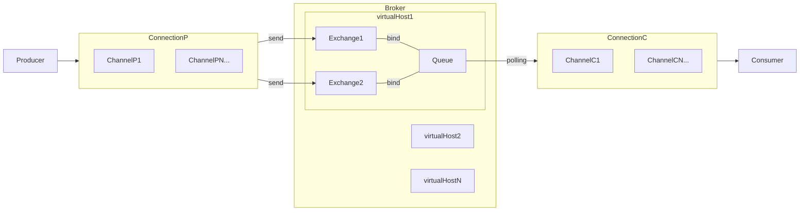
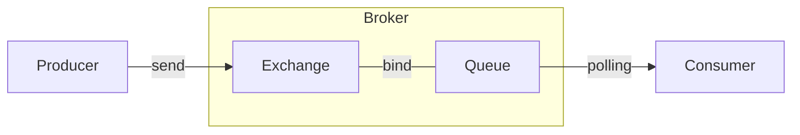
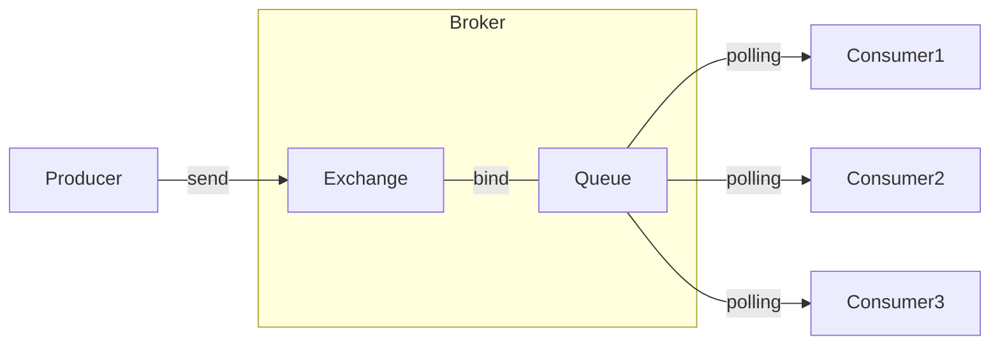
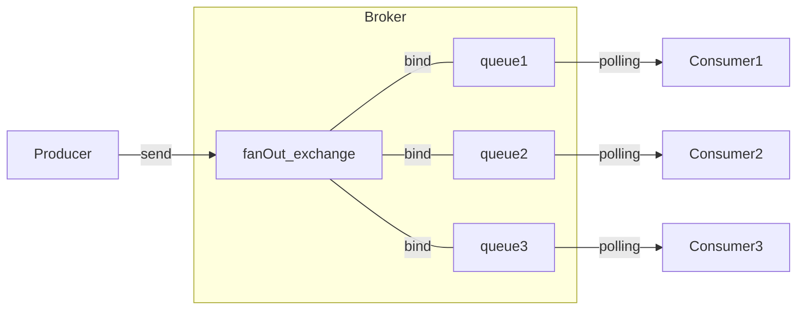
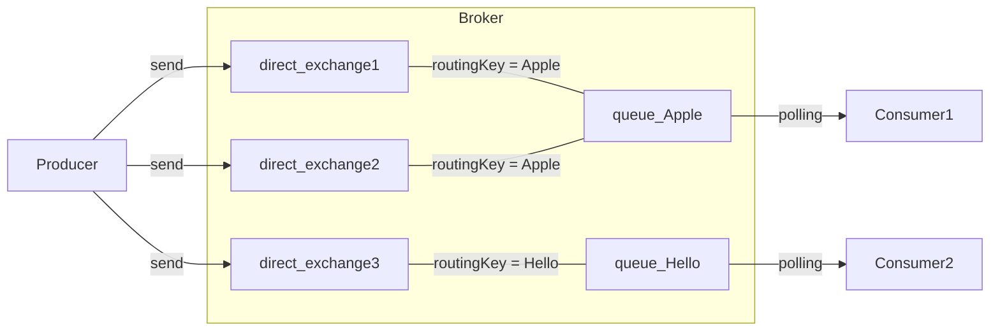
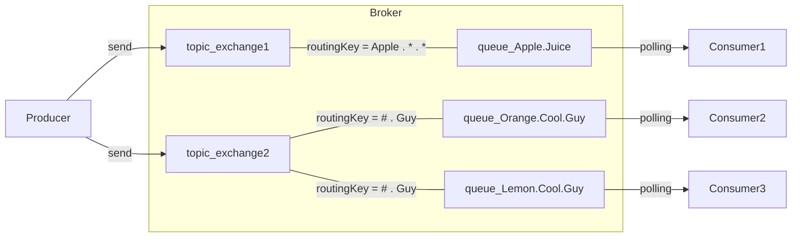

高性能的訊息隊列服務器, 用於在分布式系統中傳遞訊息

常見應用場景

- 解耦: 用於上游任務有多個下游任務相依, 可以使用MQ解耦
- 異步處理: 若下游任務需要較長處理時間, 可優先嚮應, 將待處理任務放入MQ
- 消峰: 用於流量突增時, 將請求排入MQ, 逐步處理, 可防止server來不及處理導致的崩潰

## 基礎架構

| 名稱          | 說明                                                   |
|-------------|------------------------------------------------------|
| Producer    | 發送訊息的client                                          |
| Consumer    | 接收訊息的client                                          |
| Connection  | 連線接口 (由channel組成)                                    |
| Broker      | 訊息中介,包含一個或多個 exchange與queue (實際上就是rabbitMQ server本身) |
| virtualHost | 可理解成在Server內分組                                       |

Producer, Consumer 都是會開啟connection與Broker進行連接通訊,

broker 中 exchange 會收集Producer發送的訊息, 並且根據設定的規則將訊息發送到對應的queue中,



| 名稱       | 說明                                                              |
|----------|-----------------------------------------------------------------|
| channel  | 輕量級的connection, 讓rabbitMQ一個TCP connection中包含多個channel, 減少TCP的開銷 |
| Exchange | 可以理解成 Message的 route, 把Message轉至相對應的Queue中                      |
| Queue    | 存儲Message的容器,等待Message被送入儲存, 最後被Consummer取出處理                   |

## 名詞解釋

### exchange

在rabbitMQ中, 訊息不會直接發送到queue上, 而是會先發送到exchange上, exchange會根據規則將訊息發送到對應的queue上  
需注意exchange無存儲功能, 若找不到對應的queue, 訊息會丟失  
exchange 有三種類型    

- FanOut: 將訊息發送到所有綁定的queue上 (只要綁定的都會被發送)
- Direct: 將訊息發送到指定的queue上 (根據routing key發送)
- Topic: 類似Direct, 只是routing Key 會配合 通配符使用
    - `#` 表示match 0個或多個 單詞  (0,1,2,3,4....組單詞 都符合)
    - `*` 表示match 1個 單詞
    - 單詞定義為 用 `.` 分切的詞彙 e.g. `order.info`  有兩個單詞 `order`, `info`  
    -  e.g. `order.info` match `order.*`  也 match `*.*` 也 match `order.#`

### route key

簡單可理解成 傳送訊息的label, 傳出去後 會藉由exchange規則與label 將訊息傳送到對應的queue

### connection & channel

connection 為 client與server之間的tcp 實體連接, channel 為 connection上的虛擬連接,
一個connection可以有多個channel,   
connection是一昂貴的資源 ,在connection下創建channel主要是為了節省connection的開銷,增加資源利用率,
每個channel都是一個獨立的連接, 並且可以進行獨立的操作, 如: 發送訊息, 接收訊息, 可以實現併發操作, 並且可以進行流量控制,
保證資源的使用效率

### prefetch count

用於設定Consumer的流量控制, 限制Consumer一次最多接收多少訊息  
預設是0, 代表不限制,  
一般來說 rabbitMQ 預設是已輪詢的方式對worker進行訊息分發,  
假設有n個任務 且有m個worker, 那每個worker的工作量為 n/m 個 ,  
若是不限制的情況下 會將queue的所有任務一次分出去, worker會一次拿到平均分發的所有任務, 然後在各自慢慢處理  
這樣會跑出一個問題, 若是有worker處理速度較慢的情況下, 因大家處理的任務數是相同的 速度比較快的worker會閒置,
會有資源浪費的問題  
所以可以透過prefetch count 設定一次分出去的任務量, 若是設定為1, 代表一次只分一個任務, 處理完才會在取得下一件任務,
這樣可以保證資源的使用效率  
但若是單個任務處理時間短, 且有大量任務的情況下, 會變成處理完後 需要重新等待下個任務被分派的時間, 這樣會導致效率降低  
官方文件 建議設定為30左右    
可參考 [官方文件](https://blog.rabbitmq.com/posts/2014/04/finding-bottlenecks-with-rabbitmq-3-3/)

需注意 AMQP 中, 若設置no-ack,則忽略prefetch count選項  
在python pika中 no-ack = auto_ack=True , 因此需設置 auto_ack=False 才能使用prefetch count

## 基礎指令

```bash

rabbitmqctl list_exchanges
# 列出所有的exchange

rabbitmqctl list_queues
# 列出所有的queue

rabbitmqctl list_bindings
# 列出所有的綁定 exchange 與 queue 的規則 

```


## 設計模式

常用設計模式

### Basic

最簡單的模式, 一個Producer發送訊息到一個queue, 一個Consumer接收訊息



### Work Queue

多個Consumer共同處理一個queue中的訊息, 並且每個訊息只會被處理一次



### Pub / Sub

會先創建一個fan out exchange  
每個Sub(consumer)都會創建一個隨機id 暫存用的queue, 並且將queue綁定到該exchange上  
之後Pub(publisher)只要將訊息發送到exchange上, exchange會將訊息發送到所有綁定的queue上   
這樣所有Sub都會收到訊息



### Routing



### Topic

- 單詞定義 為 用 `.` 分切的詞彙 e.g. `order.info`  有兩個單詞 `order`, `info`
- `*` 表示match 1個 單詞
- `#` 表示match 0個或多個 單詞



