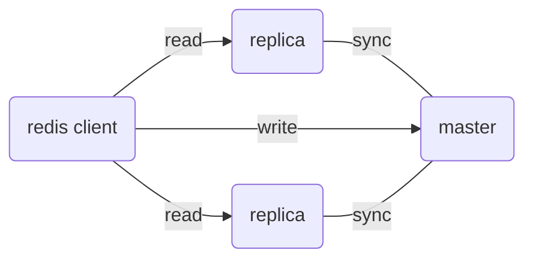
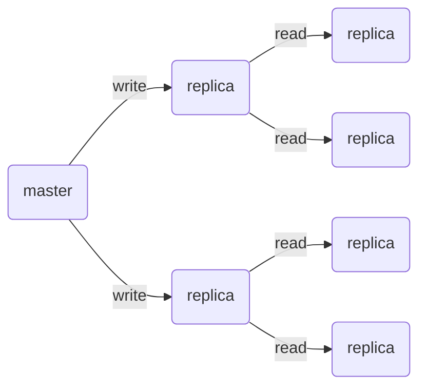
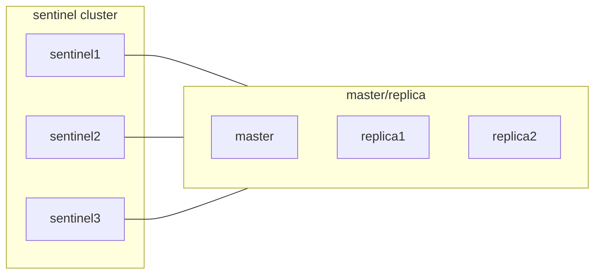

redis cluster機制  

- master/replica
- sentinel
- sharding


## 持久化

- RDB(Redis Database Backup File)
- AOF(Append Only File)

### RDB

可理解成snap shot, 若重啟會直接讀取該檔案恢復資料

```
save
# 執行快照, 會阻塞

bgsave
# 開子線程執行快照, 不會阻塞
# 實際上是會fork出一個子進程(共享父進程記憶體), 並在子進程中執行bgsave, 寫入RDB並取代原有RDB
```

redis.conf

```
save <seconds> <changes>
# 若 seconds 秒內有 changes 次寫入, 則執行 bgsave

dbfilename <file name>
# 存儲檔名

dir <path>
# 存儲路徑
```

```
save 900 1
save 300 10
save 60 10000

dbfilename dump.rdb

dir /var/lib/redis
```

- 若bgsave時 又被同時寫入, 會使用copy-on-write, 保證bgsave的資料不會被修改, 但記憶體使用量會變成兩倍, 需要注意硬體資源
- RDB持久化間隔過長, 可能會丟失資料
- 全本備份, 持久化較耗時
- 資源佔用較大(CPU , RAM)
- 重啟時, 會讀取RDB檔案, 速度較快

### AOF

`每次寫入`都會將寫入命令存儲到AOF檔案, 重啟時會重新執行AOF檔案中的命令

redis.conf

```
appendonly yes
# 開啟aof
appendfilename "appendonly.aof"
# aof檔名

# appendfsync always # or everysec, no
```

| option   | 說明          | 優點    | 缺點 ｜
|----------|-------------|-------|-----------------|
| always   | 每次寫入都同步到磁碟  | 可靠性較高 | 效能差             |
| everysec | 每秒同步一次, 預設值 | 可靠性較高 | 一秒內的資料會丟失       |
| no       | 由OS決定       | 效能較好  | 可能會丟失資料,可靠性三者最低 |

- 可靠性較RDB高
- 資料完整性較高 (rdb有間隔時間內的資料會丟失)
- 資料回復速度較慢 (需跑所有寫入指令)
- 檔案佔用較大

## master / replica

redis主從機制, 簡單說就是讀寫分離, 主要目的是提高I/O瓶頸
因大多時候都是讀取大於寫入, 所以將讀取分散到多個節點, 以提高效能

- master: write, read
- replica: read only



### 同步方式

- 初次在同步至replica節點時, 會使用 全量的同步, 該全量同步實現方式是依據RDB快照檔案
- 之後的同步則會傾向使用 增量同步, 但若累積的資料量過多, 則會採用全量同步
- 增量同步是依賴 Replication backlog ,Replication backlog是一個存於記憶體中 固定size的環形buffer, 用來存儲近期使用的寫入指令,
  replica會提交當前offset位置, master會將offset之後的指令發送給replica, 以達到增量同步的目的

### master node config 參考

```
port 6379
bind 0.0.0.0
cluster-enabled no
# 若只有一個master, 因此非cluster, 需要設定為 no

replica-announce-ip 162.23.0.2
# 宣告自己的ip (防止偵測錯誤)
```

### replica node config 參考

```
port 6379
bind 0.0.0.0
slaveof 162.23.0.2 6379
# 主伺服器的 IP port
replica-announce-ip 162.23.0.3
```

### 優化設定

```
repl-diskless-sync no
# 全量同步時, 是否使用磁碟同步, 預設為no, 若為yes, 則會將RDB檔案存儲在記憶體中, 並透過網路傳輸
# 適用於網路頻寬較快, 磁碟速度較慢的情況

replication-backlog-size 128mb
# 增量同步時, backlog的大小, 預設為1mb, 若增量同步的資料量過大, 則會採用全量同步
```

若節點數量過多 可以採用 master-replica-replica 的方式, 來減少master的壓力



### 啟動指令

```bash
redis-server /usr/local/etc/redis/redis.conf
```

master 查看當前replica狀態

```
127.0.0.1:6379> info replication
# Replication
role:master
connected_slaves:2
slave0:ip=162.23.0.4,port=6379,state=online,offset=289,lag=0
slave1:ip=162.23.0.3,port=6379,state=online,offset=289,lag=0
master_failover_state:no-failover
master_replid:a4727f570de87a94cf7717fdb324d408f5cf02e9
master_replid2:0000000000000000000000000000000000000000
master_repl_offset:289
second_repl_offset:-1
repl_backlog_active:1
repl_backlog_size:1048576
repl_backlog_first_byte_offset:1
repl_backlog_histlen:289
```

### Playground

```yaml
services:

  redis:
    image: redis:7.2-bookworm
    restart: always
    container_name: rdm
    ports:
      - 6379:6379
    command: redis-server /usr/local/etc/redis/redis.conf
    volumes:
      - ./redis_master.conf:/usr/local/etc/redis/redis.conf
    networks:
      redis_net:
        ipv4_address: 162.23.0.2
  redis_replica1:
    image: redis:7.2-bookworm
    restart: always
    container_name: rd1
    ports:
      - 6380:6379
    command: redis-server /usr/local/etc/redis/redis.conf
    volumes:
      - ./redis_replica1.conf:/usr/local/etc/redis/redis.conf
    networks:
      redis_net:
        ipv4_address: 162.23.0.3

  redis_replica2:
    image: redis:7.2-bookworm
    restart: always
    container_name: rd2
    ports:
      - 6381:6379
    command: redis-server /usr/local/etc/redis/redis.conf
    volumes:
      - ./redis_replica2.conf:/usr/local/etc/redis/redis.conf
    networks:
      redis_net:
        ipv4_address: 162.23.0.4

networks:
  redis_net:
    driver: bridge
    ipam:
      config:
        - subnet: 162.23.0.0/16
          gateway: 162.23.0.1

```

### 驗證

```bash
redis-cli -p 6379
#127.0.0.1:6379> set a 88
#OK
redis-cli -p 6380
#127.0.0.1:6380> get a
#"88"
redis-cli -p 6381
#127.0.0.1:6381> get a
#"88"
```

## Sentinel

可理解為 redis HA的機制, 主要負責

- 監控 master/replica 健康
- failover
- 通知client端當前 master node

sentinel cluster 會監控master node的狀態, 若發現master node失效, 則會進行failover, 選擇一個replica node作為新的master
node, 並將其他replica node設定為新的replica node
之後master復原後, 則轉為replica node , 若master轉移後, 會通知client 當前master 位於哪個node

### 監控方式

- sentinel 每秒對各node ping
- 主觀失效: 若sentinel node發現某節點未在時間內回應, 則標記為主觀的失效
- 客觀失效: 若超過 quorum 數量的主觀失效, 則為客觀失效, 進行failover  (quorum通常大於 sentinel數量的一半)



### master candidate

若master node失效 則會從replica選出一個node作為新的master node

若依序滿足才會往下比較,

- 先判斷replica與master斷開時間, 若超過 down-after-milliseconds 該replica會被排除
- 判斷 priority , 愈小優先度愈高
- 判斷 replica 的 offset, offset 愈大表示當前資料愈新
- 最後判斷 replica id, 愈小優先級愈高

failover 過程

- sentinel cluster 選出新的master node
- 發送該 replica , slaveof no one 使其成為master
- sentinel 發送其他replica , slaveof <new master ip> <port> 將其他replica改為與該新master同步
- 標記 舊master 為 replica (若恢復後, 會作為replica繼續工作)

### config

```
port 27001
sentinel announce-ip "162.23.0.5"
# 宣告自己的ip (防止偵測錯誤)

sentinel monitor my_master 162.23.0.2 6379 2
# master/replica cluster的 master node,  port,  quorum
# quorum 表示sentinel cluster中, 需要多少個sentinel同意才能進行failover
# 若超過該數目的sentiel都發現master node失效, 則進行failover

sentinel down-after-milliseconds my_master 5000
# 若master node在5000ms內沒有回應, 則被標記為 主觀的失效, 若超過quorum數量的主觀失效, 則為客觀失效, 進行failover

sentinel failover-timeout my_master 60000
# sentinel cluster進行故障轉移最長時間, 若超過此時間沒成功, 則重試

dir "/tmp"
```

### playground

```yaml
services:

  redis:
    image: redis:7.2-bookworm
    restart: always
    container_name: rdm
    ports:
      - 6379:6379
    command: redis-server /usr/local/etc/redis/redis.conf
    volumes:
      - ./redis_master.conf:/usr/local/etc/redis/redis.conf
    networks:
      redis_net:
        ipv4_address: 162.23.0.2
  redis_replica1:
    image: redis:7.2-bookworm
    restart: always
    container_name: rd1
    ports:
      - 6380:6379
    command: redis-server /usr/local/etc/redis/redis.conf
    volumes:
      - ./redis_replica1.conf:/usr/local/etc/redis/redis.conf
    networks:
      redis_net:
        ipv4_address: 162.23.0.3

  redis_replica2:
    image: redis:7.2-bookworm
    restart: always
    container_name: rd2
    ports:
      - 6381:6379
    command: redis-server /usr/local/etc/redis/redis.conf
    volumes:
      - ./redis_replica2.conf:/usr/local/etc/redis/redis.conf
    networks:
      redis_net:
        ipv4_address: 162.23.0.4

  redis_sentinel1:
    image: redis:7.2-bookworm
    restart: always
    container_name: rs1
    ports:
      - 27001:27001
    command: redis-sentinel /data/sentinel/sentinel1.conf
    volumes:
      - ./sentinel/:/data/sentinel/
    networks:
      redis_net:
        ipv4_address: 162.23.0.5

  redis_sentinel2:
    image: redis:7.2-bookworm
    restart: always
    container_name: rs2
    ports:
      - 27002:27002
    command: redis-sentinel /data/sentinel/sentinel2.conf
    volumes:
      - ./sentinel/:/data/sentinel/
    networks:
      redis_net:
        ipv4_address: 162.23.0.6

  redis_sentinel3:
    image: redis:7.2-bookworm
    restart: always
    container_name: rs3
    ports:
      - 27003:27003
    command: redis-sentinel /data/sentinel/sentinel3.conf
    volumes:
      - ./sentinel/:/data/sentinel/
    networks:
      redis_net:
        ipv4_address: 162.23.0.7


networks:
  redis_net:
    driver: bridge
    ipam:
      config:
        - subnet: 162.23.0.0/16
          gateway: 162.23.0.1

```

### 除錯

```
1:X 30 Jun 2024 23:33:22.205 # Could not rename tmp config file (Device or resource busy)
1:X 30 Jun 2024 23:33:22.205 # WARNING: Sentinel was not able to save the new configuration on disk!!!: Device or resource busy
1:X 30 Jun 2024 23:33:27.227 # +sdown sentinel c780c368f3aa56409babab39dbb20c6b705b7ab2 162.23.0.8 27003 @ my_master 162.23.0.2 6379
1:X 30 Jun 2024 23:33:30.795 * +slave slave 162.23.0.3:6379 162.23.0.3 6379 @ my_master 162.23.0.2 6379
```

docker 若是直接volume單一設定檔, 可能會有權限問題
若是volume目錄, 可以避免該問題
但volume目錄後, 目錄會以container內部的uid為主, 之後外部無法修改該目錄的檔案, 也無法讀取
消極一點可以直接 chmod 777 該目錄

## sharding

讓redis 可以針對容量水平擴展的cluster, 會在多個節點之間自動分片（sharding）和分佈數據。當客戶端用 key 查詢時，會根據這個 key
的hash決定該查詢應該發送到哪個節點
待補充實做
