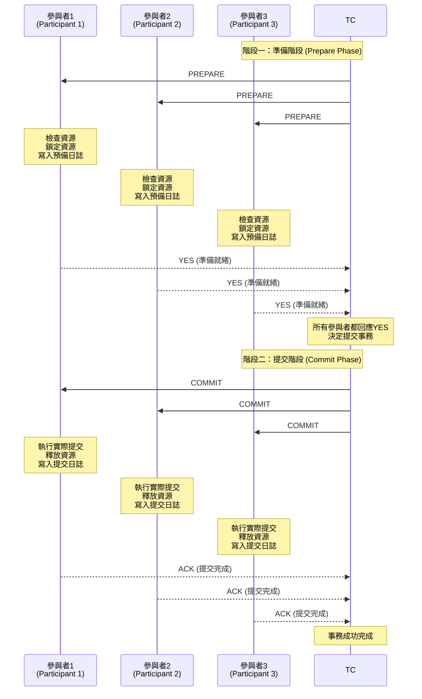

分佈式系統若執行分佈式transaction的處理方案之一,

核心思想可分為協調者與參與者, 協調者主要負責協調參與者transaction 狀態, 並決定是否commit

協者者的任務都必須是transaction task 才適用

Pros:

- 強一致性: 全成功或是全失敗

Cons:

- 阻塞問題: 協調者等待參與者時,會阻塞, 參與者等待協調者時也會阻塞
- 單點故障: 協調者崩壞, 參與者就會永久阻塞等待
- 性能低落: 多輪等待, 且會鎖定資源, 影響吞吐量
- 擴展性差: 參與者數量多時, 協調複雜度大, 任一參與者延遲就會影響整個transaciton完成時間

適用場景:

- 一致性需求極高場景 (金流)
- 併發低的系統

## 狀態說明

- Prepare: 表示參與者為執行完成狀態, 但尚未commit
- Non-Prepare: 表示參與者執行失敗狀態

## 成功流程

- 協調者調用參與者們 各開啟一個transaction執行任務
- 協調者阻塞等待參與者執行
- 參與者ack 協調者回傳執行狀態,  Pepare表示成功, Non-Prepare表示失敗
- 協者者若接收所有參與者都是 prepare, 則傳遞commit給所有參與者表示可以commit變更
- 等待參與者commit/rollback 執行完成,
  - 接收完成, 結束
  - 若等待不到則嘗試傳遞retry, 若依然無法應則alerting 管理者介入處理



## 失敗流程

- 協調者調用參與者們 各開啟一個transaction執行任務
- 協調者阻塞等待參與者執行
- 參與者ack 協調者回傳執行狀態,  Pepare表示成功, Non-Prepare表示失敗
- 協者者若接收其中之一參與者為 non-prepare, 則傳遞rollback給所有參與者
- 等待參與者rollback 執行完成,
  - 接收完成, 結束
  - 若等待不到則嘗試傳遞retry, 若依然無法應則alerting 管理者介入處理

  ```mermaid
  sequenceDiagram
    participant TC as 事務協調器<br/>(Transaction Coordinator)
    participant P1 as 參與者1<br/>(Participant 1)
    participant P2 as 參與者2<br/>(Participant 2)
    participant P3 as 參與者3<br/>(Participant 3)

    Note over TC,P3: 階段一：準備階段 (Prepare Phase)
    
    TC->>P1: PREPARE
    TC->>P2: PREPARE
    TC->>P3: PREPARE
    
    Note over P1: 檢查資源<br/>鎖定資源<br/>寫入預備日誌
    Note over P2: 檢查資源失敗<br/>(資源不足/衝突)
    Note over P3: 檢查資源<br/>鎖定資源<br/>寫入預備日誌
    
    P1-->>TC: YES (準備就緒)
    P2-->>TC: NO (無法準備)
    P3-->>TC: YES (準備就緒)
    
    Note over TC: 有參與者回應NO<br/>決定中止事務
    
    Note over TC,P3: 階段二：中止階段 (Abort Phase)
    
    TC->>P1: ABORT
    TC->>P2: ABORT
    TC->>P3: ABORT
    
    Note over P1: 回滾所有變更<br/>釋放資源<br/>清除預備日誌
    Note over P2: 回滾所有變更<br/>釋放資源
    Note over P3: 回滾所有變更<br/>釋放資源<br/>清除預備日誌
    
    P1-->>TC: ACK (中止完成)
    P2-->>TC: ACK (中止完成)
    P3-->>TC: ACK (中止完成)
    
    Note over TC: 事務已中止
  ```
