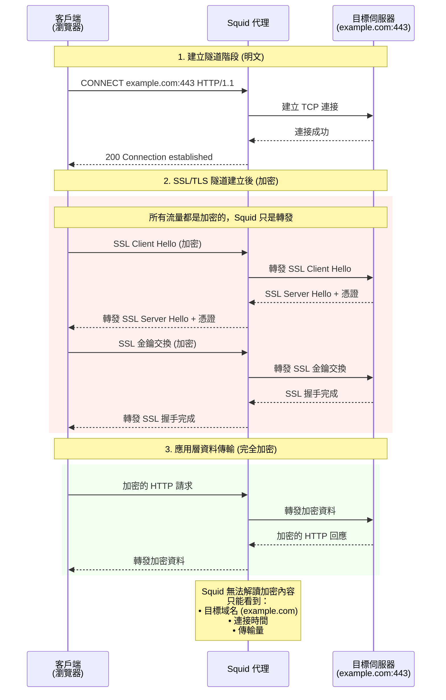

主要用來做 forward proxy

squid主要是依靠 HTTP CONNECT 進行轉發TCP流量

最近剛好遇到有些外部服務有限制IP或地區

## HTTP CONNECT

HTTP協議之一, 主要適用於創建一個tunnel進行tcp的傳輸, 傳輸內容squid不會進行解析

```http
CONNECT example.com:443 HTTP/1.1
Host: example.com:443
User-Agent: Mozilla/5.0...
```

簡單來說, 會明文建立起連接, 但實際傳輸是會是SSL/TLS的內容(若目標主機是https)



## 主機資訊

假設兩台主機

- server: 120.44.197.55
- client: 43.22.123.6

## server

```bash
sudo apt-get update
sudo apt-get install squid
```

vim /etc/squid/squid.conf

```text
acl aws_nat src 43.22.123.5/32
http_access allow aws_nat
# 需放在最前面
# 有順序性
# 設定檔中預設 https_access deny all, 放後面會最先被檔


http_port 3128 #這是預設的 原本就有, 要修改可以直接/3128
```

## cliet

```bash
export http_proxy="http://120.44.197.55:3128"
# 該terminal session 所有http 做forward proxy
export https_proxy="http://120.44.197.55:3128"
# 該terminal session 所有https 做forward proxy

unset http_proxy
# 取消環境變數 = 取消http_proxy
unset https_proxy
# 取消環境變數 = 取消https_proxy

```

or 應用程式單獨設置proxy

```python
import requests

proxy = "http://120.44.197.54:3128"

proxies = {
    "http": proxy,
    "https": proxy,
}

url = "https://cop.land.moi.gov.tw/Portal"  # 測試用網址，可以看到你外網IP

response = requests.get(url, proxies=proxies)

print(response.status_code)
print(response.text)
```
